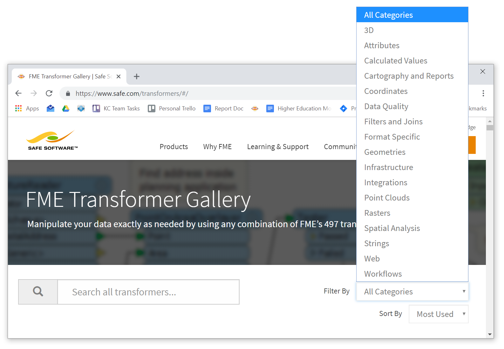
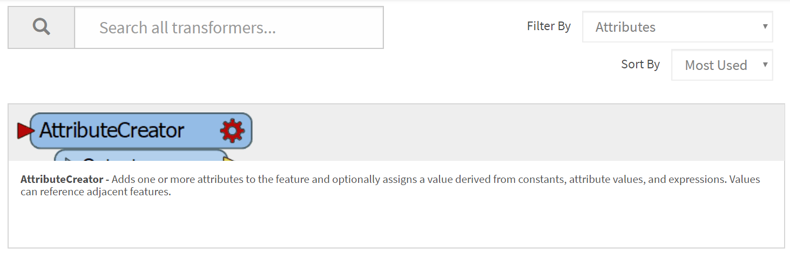
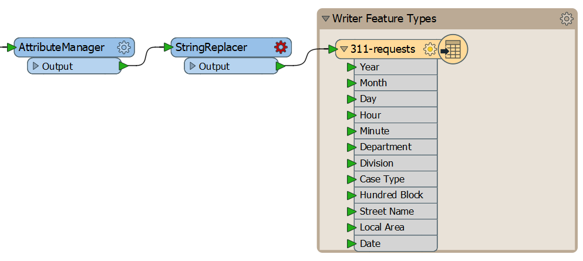
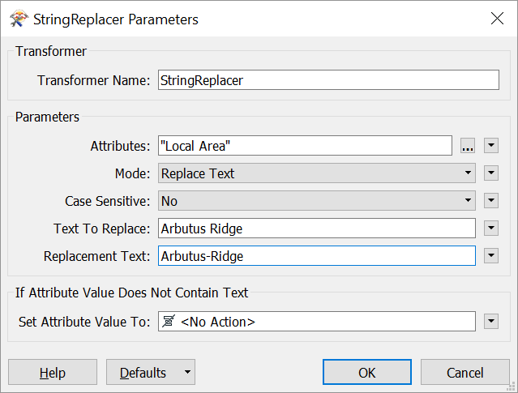
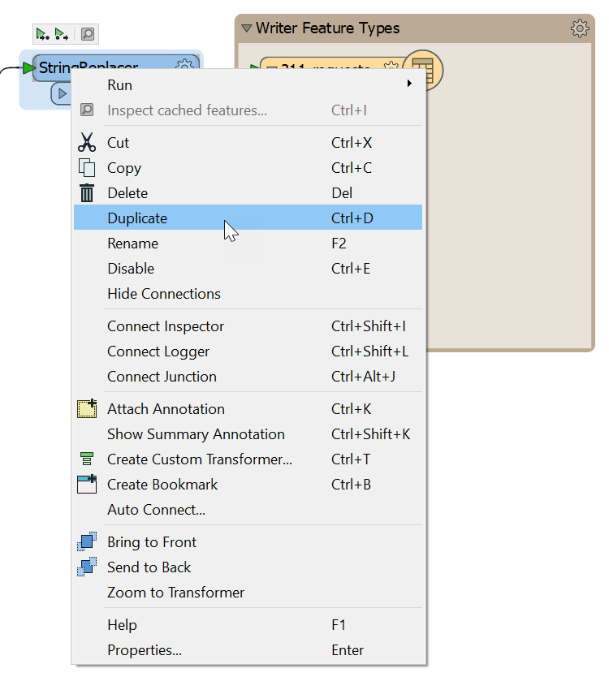
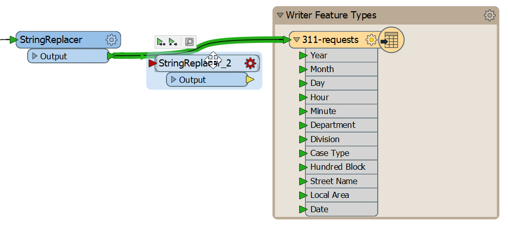
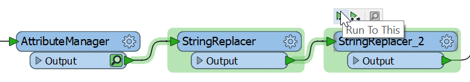
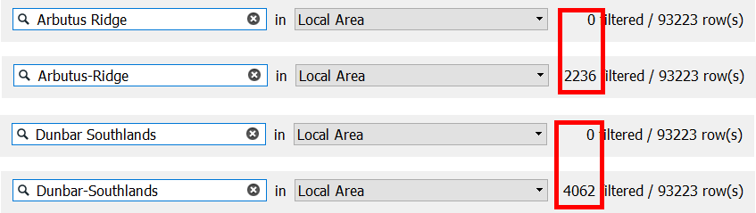

在[练习2.2](../2.translations/2.05.ex2.2.md)中，我们发现`Local Area`属性的一些值是不一致的。在本练习中，我们将找到一个合适的转换器来解决这个问题。正如我们刚才所述，搜索转换器有很多选择。在这种情况下，我们需要一个转换器，它可以在**属性中找到**特定文本**字符串****并用另一个值替换**它们。具体来说，我们想要找到“Local Area”的值并将其替换为：

|查找|替换|
|-|-|
|Dunbar Southlands|Dunbar-Southlands|
|Arbutus Ridge|Arbutus-Ridge|

我们可以使用任何可用的资源(Workbench中的转换器库，[Transformer Gallery online](https://www.safe.com/transformers/)，[FME转换器参考指南](http://cdn.safe。com/resources/fme/FME-Transformer-Reference-Guide.pdf)和Quick Add search)找到这样的转换器。

# 1)检查转换器库类别

转到FME[转换器库](https://www.safe.com/transformers/#/)，然后单击类别下拉菜单：

您认为我们可能需要查看哪个类别？我们正在尝试修改**属性**的值，因此在**Attributes**类别中开始搜索是有意义的。从下拉列表中选择属性以按这些转换器进行过滤。

嗯，这是一个好的开始，但这个类别中仍有30个转换器。我们可以一个接一个地阅读每个描述，直到找到合适的描述，但这需要太长时间。相反，我们应该搜索一些描述我们想要做的事情的关键字。

尝试搜索以下条款：

- Find
- Replace

这些术语不会产生此类别的任何转换器。也许我们应该尝试不同的方法。

# 2)尝试不同的类别

我们的转换器可能属于不同的类别吗？返回下拉菜单并查看。有**Strings**类！这可能有效，因为我们正在尝试修改文本(即字符串)值。选择**字符串**类别。

这个类别中有更多的转换器：43！但是，让我们再次尝试使用我们的关键字搜索此类别中的转换器：

- Find
- Replace

“Find”结果在[ListSearcher](http://docs.safe.com/fme/2019.0/html/FME_Desktop_Documentation/FME_Transformers/Transformers/listsearcher.htm)中搜索列表(一种特殊的属性值)，而不是属性，这样就行不通了。

“Replace”导致三个转换器：

-[StringReplacer](http://docs.safe.com/fme/2019.0/html/FME_Desktop_Documentation/FME_Transformers/Transformers/stringreplacer.htm)-替换匹配源属性中包含的字符串中的字符串或正则表达式的子字符串。
-[StringPairReplacer](http://docs.safe.com/fme/2019.0/html/FME_Desktop_Documentation/FME_Transformers/Transformers/stringpairreplacer.htm)-根据替换键值对替换source属性中包含的值中的字符。
-[CharacterCodeReplacer](https://www.safe.com/transformers/character-code-replacer/)-将结果属性设置为源代码属性(或输入的整数)中包含数字代码的字符。

听起来前两个中的任何一个都会起作用！作为一个经验丰富的FME用户，我知道其中任何一个都可以工作，但**StringReplacer**会更直接，所以让我们使用那个转换器。

FME中的特定问题通常有多种解决方案。要完成相同的结果我们可以通过使用：

<ul>
  <li>An <a href="https://docs.safe.com/fme/html/FME_Desktop_Documentation/FME_Transformers/Transformers/attributevaluemapper.htm" target="_blank">AttributeValueMapper</a></li>
  <li>An <a href="https://docs.safe.com/fme/html/FME_Desktop_Documentation/FME_Transformers/Transformers/attributemanager.htm" target="_blank">AttributeManager</a> 带有 <a href="https://docs.safe.com/fme/html/FME_Desktop_Documentation/FME_Workbench/!Transformer_Parameters/Parameter_Condition_Definition_Dialog.htm" target="_blank">条件值</a></li>
  <li>An <a href="https://docs.safe.com/fme/html/FME_Desktop_Documentation/FME_Transformers/Transformers/attributecreator.htm" target="_blank">AttributeCreator</a> 带有 <a href="https://docs.safe.com/fme/html/FME_Desktop_Documentation/FME_Workbench/!Transformer_Parameters/Parameter_Condition_Definition_Dialog.htm" target="_blank">条件值</a></li>
  <li>A <a href="https://docs.safe.com/fme/html/FME_Desktop_Documentation/FME_Transformers/Transformers/testfilter.htm" target="_blank">TestFilter</a> 和 <a href="https://docs.safe.com/fme/html/FME_Desktop_Documentation/FME_Transformers/Transformers/attributecreator.htm" target="_blank">AttributeCreators</a></li>
  <li><a href="https://docs.safe.com/fme/html/FME_Desktop_Documentation/FME_Transformers/Transformers/tester.htm" target="_blank">Testers</a> 和 <a href="https://docs.safe.com/fme/html/FME_Desktop_Documentation/FME_Transformers/Transformers/attributecreator.htm" target="_blank">AttributeCreators</a></li>
  <li><a href="http://docs.safe.com/fme/html/FME_Desktop_Documentation/FME_Transformers/Transformers/attributevalidator.htm" target="_blank">AttributeValidators</a> 和 <a href="https://docs.safe.com/fme/html/FME_Desktop_Documentation/FME_Transformers/Transformers/attributecreator.htm" target="_blank">AttributeCreators</a></li>
  <li>A <a href="https://docs.safe.com/fme/html/FME_Desktop_Documentation/FME_Transformers/Transformers/stringpairreplacer.htm" target="_blank">StringPairReplacer</a></li>
</ul>
你找到了另一种方式吗？恭喜！请通过<a href="mailto:train@safe.com"target="_blank">train@safe.com</a>告诉我们。

# 3)启动Workbench

现在，让我们将StringReplacer添加到我们的工作空间。

启动Workbench(如有必要)并从练习3.1打开工作空间。或者，您可以打开C：//FMEData2019//Workspaces//IntroToDesktop//Ex3.2-Begin.fmw。

#4)添加StringReplacer

通过单击要素连接线并在StringReplacer中键入以在“快速添加”中查看它，然后按Enter键，将StringReplacer添加到AttributeManager和写模块要素类型之间的画布上：

添加后，双击它以打开其参数。此转换器要求您选择要修改的属性，然后为要替换的文本(即，查找)和要替换的文本(即替换)提供字符串。您还可以指定没有匹配的值会发生什么，默认为“<No Action>”。传入数据中的源值将替换为任何匹配的目标值，否则将接收默认值。

如您所见，因为我们只能输入一个查找和一个替换值，我们将不得不使用两个StringReplacers，每个数据问题一个。

填写如下参数：

|参数|值|
|-|-|
|属性|`局部地区||
|要替换的文本|Arbutus Ridge|
|替换文字|Arbutus-Ridge|

我们将用空格替换任何带有破折号的值-这符合[温哥华市规范](https://data.vancouver.ca/datacatalogue/localAreaBoundary.htm)。

您的对话框应如下所示：

单击确定。

# 5)添加第二个StringReplacer

我们可以通过右键单击我们的第一个并单击Duplicate或使用快捷键<kbd>Ctrl</kbd>+<kbd>D</kbd>来添加另一个StringReplacer：

现在我们需要将它连接到数据流。单击并拖动第二个StringReplacer;你会注意到左上角有一个绿色的小箭头。将此箭头移动到第一个StringReplacer和写模块要素类型之间的要素连接线上。您将看到突出显示的要素连接线。释放点击以在改点连接转换器：

双击第二个转换器以打开其参数。我们可以从第一个转换器中保留一些参数，但请确保更改以下内容：

|参数|值|
|-|-|
|要替换的文本|Dunbar Southlands|
|替换文字|Dunbar-Southlands|

填好后，单击“确定”。

# 6)检查结果

现在让我们检查一下我们的数据，以确认我们已经解决了问题。单击第二个StringReplacer以将其选中，然后单击“运行到此”：

加载缓存后，单击第二个StringReplacer上的绿色图标以在Data Inspector中打开它。我们可以使用[练习2.3](../2.translations/2.07.ex2.3.md)中搜索我们的表视图的相同过程来确认我们的数据已经更改。在表视图左下方的搜索栏中键入我们的原始值(“Arbutus Ridge”和“Dunbar Southlands”)以搜索它们。它们都应该产生零结果，而如果您使用破折号搜索版本，则应分别得到2,236和4,062个结果：

<UL>
<li>使用在线转换器库</li>搜索转换器
<li>使用StringReplacer修复不一致的数据值</li>
</UL>
