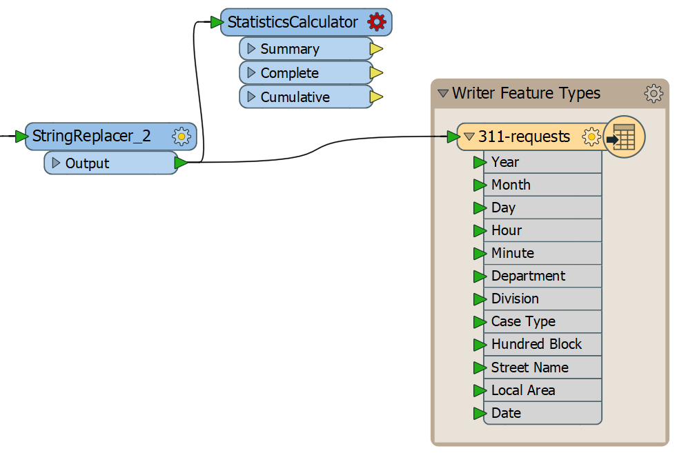
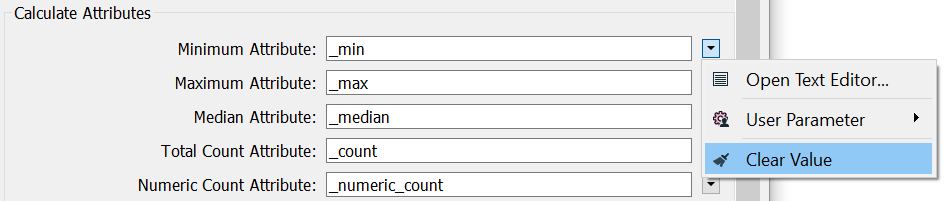
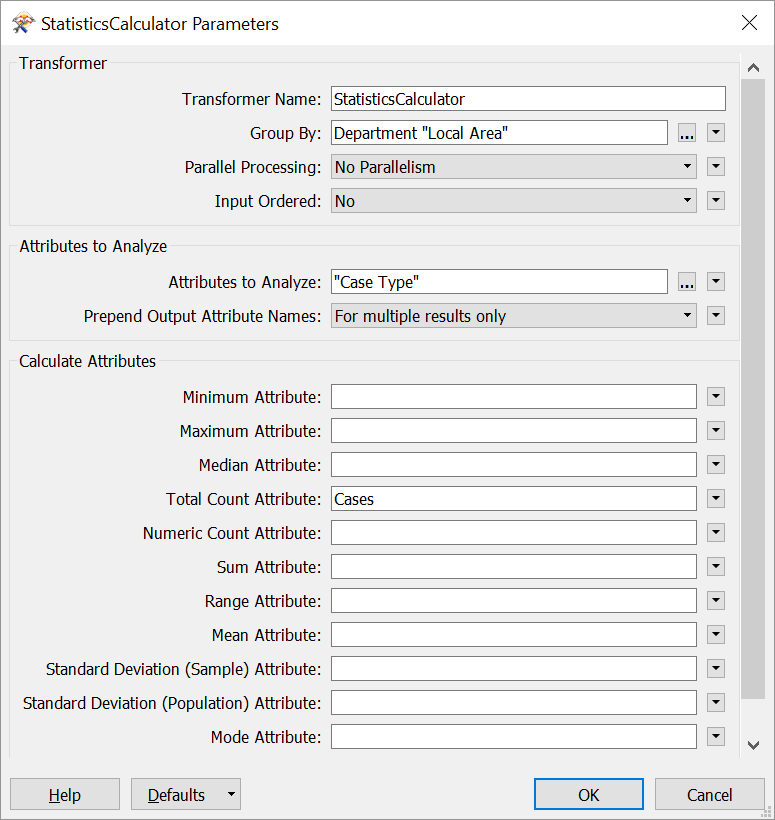
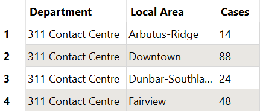

你找到了有效的转换器吗？最容易使用的是**StatisticsCalculator**。我们将它添加到我们的工作空间。

同样，对于FME中的给定问题，通常存在多种解决方案。要完成大致相同的结果，我们可以通过使用：

<ul>
<li><a href="https://docs.safe.com/fme/html/FME_Desktop_Documentation/FME_Transformers/Transformers/attributepivoter.htm"target="_blank">AttributePivoter</a></li>
<li><a href="https://docs.safe.com/fme/html/FME_Desktop_Documentation/FME_Transformers/Transformers/aggregator.htm"target="_blank">Aggregator</a>和<a href="https://docs.safe.com/fme/html/FME_Desktop_Documentation/FME_Transformers/Transformers/listhistogrammer.htm"target="_blank">ListHistogrammer</a></li>
<li>一些过于复杂的AttributeCreators，AttributeFilters，Counters和Sorters组合</li>
</ul>

# 1）启动Workbench

启动Workbench（如有必要）并从练习3.2中打开工作空间。或者，您可以打开C：\\FMEData2019\\Workspaces\\IntroToDesktop\\Ex3.3-Begin.fmw。

# 2）添加StatisticsCalculator

单击空白画布，然后在“快速添加”菜单上单击“StatisticsCalculator”并按<kbd>Enter</kbd>进行添加。单击并从StringReplacer_2的输出端口拖动到StatisticsCalculator的Input端口。然后，单击并拖动StatisticsCalculator将其放置在StringReplacer_2和写模块要素类型之间并略高于它。

您的工作空间应如下所示：

我们暂时不会将StatisticsCalculator连接到我们的要素类型;我们将在下面的步骤5中讨论原因。

# 3）设置StatisticsCalculator参数

双击StatisticsCalculator以打开其参数。像这样填写：

|参数|值|
|-|-|
|分组依据|`Department`和`Local Area`|
|要分析的属性|`Case Type`|
|总计数属性|`Cases`|

此外，请确保从所有其他计算属性（最小属性，最大属性等）中删除数值。您可以通过选择参数并使用<kbd>Delete</kbd>或<kbd>Backspace</kbd>键删除它，或者单击下拉箭头并选择Clear Value来执行此操作：

完成后，您的参数应如下所示：

单击“确定”并在StatisticsCalculator类型上使用“运行到此”来汇总数据。

使用这些参数，转换器将为您的数据添加一个属性`Cases`，它将“Case Type”的数量相加。通过将Group By设置为`Department`和`Local Area`，我们得到部门和本地区域的每个唯一组合的总数。

# 4）检查缓存

让我们检查缓存以确保我们的数据看起来正确。单击StatisticsCalculator的**Summary**输出端口上的绿色检查缓存图标。StatisticsCalculator说明转换器的输入和输出端口数量各不相同。Summary端口输出结果汇总表，生成新的要素流（此处为329），而Complete和Cumulative端口将汇总结果添加到每个传入要素（此处为93,223）。

在Data Inspector中，您应该在Table View中看到这一点：

这个结果是一个好的开始，但是现在我们的数据模式已经改变，我们的属性与现有的写模块要素类型不同。我们可以添加一个新的写模块要素类型来编写汇总表。我们将在下一节中做到这一点。

<UL>
<li>使用StatisticsCalculator生成汇总表。</li>
<li>使用分组来对转换器中的要素进行分组。</li>
<li>观察一些转换器有多个输出端口，创建不同的数据流。</li>
</UL>
