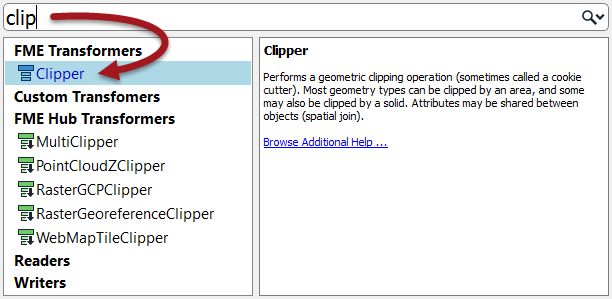
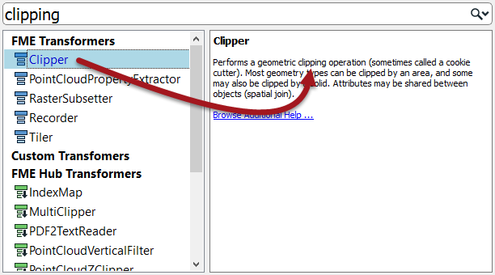
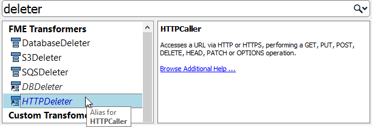

# 转换器搜索

转换器库和“快速添加”对话框中都有搜索功能。

## 转换器库搜索

要在转换器库中执行搜索，请输入搜索词，然后按键或单击搜索图标（双筒望远镜图标）。

转换器库搜索在名称和描述中搜索。因此，搜索项可能是转换器的确切名称，或者它可能是一般性的关键字，通常指的是功能：

搜索字词可以是完整字词或部分字词，也可以包含多个关键字，包括用于包含单个搜索引用的引号：

## 快速添加搜索

快速添加搜索字词也可以是完整或部分字词：

默认情况下，“快速添加”不会查找转换器描述，因此搜索项必须是转换器的实际名称：

但是，如果按&lt;TAB&gt;键，“快速添加”将搜索转换器描述：

快速添加结果包括别名 - 例如，具有替代名称或已重命名的转换器 - 还包括在FME中心中找到的转换器：

|  消防队员Mapp说...... |
| :--- |
|  以防您不知道，FME Hub（hub.safe.com）是一个用于共享FME功能的工具，例如自定义转换器，Web连接和格式： 集线器中的转换器显示在Quick Add中，带有一个小的向下 - 指向箭头，表示如果选择它们将被下载。     |

### 驼峰式命名法

快速添加还允许使用驼峰式命名法的首字母作为快捷方式。驼峰式命名法是一个单个关键字由几个连接的单词组成的单词，每个单词保留一个大写的首字母; 例如AttributeFileWriter（AFW）或ShortestPathFinder（SPF）。

|  Vector小姐说...... |  |
| :--- | :--- |
|  试试这些问题，看看你是否可以搜索转换器。 以下哪一项不属于转换器？  [1.属性](http://52.73.3.37/fmedatastreaming/Manual/QAResponse2017.fmw?chapter=5&question=1&answer=1&DestDataset_TEXTLINE=C%3A%5CFMEOutput%5CQAResponse.html) [2.计算](http://52.73.3.37/fmedatastreaming/Manual/QAResponse2017.fmw?chapter=5&question=1&answer=2&DestDataset_TEXTLINE=C%3A%5CFMEOutput%5CQAResponse.html) [3.数据质量](http://52.73.3.37/fmedatastreaming/Manual/QAResponse2017.fmw?chapter=5&question=1&answer=3&DestDataset_TEXTLINE=C%3A%5CFMEOutput%5CQAResponse.html) [4.工作流程](http://52.73.3.37/fmedatastreaming/Manual/QAResponse2017.fmw?chapter=5&question=1&answer=4&DestDataset_TEXTLINE=C%3A%5CFMEOutput%5CQAResponse.html)  这里有四个转换器和四个类别。将转换器与正确的类别匹配。 |  |
| 场景 | 工具 |
| [Chopper](http://52.73.3.37/fmedatastreaming/Manual/QAResponse2017.fmw?chapter=5&question=2&answer=1&DestDataset_TEXTLINE=C%3A%5CFMEOutput%5CQAResponse.html) | 工作流程 |
| [Terminator](http://52.73.3.37/fmedatastreaming/Manual/QAResponse2017.fmw?chapter=5&question=2&answer=2&DestDataset_TEXTLINE=C%3A%5CFMEOutput%5CQAResponse.html) | 字符串 |
| [Matcher](http://52.73.3.37/fmedatastreaming/Manual/QAResponse2017.fmw?chapter=5&question=2&answer=3&DestDataset_TEXTLINE=C%3A%5CFMEOutput%5CQAResponse.html) | 几何图形 |
| [DateTimeConverter](http://52.73.3.37/fmedatastreaming/Manual/QAResponse2017.fmw?chapter=5&question=2&answer=4&DestDataset_TEXTLINE=C%3A%5CFMEOutput%5CQAResponse.html) | 数据质量 |

