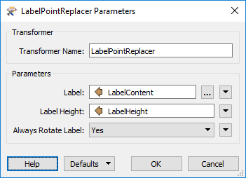
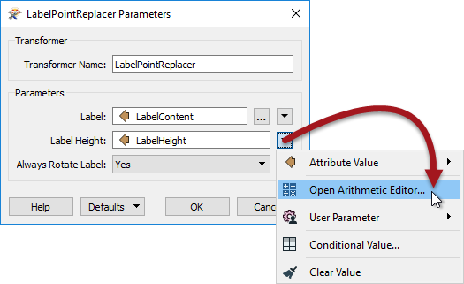
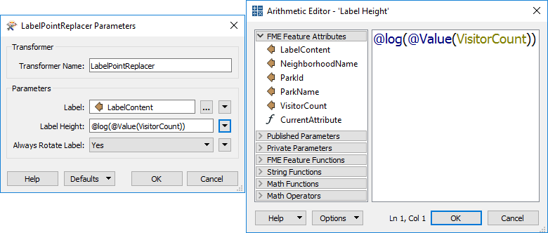

# 构建转换器参数

让我们暂时将属性放在一边，看一下转换器参数。

转换器参数通常以固定方式设置（硬编码）或设置为采用特定属性的值。但是，与构建属性的方式相同，可以使用文本或算术编辑器为转换器参数构建值。

## 使用参数属性

如上所述，大多数转换器参数允许用户选择属性值而不是手动输入固定值。例如，LabelPointReplacer可以创建一个标签，其内容和高度由属性值指定：

此特性很有用，因为它允许参数（例如标签大小）为每个要素获取不同的值。可以从源数据集中读取属性，也可以使用ExpressionEvaluator计算属性，以便一个要素创建高度为十个单位的标签，另一个要素创建高15个单位的标签，依此类推。它不再是固定值。

## 构建参数值

如果需要计算或构建参数值，而不是使用单独的转换器，FME已将集成的字符串和数字编辑器内置到参数对话框中。

例如，这里用户选择使用算术计算器计算标签高度：

计算器允许选择和使用FME属性，其他参数，以及数学和基于字符串的函数。例如，此处用户已选择使用公园的访客计数的对数来计算其标签的高度：

|  E. Dict先生（FME法务律师）说...... |
| :--- |
|  编辑器对话框可用的固定规则取决于所设置参数的类型。例如，LabelPointReplacer中的Label参数打开文本编辑器，因为该参数需要文本值。Label Height参数打开算术编辑器，因为该参数需要数值。 |

### 减少工作空间拥塞

就像构建属性值一样，当尽可能多的外围操作直接集成到单个转换器或参数中时，工作空间更紧凑。但是，与属性一样，添加适当的注释很重要，否则一个普通的观察者很难理解工作空间的意图。

另一个缺点是，特别是对于参数来说，您也不能获取信息作为属性以在其他地方使用。例如，您如果在LabelPointReplacer中构建一个标签字符串，则该字符串不可用作工作空间中其他位置的属性。

