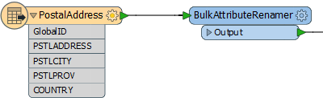
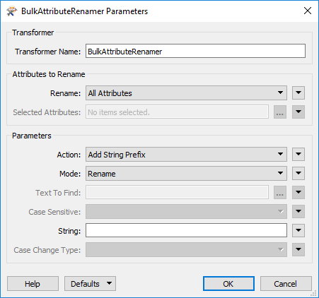
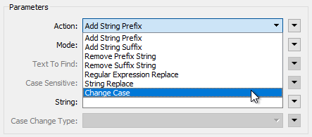
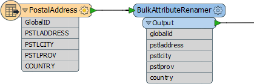
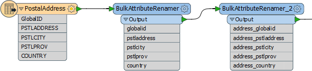

# 批量属性重命名

通常的属性重命名涉及选择要修改的各个属性。但是，在某些情况下，能够对大量属性执行相同的重命名操作非常重要。

这种情况由BulkAttributeRenamer转换器提供。

## BulkAttributeRenamer

BulkAttributeRenamer执行重命名属性的核心功能。但是，这个转换器不是手动指定每个属性，而是让用户选择多个属性 - 或者全部：

当选择多个属性时，操作必须 - 当然 - 对它们执行相同的重命名操作。这些操作是：

* 添加字符串前缀
* 添加字符串后缀
* 删除前缀字符串
* 删除后缀字符串
* 正则表达式替换
* 字符串替换
* 改变大小写

转换器的功能还在于能够一次操作多个属性，而无需单独选择它们。例如，在这里，传入的属性都被重命名为小写名称，以匹配不支持大写的写模块模式：

可以使用多个转换器来创建累积效果。例如，用户已转换为小写，然后使用第二个转换器添加前缀：

