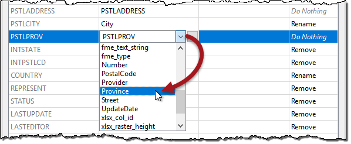

# 练习：地址开放数据项目

|  练习2 |  噪音控制法项目（地址） |
| :--- | :--- |
| 数据 | 地址（文件地理数据库） |
| 总体目标 | 将文件地理数据库转换为Microsoft Excel并映射模式 |
| 演示 | 模式映射的属性管理 |
| 启动工作空间 | 无 |
| 结束工作空间 | C:\FMEData2018\Workspaces\DesktopBasic\Transformers-Ex2-Complete.fmw |

市议员投票决定修改噪声控制法，生活在受影响地区的居民必须了解这些变化。

您的经理建议您承担查找所有受影响地址的任务。有一个紧迫的截止日期，至少有三位市议员正在观看你的工作。压力很大，由你来决定！

本练习是该项目的第一部分。您知道城市的地址数据库存储在Esri地理数据库中，该模式的模式与本地政府信息模型PostalAddress表相匹配。

但是，您被告知用于执行自动批量邮件的软件需要使用完全不同的模式存储在Excel电子表格中的地址。

因此，您的第一个任务是创建一个工作空间，将地址从Geodatabase转换为Excel，同时映射模式。

  
**1）检查数据**  
像往常一样，第一项任务是熟悉数据。为此，请在FME Data Inspector中打开以下数据集：

| 读模块格式 | Esri地理数据库（File Geodb API） |
| :--- | :--- |
| 读模块数据集 | C:\FMEData2018\Data\Addresses\Addresses.gdb |

要转换的表称为“PostalAddress”。这里重要的不是数据在图形显示中的外观，而是表视图窗口中存在的更多属性。

[](https://github.com/safesoftware/FMETraining/blob/Desktop-Basic-2018/DesktopBasic4Transformers/Images/Img4.200.Ex2.SourceAddressData.png)

**2）添加Creator / FeatureReader**  
现在您已熟悉源数据，启动FME Workbench并从空工作空间开始。

我们可以选择使用读模块或FeatureReader转换器来读取源数据。FeatureReader将允许我们构建空间过滤器，因为我们相信这个项目可能需要一些过滤 - 我们将使用FeatureReader转换器和Creator来创建一个触发它的要素。

所以放置一个Creator转换器并将其连接到FeatureReader：

[](https://github.com/safesoftware/FMETraining/blob/Desktop-Basic-2018/DesktopBasic4Transformers/Images/Img4.201.Ex2.CreatorFeatureReader.png)

检查FeatureReader参数。如下设置参数：

| 读模块格式 | Esri地理数据库（File Geodb API） |
| :--- | :--- |
| 读模块数据集 | C:\FMEData2018\Data\Addresses\Addresses.gdb |
| 要读取的要素类型 | PostalAddress |

[](https://github.com/safesoftware/FMETraining/blob/Desktop-Basic-2018/DesktopBasic4Transformers/Images/Img4.202.Ex2.FeatureReaderParams.png)

确保已启用“使用要素缓存运行”并运行工作空间。检查FeatureReader：PostalAddress输出缓存以确认正确读取所有地址。

**3）添加写模块**  
现在让我们添加一个写模块来写入输出数据。目前似乎没有任何好处或需要使用FeatureWriter，因此从菜单栏中选择Writers&gt; Add Writer并使用以下内容：

| 写模块格式 | Microsoft Excel |
| :--- | :--- |
| 写模块数据集 | C:\FMEData2018\Output\Training\AddressFile.xlsx |
| 工作表定义 | 从数据集导入 |

[](https://github.com/safesoftware/FMETraining/blob/Desktop-Basic-2018/DesktopBasic4Transformers/Images/Img4.203.Ex2.WriterParams.png)

设置“从数据集导入”将允许我们导入Excel电子表格以用作指南。单击“确定”以添加写模块。

  
**4）导入要素类型**  
此时，系统会提示您选择要从中导入模式定义的数据集。应使用与写模块相同的值设置这两个字段。设置数据集参数如下：

| 读模块数据集 | C:\FMEData2018\Resources\DesktopBasic\AddressSchema.xlsx |
| :--- | :--- |


此文件是我们的指南/模板。单击“确定”接受值。将创建新要素类型以匹配所选的Excel模式。

  
**5）添加AttributeManager**  
现在我们可以开始将模式从读模块（FeatureReader）映射到写模块。正如你已经注意到的那样，两者目前并不匹配。

因此，将两者之间的AttributeManager连接起来。

[](https://github.com/safesoftware/FMETraining/blob/Desktop-Basic-2018/DesktopBasic4Transformers/Images/Img4.204.Ex2.AttrManagerCanvas.png)

它的参数如下所示：

[](https://github.com/safesoftware/FMETraining/blob/Desktop-Basic-2018/DesktopBasic4Transformers/Images/Img4.205.Ex2.AttrManagerOriginal.png)

首先，让我们通过删除一些不需要的属性来清理读模块模式。

单击以下属性，然后按 - 按钮将其删除：

* OBJECTID
* GlobalID
* OWNERNM1
* OWNERNM2
* INTSTATE
* INTPSTLCD
* REPRESENT
* STATUS
* LASTUPDATE
* LASTEDITOR

[](https://github.com/safesoftware/FMETraining/blob/Desktop-Basic-2018/DesktopBasic4Transformers/Images/Img4.206.Ex2.AttrManagerDeletedAttrs.png)

  
**6）重命名属性**  
可以将多个源属性按原样写入输出，但需要先重命名。

在AttributeManager中重命名以下内容：

* PSTLCITY到City
* PSTLPROV到Province
* POSTALCODE到PostalCode
* COUNTRY到Country

[](https://github.com/safesoftware/FMETraining/blob/Desktop-Basic-2018/DesktopBasic4Transformers/Images/Img4.207.Ex2.AttrManagerRenamedAttrs.png)

如果AttributeManager连接到写模块要素类型，那么您应该能够从下拉列表中选择“输出属性”字段，而不是键入它。

  
**7）创建属性（Provider）**  
输出上的两个属性（Provider和UpdateDate）是新的，不能从源数据中复制。必须创建它们。

在AttributeManager中创建新属性“Provider”。由于该属性存在于输出模式中，因此您可以再次从下拉列表中选择该属性。

设置固定值，例如您自己的组织名称，“Safe Software”或“Interopolis城市”。

  
**8）创建属性（UpdateDate）**  
现在创建新属性“UpdateDate”。不要对值进行硬编码，而是单击“属性值”字段中的下拉箭头，然后选择“打开文本编辑器”。

在文本编辑器中找到名为DateTimeNow的日期/时间函数，然后双击将其放在编辑器中。默认情况下，它会在ISO语法中创建一个日期时间，这对我们来说很好，所以单击“确定”接受此操作。

再次单击“确定”以关闭“AttributeManager”对话框。

  
**9）运行转换器**  
通过单击AttributeManager转换器并选择Run to This运行工作空间：

[](https://github.com/safesoftware/FMETraining/blob/Desktop-Basic-2018/DesktopBasic4Transformers/Images/Img4.208.Ex2.AttrManagerRunToHere.png)

这将使用以前的缓存自行运行转换器，但不写入任何输出（我们还不需要）。

检查AttributeManager：输出缓存以确认该过程按预期工作：

[](https://github.com/safesoftware/FMETraining/blob/Desktop-Basic-2018/DesktopBasic4Transformers/Images/Img4.209.Ex2.AttrManagerOutput.png)

  
**10）添加AttributeSplitter**  
查看输出模式，Number和Street有两个字段（例如“3305”和“W 10th Av”）。但是，源模式将该信息压缩到一个字段中，其中&lt;space&gt;字符分隔字段（“3305 W 10th Av”）。因此，我们必须将源属性拆分为与写模块模式匹配。

插入AttributeSplitter转换器。在AttributeManager _**之前**_插入它- 然后如果要对split属性执行任何操作，我们可以使用相同的AttributeManager转换器。

查看AttributeSplitter参数。将PSTLADDRESS设置为要拆分的属性，并在Delimiter参数中输入空格字符。请注意，列表名称在List Name参数中设置（我们将很快使用该列表）：

[](https://github.com/safesoftware/FMETraining/blob/Desktop-Basic-2018/DesktopBasic4Transformers/Images/Img4.210.Ex2.AttrSplitterParameters.png)

单击“确定”关闭对话框。如果现在运行工作空间并检查缓存，您将在“要素信息”窗口中看到该地址作为列表属性：

```text
_list{0}（encoded：utf-8）3305
_list{1}（encoded：utf-8）W
_list{2}（encoded：utf-8）10
_list{3}（encoded：utf-8）Av
```

请记住，列表属性是可以在单个名称（\_list）下存储多个值的属性。

  
**11）重命名属性**  
现在让我们处理输出中的Number字段。返回AttributeManager参数。

请注意，现在有一个名为\_list{}的list属性的条目。但是，这只是_“一般的”_ 列表属性- 它没有显示列表中的每个元素（值）。

我们需要做的是创建一个新属性并将我们想要的列表元素复制到其中。因此，在“输出属性”字段中，通过从下拉列表中选择一个名为“数字”的新属性。

对于“属性值”字段，单击下拉箭头并选择“属性值”&gt;“\_list {}”。

现在将提示您选择列表中的元素。确保将其设置为零（0）并单击“确定”。

[](https://github.com/safesoftware/FMETraining/blob/Desktop-Basic-2018/DesktopBasic4Transformers/Images/Img4.211.Ex2.AttrManagerListElementRename.png)

单击“应用/确定”以确认更改。运行工作空间并检查AttributeManager:Output缓存以确保正在复制该编号。

  
**12）构建属性**  
最后一步是重新创建Street属性，而不用地址编号作为前缀。

再次查看AttributeManager参数。这次在输出属性字段中，通过从列表中选择它来创建一个名为Street的新属性。

与Number字段不同，我们希望通过连接多个列表元素来创建此值。因此，单击“属性值”字段中的下拉箭头，然后选择“打开文本编辑器”。

在FME Feature Attributes菜单中找到\_list {}并执行以下步骤：

* 双击\_list{}，然后在提示时选择元素1.单击“确定”
* 按空格键输入&lt;space&gt;字符
* 双击\_list{}，然后在提示时选择元素2.单击“确定”。
* 按空格键输入&lt;space&gt;字符
* 双击\_list{}，然后在提示时选择元素3.单击“确定”。

该对话框现在看起来像这样：

[](https://github.com/safesoftware/FMETraining/blob/Desktop-Basic-2018/DesktopBasic4Transformers/Images/Img4.212.Ex2.AttrManagerListElementConcat.png)

通过这种方式，我们将街道名称的所有部分连接在一起，例如：

```text
“W”+“17th”+“St”变成“W 17th St”
```

我们假设没有街道名称有三个以上的部分，但这对我们的例子来说是合理的。

  
**13）运行工作空间**  
保存工作空间。关闭要素缓存，然后运行工作空间。

|  警告 |
| :--- |
|  Excel的写模块有一个参数名为**覆写现有文件**，默认设置为**No**。 这可能是将参数更改为Yes的好时机，因为我们已经多次运行工作空间！  [](https://github.com/safesoftware/FMETraining/blob/Desktop-Basic-2018/DesktopBasic4Transformers/Images/Img4.213.Ex2.ExcelWriterOverwriteParam.png)   |

打开包含文件夹以检查输出是否已写入。检查FME Data Inspector中的数据。输出（在“表视图”窗口中）应如下所示：

[](https://github.com/safesoftware/FMETraining/blob/Desktop-Basic-2018/DesktopBasic4Transformers/Images/Img4.214.Ex2.ExcelWriterOutput.png)

|  技巧 |
| :--- |
|  此时，“事件\(Event\)”字段仍为空，但将在后续练习中完成。 |

<table>
  <thead>
    <tr>
      <th style="text-align:left">恭喜</th>
    </tr>
  </thead>
  <tbody>
    <tr>
      <td style="text-align:left">
        <p>通过完成本练习，您已学会如何：
          <br />
        </p>
        <ul>
          <li>使用AttributeManager转换器创建，删除和重命名属性</li>
          <li>使用AttributeSplitter将属性拆分为列表属性</li>
          <li>处理AttributeManager中的列表属性</li>
          <li>在AttributeManager文本编辑器中使用日期/时间要素</li>
        </ul>
      </td>
    </tr>
  </tbody>
</table>