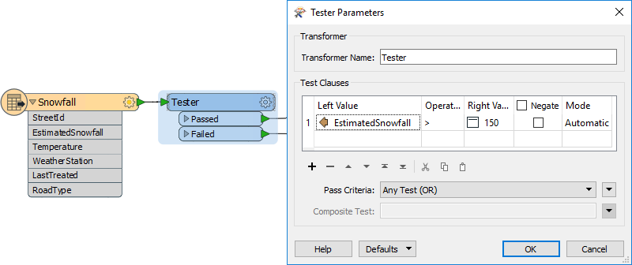
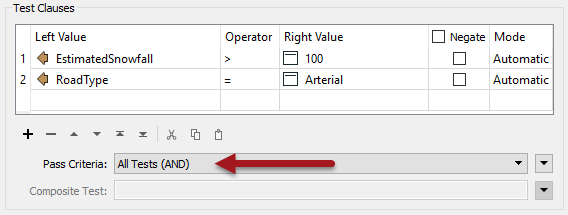
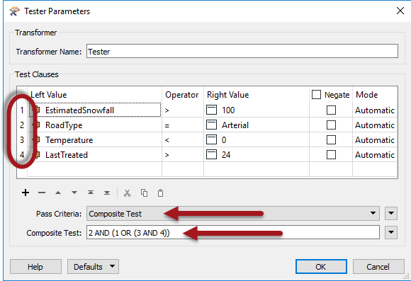
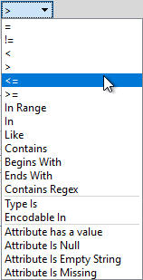
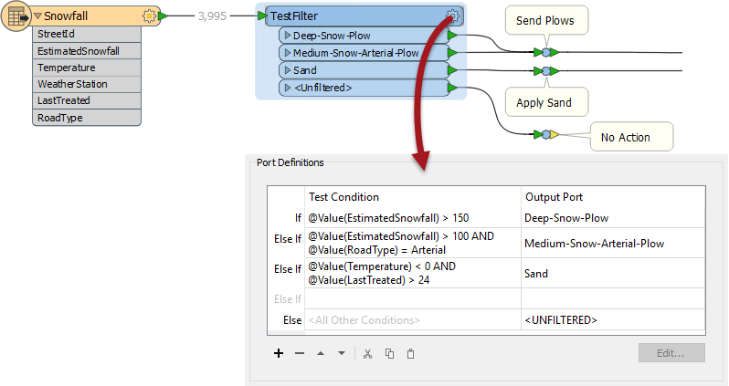

# Tester和TestFilter

Tester和TestFilter是条件过滤的两个关键转换器。它们测试属性值的值。

## Tester

Tester转换器（前30位中的编号1）通常用于产生“是/否”结果的单次测试。

例如，在这里我们希望根据Snowfall属性的值是否大于150毫米（约6英寸）来决定是否将扫雪机发送到特定道路：

如果降雪量大于150，道路要素将通过测试，并将发送扫雪机。

### 多个子句

Tester中的每个子句都是一个允许通过/失败结果的单独测试。例如，以下每个条件可能是单独的测试：

* 有超过100毫米（4英寸）的降雪？
* 这是一条主要道路吗？
* 温度是否低于零摄氏度？
* 沙子上次使用超过24小时了吗？

但是，测试程序允许组合多个测试，其中用户可以使用AND和OR语句组合任意数量的子句。因此，我可能会问：

* 这是一条动脉（主要）道路并且有超过100毫米的雪吗？

Tester还允许使用所谓的复合测试混合AND和OR语句。例如：

* 这是一条主干道AND\(有超过100毫米的雪OR\(温度小于零AND是24小时前\(用沙子\)处理的道路\)\)？

请注意，复合测试中使用的数字是Test Clauses窗口左侧列出的子句编号。

但是 - 无论测试变得多么复杂 - 它仍然会导致单个是/否（二进制）结果; 要素将通过或未通过这组测试。

值得记住的是，我们不仅限于简单的平等测试（A = B）; 在上面，还有“大于”和“小于”的测试。那是因为有许多不同的运算符可用于测试子句。

### 运算符

Tester转换器（或许多其他使用Tester对话框的位置）中可用的运算符列表如下所示：

除了通常的运算符之外，还有一些基于SQL where子句的运算符。这些包括:

* In
* Like
* Contains
* Begins With
* Ends With
* Contains Regex

...还有其他测试可以检查属性和值的存在：

* 属性有一个值
* 属性为空
* 属性为空字符串
* 属性缺失

|  技巧 |
| :--- |
|  “属性有一个值”与其他三个测试相反; 即此属性不是空，并且它不是空字符串，并且它不会丢失。顺便提一下，“缺失”表示该属性在被测试的要素上根本不存在。 |

<table>
  <thead>
    <tr>
      <th style="text-align:left">技巧</th>
    </tr>
  </thead>
  <tbody>
    <tr>
      <td style="text-align:left">
        
“包含正则表达式”（Contains Regex）表示只需要匹配字符串的一部分。例如...

        
即整个字符串不需要匹配。

      </td>
    </tr>
  </tbody>
</table>## TestFilter

TestFilter（前30名中的＃8）允许测试许多条件，每个条件都可以有许多测试条款。每个条件都有一个输出端口，还有一个额外的输出端口，用于在所有测试条件下失败的要素。

TestFilter与编程或脚本语言中的CASE或SWITCH命令非常相似。在Workbench中它看起来像这样：

请注意，有多个条件，每个条件都有一个输出端口。每个条件/端口组合相当于一个Tester转换器; 因此，TestFilter是将多个Tester转换器合而为一的好方法。

TestFilter输出端口可以给出自定义名称，而不是简单的PASSED / FAILED，这是该转换器相比Tester的另一个优势。

TestFilter具有Tester可用的全套运算符，例如相等，大于，小于等等。每个条件依次进行测试。

通过的要素通过匹配的输出端口输出。失败的要素将发送到列表中的下一个条件。因此，以正确的顺序获得条件非常重要。

<table>
  <thead>
    <tr>
      <th style="text-align:left">Intuitive修女说......</th>
    </tr>
  </thead>
  <tbody>
    <tr>
      <td style="text-align:left">
        
TestFilter非常适合通过一系列级联条件过滤要素，例如，这里有一组测试可以再次确定是否派出扫雪机：
           
           - 降雪量超过150毫米？
           - 降雪量超过100毫米并且这是一条干道吗？
           - 温度是否低于零摄氏度并且是否超过24小时前最后施加的沙子？

        

           
           这是一套级联测试，因为如果有超过150毫米的雪，扫雪机就会被送出去; 您不需要测试任何其他条件。因此测试顺序非常重要。如果每次测试都失败，那么扫雪机不会派出。
           
           另请注意，您可以包含复合测试（包含ANDs或OR的测试）。

      </td>
    </tr>
  </tbody>
</table>如果使用上面的降雪示例，您使用了三个Tester转换器，则可以节省工作区画布上的空间，通过仅使用一个TestFilter替换该设置。

|  厨师Bimm说...... |
| :--- |
|  因为TestFilter可以执行单个测试（以及多个测试），所以可以完全使用它而不是Tester转换器。 |

