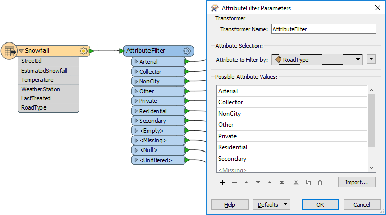
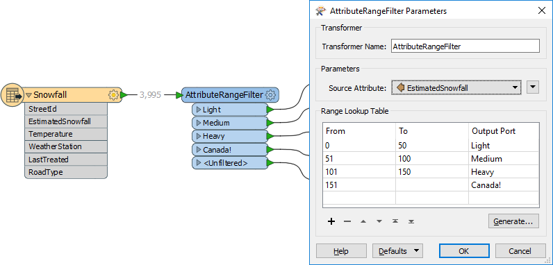
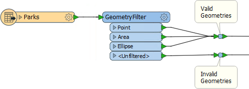
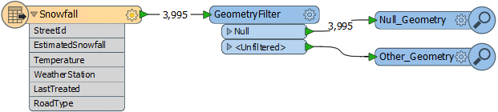

# 其他主要滤波器转换器

Tester和TestFilter不是唯一有用的滤波转换器。

## AttributeFilter

AttributeFilter转换器（前30个中的＃13）通过所选属性中的值来定向要素。它不是二进制测试（是/否），而是一种为单个属性分隔多个值的方法，例如：

* 那条道路是主干道，联络道路，非城市的，其他，私人的，住宅区道路还是二级公路 ？

如果您使用七个Tester转换器来分隔这些数据，则可以节省工作区画布上的空间，并仅使用一个TestFilter替换该设置。

|  Intuitive修女说...... |
| :--- |
|  在几乎所有使用多个Tester变换器的场景中，可以使用不同的过滤转换器来实现相同的结果，但在画布上使用的空间要少得多。 |

AttributeFilter也可以使用处理数值; 但是，它唯一的“运算符”是求等价\(=\)，所以你会很少用它来进行算术测试。在这种情况下，更好的解决方案是AttributeRangeFilter。

## AttributeRangeFilter

AttributeRangeFilter执行与AttributeFilter相同的操作，除了它可以处理一系列数值而不是简单的一对一匹配。

例如，我们可能希望根据一系列降雪值来分离数据，如下所示：

请注意，AttributeRangeFilter参数对话框有一个Generate按钮，可以从一组用户定义的区段自动生成范围。

## GeometryFilter

GeometryFilter（前30名中的＃22）基于几何类型定向要素; 例如，点，线，面，椭圆：

它甚至可以根据空几何对象（表格记录）过滤数据：

GeometryFilter对以下内容非常有用：

* 过滤掉不需要的几何类型; 例如，在使用AreaBuilder转换器之前删除非线性要素
* 根据允许类型列表验证几何对象; 例如，数据集被约束到点或面要素（上图）
* 划分几何类型以写入单独的目标要素类型; 例如，写入到有几何限制的格式（如Esri Shapefile）时

|  来自Interopolis的Confused说...... |
| :--- |
|  亲爱的Interop阿姨， 如果Tester，TestFilter和AttributeFilter都根据属性条件过滤要素，那么有什么区别？我什么时候会用到它们？ |

|  Interop阿姨说...... |
| :--- |
|  亲爱的Confused 最好的解决方案是在Safe Software博客上查看这两篇文章： - [FME中的条件处理](https://blog.safe.com/2013/03/fmeevangelist113/)  - [FME过滤转换器的简单指南](https://blog.safe.com/2015/05/fmeevangelist133/) 我还做了一个有用的表格: |

|  | 单一测试 | 多个测试 | 测试类型 | 运算符 | 属性 |  |  |  |
| :--- | :--- | :--- | :--- | :--- | :--- | :--- | :--- | :--- |
|  | 单一 子句 | 多个 子句 | 单一 子句 | 多个 子句 | 字符串 | 数字 |  |  |
| Tester | Y | Y | - | - | Y | Y | 16 | 多个 |
| TestFilter | Y | Y | Y | Y | Y | Y | 16 | 多个 |
| AttributeFilter | Y | Y | - | - | Y | - | 1 | 1 |
| AttributeRangeFilter | Y | Y | - | - | - | Y | 6 | 1 |

