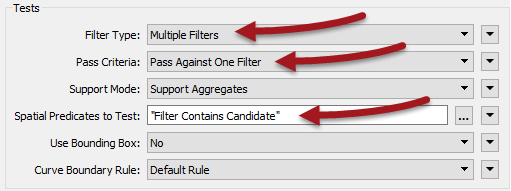

# 练习：噪音控制法律项目

|  练习3 |  噪声控制法项目（空间过滤） |
| :--- | :--- |
| 数据 | 地址（文件地理数据库） 分区（MapInfo TAB） 道路（AutoCAD DWG） |
| 总体目标 | 查找主干道50米范围内的所有住宅地址 |
| 演示 | 条件过滤的方法 |
| 启动工作空间 | C:\FMEData2018\Workspaces\DesktopBasic\Transformers-Ex3-Begin.fmw |
| 结束工作空间 | C:\FMEData2018\Workspaces\DesktopBasic\Transformers-Ex3-Complete.fmw |

众所周知，市议员投票决定修改噪音控制法，生活在受影响地区的居民必须了解这些变化。

您的经理建议您接受任务，并且有一个紧迫的截止日期。

在项目的第一部分中，您创建了一个工作空间，用于将地址从地理数据库转换为Excel，同时映射模式。

该练习是该项目的第二部分：定位所有受影响的居民。您必须在距主要高速公路50米范围内找到所有单户住宅，并从地址数据流中过滤掉所有其他住宅。

  
**1）启动Workbench**  
 启动Workbench（如有必要）并从练习2打开工作空间。或者，您可以打开C：\ FMEData2018 \ Workspaces \ DesktopBasic \ Transformers-Ex3-Begin.fmw

工作空间已有一个FeatureReader用于读取地址，转换器用于编辑地址模式，还有一个写模块用于将数据写入Excel电子表格。

  
**2）添加读模块（道路数据）**  
使用读模块&gt;添加读模块为道路数据添加读模块。道路数据将用于确定与主干路线的距离。

| 读模块格式 | Autodesk AutoCAD DWG / DXF |
| :--- | :--- |
| 读模块数据集 | C:\FMEData2018\Data\Transportation\CompleteRoads.dwg |

出现提示时，仅选择名为Arterial的要素类型（图层）。

  
**3）添加读模块（分区数据）**  
使用Readers&gt; Add Reader为分区数据添加读模块。分区数据将用于确定地址是否是单户住宅。

| 读模块格式 | MapInfo TAB（MITAB） |
| :--- | :--- |
| 读模块数据集 | C:\FMEData2018\Data\Zoning\Zones.tab |

随着属性列表的折叠，工作空间现在看起来是这样的：

请随意检查所有源数据，以熟悉其内容。您甚至可以运行工作空间以确保所有缓存都是最新的。

  
**4）添加Tester转换器**  
将Tester转换器添加到Zoning 要素类型。

该Tester将用于过滤其他分区的住宅区。所有单户住宅区都将以RS开头，因此Tester应如下设置：

重要的是使用“Begins With”运算符设置测试。

|  Vector小姐说...... |
| :--- |
|  所以...为什么是Tester呢？为什么不使用AttributeFilter？[你知道吗？](http://52.73.3.37/fmedatastreaming/Manual/QAResponse2017.fmw?chapter=5&question=5&answer=1&DestDataset_TEXTLINE=C%3A%5CFMEOutput%5CQAResponse.html) |

  
**5）连接到FeatureReader**  
过滤数据的一种方法是使用SpatialFilter转换器，我们将使用道路要素来做这件事。但另一种方法是在FeatureReader转换器中使用过滤。

因此，删除Creator转换器并将Tester：Passed端口连接到FeatureReader：Initiator端口：

  
**6）设置FeatureReader**  
现在检查FeatureReader的参数。将Spatial Filter参数设置为_Initiator Contains Result：_

这可确保只从数据库中读取属于单户居民区域的地址。确保打开要素缓存并运行工作空间。检查Tester:Passed和FeatureReader:PostalAddress缓存以确认结果是否正确。

  
**7）添加Bufferer**  
现在我们可以确定哪个过滤地址落在主干路线的50米范围内。这次我们将使用SpatialFilter转换器。

SpatialFilter没有“在X距离内”的测试，因此我们必须对它进行一些不同的设置。将Bufferer转换器添加到工作空间。将它连接到干道道路数据：

将Bufferer缓冲区数量参数设置为50。

|  技巧 |
| :--- |
|  您可以选择在Bufferer之后添加Dissolver转换器，以将所有缓冲区要素合并在一起。  转换结果将相同（就所选地址而言），但数据在FME Data Inspector中看起来会更好。 |

  
**8）添加SpatialFilter**  
添加SpatialFilter转换器。buffered的主干路线是Filter.。Candidate端口可以连接在FeatureReader和AttributeSplitter之间：

这样，AttributeSplitter和AttributeManager仅在过滤的要素上运行。如果在AttributeManager之后连接了SpatialFilter，则数据将被处理然后被丢弃。

  
**9）设置SpatialFilter参数**  
设置SpatialFilter参数，如下所示：

| 过滤类型 | 多个过滤器 | 有多个缓冲多边形 |
| :--- | :--- | :--- |
| 通过标准 | 通过一个过滤器 | 单个地址不能存在于**所有**缓冲区中 |
| 空间谓词测试 | 过滤器包含候选者Filter Contains Candidate | 查找主干缓冲区中包含的地址 |

也就是说，有多个道路缓冲区，但地址只需要在一个缓冲区内传递，而不是全部。

**10）运行工作空间**  
使用SpatialFilter上的**“从此运行”**运行工作空间。检查缓存输出以证明只有单户家庭区域和主干道路缓冲区内的地址已通过过滤过程。

**11）设置事件\(Event\)字段**  
最后一步，打开Excel写模块的“要素类型”对话框，单击“用户属性”选项卡，然后为“事件”字段设置固定值：

关闭缓存，重新运行工作空间，并检查输出以确认数据集已正确写入。电子表格中应该有148条记录，随时可以发送给管理部门进行批量邮寄。

<table>
  <thead>
    <tr>
      <th style="text-align:left">恭喜</th>
    </tr>
  </thead>
  <tbody>
    <tr>
      <td style="text-align:left">
        
通过完成本练习，您已学会如何：
           
        

        <ul>
          <li>使用Tester转换器按属性值过滤</li>
          <li>使用FeatureReader转换器中的空间过滤器选项</li>
          <li>使用Bufferer转换器设置“在x距离内”测试</li>
          <li>使用SpatialFilter转换器按几何对象过滤</li>
        </ul>
      </td>
    </tr>
  </tbody>
</table>