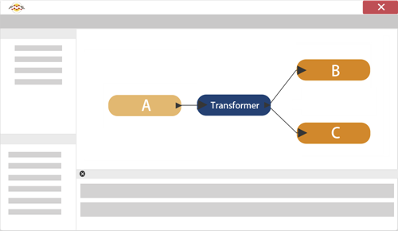
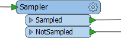
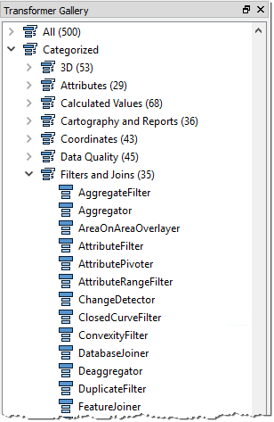

# 条件过滤

过滤转换器不会转换数据内容，但调查表明它们是最常用的转换器类型！

## 什么是过滤？

过滤是在数据流经工作空间时细分数据的技术。在这种情况下，转换器有多个输出连接，每个输出都承载要以不同方式处理的数据。这里（例如）传入流A被过滤成两个新流B和C：

过滤转换器可以是具有多个输出端口的任何转换器，例如GeometryFilter或Sampler转换器，后者创建数据样本选择并通过Sampled和NotSampled输出端口将其分离：

但是，这些大多是内置的固定测试。条件过滤是决定哪些要素输出到哪个连接由_某种形式_的用户定义的测试或条件决定的。Tester转换器就是最明显的例子。它执行测试并具有不同的输出端口，用于通过和未通过测试的要素。

## 过滤转换器

“过滤和连接”类别中的许多转换器执行这些测试并根据结果重定向数据：

尽管Tester变换器是此类别中使用最多的变换器，但还有许多其他变换器，例如TestFilter, GeometryFilter, AttributeFilter, SpatialFilter, and Sampler。

|  Vector小姐说... |
| :--- |
|  是时候快速提问了。过滤和连接类别中有多少个过滤转换器出现在前30个最有价值转换器列表中？  [1. 一 \(1\)](http://52.73.3.37/fmedatastreaming/Manual/QAResponse2017.fmw?chapter=5&question=4&answer=1&DestDataset_TEXTLINE=C%3A%5CFMEOutput%5CQAResponse.html) [2. 四 \(4\)](http://52.73.3.37/fmedatastreaming/Manual/QAResponse2017.fmw?chapter=5&question=4&answer=2&DestDataset_TEXTLINE=C%3A%5CFMEOutput%5CQAResponse.html) [3. 七 \(7\)](http://52.73.3.37/fmedatastreaming/Manual/QAResponse2017.fmw?chapter=5&question=4&answer=3&DestDataset_TEXTLINE=C%3A%5CFMEOutput%5CQAResponse.html) [4. 十 \(10\)](http://52.73.3.37/fmedatastreaming/Manual/QAResponse2017.fmw?chapter=5&question=4&answer=4&DestDataset_TEXTLINE=C%3A%5CFMEOutput%5CQAResponse.html) |

