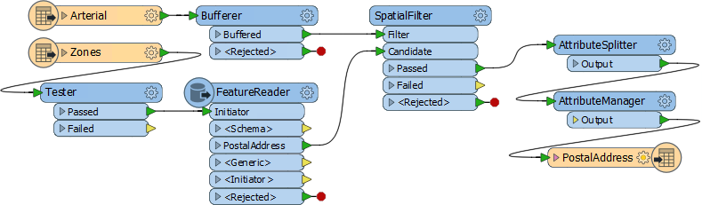
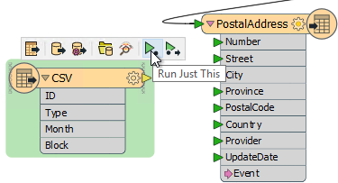
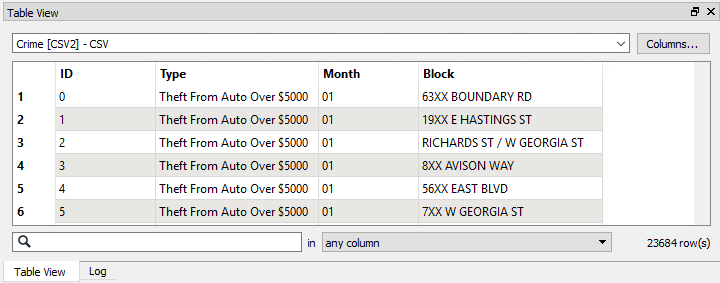
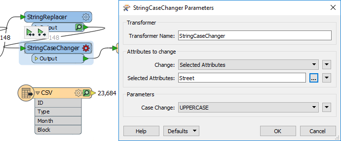
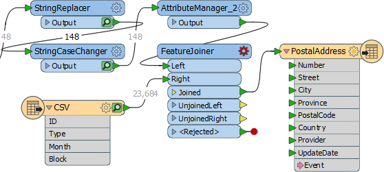
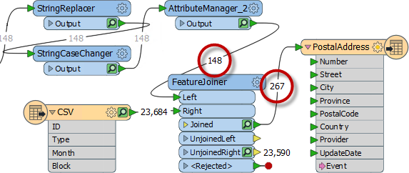
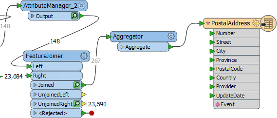
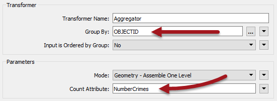
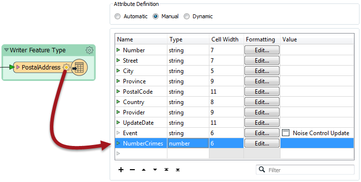

# 练习：犯罪映射数据请求

|  练习4 |  噪音控制法项目（犯罪数据加入） |
| :--- | :--- |
| 数据 | 犯罪统计（CSV） |
| 总体目标 | 在犯罪统计数据和地址要素之间进行连接 |
| 演示 | 基于属性的连接 |
| 启动工作空间 | C:\FMEData2018\Workspaces\DesktopBasic\Transformers-Ex4-Begin.fmw |
| 结束工作空间 | C:\FMEData2018\Workspaces\DesktopBasic\Transformers-Ex4-Complete.fmw |

如你所知，市议员投票决定修改噪音控制法，生活在受影响地区的居民被告知这些变化。。

在项目的第一部分中，您创建了一个工作空间，用于将地址从地理数据库转换为Excel，同时映射模式。在项目的第二部分，您继续工作空间，找到距离主要高速公路50米范围内的所有单户住宅，并从地址数据流中过滤掉所有其他住宅。

现在，一家全国性报纸的数据记者担心，放宽噪音控制法可能会导致该市犯罪率上升。因此，他们要求每个受影响地址的最近犯罪数字。他们打算将此与未来数据进行比较，看看他们的理论是否正确。

该请求是对该城市开放数据政策的重要考验，并且不存在不遵守的问题。然而，由于当前的犯罪数据集（CSV，非空间）没有以任何方式加入地址数据库，因此出现了危机。

因此，对于该项目的最后部分，您必须采用现有的噪声控制工作空间并对其进行修改以纳入犯罪统计数据。

完成这个任务，你就会成为一个空间超级英雄!

  
**1）启动Workbench**  
 启动Workbench（如有必要）并从练习3打开工作空间。或者，您可以打开C：\ FMEData2018 \ Workspaces \ DesktopBasic \ Transformers-Ex4-Begin.fmw

工作空间已设置为读取地址，在空间上过滤它们，并将它们写入Excel电子表格。

[](https://github.com/safesoftware/FMETraining/blob/Desktop-Basic-2018/DesktopBasic4Transformers/Images/Img4.225.Ex4.StartingWorkspace.png)

  
**2）添加读模块**  
现在让我们开始处理犯罪数据。使用FeatureReader没有任何好处，因此使用菜单栏中的“读模块”&gt;“添加读模块”将读模块添加到工作空间。使用以下参数：

| 读模块格式 | 逗号分隔值（CSV） |
| :--- | :--- |
| 读模块数据集 | C:\FMEData2018\Data\Emergency\Crime.csv |
| 读模块参数 | 字段:分隔符字符:,\(逗号\) 字段:字段名称行:1 |

  
**3）检查数据**  
下一个任务是熟悉源数据。启用要素缓存并使用Run Just This运行CSV读模块：

[](https://github.com/safesoftware/FMETraining/blob/Desktop-Basic-2018/DesktopBasic4Transformers/Images/Img4.226.Ex4.CSVRunJustThis.png)

检查缓存的数据。它将在Data Inspector表视图窗口中显示如下：

[](https://github.com/safesoftware/FMETraining/blob/Desktop-Basic-2018/DesktopBasic4Transformers/Images/Img4.224.Ex4.SourceCSV.png)

注意没有这样的空间数据，但是有一个块号。

|  警察局长Webb-Mapp说...... |
| :--- |
|  犯罪？！在我的城市？我想不是。但如果有......请注意，7XX W Georgia Street意味着安大略街以西乔治亚街的第七个街区，覆盖700-800号楼。7XX E Georgia Street距离安大略省东部第七个街区14个街区。明白了吗？ |

您可能已经发现每个地址要素都有一个数字（不是像“7XX”那样的块ID），并且道路数据以首字母大写（“W Georgia St”）存储在道路数据集中，而犯罪数据集是大写（“W GEORGIA ST”）。

这两者都会使两组数据加在一起变得更加困难，但并非不可能。

  
**4）添加StringReplacer**  
要合并数据，我们需要将地址编号减少到与结构中的犯罪数据匹配的块编号; 例如，我们需要74XX而不是7445。

因此，添加StringReplacer转换器并在AttributeManager和PostalAddress要素类型之间进行连接。

设置以下参数：

| 属性 | 数字 |
| :--- | :--- |
| 模式 | 替换正则表达式 |
| 要替换的文本 | ..$ |
| 替换文本 | XX |

此要替换的文本（.. $）表示替换字符串的最后两个字符，并将它们替换为XX以匹配犯罪数据。

[](https://github.com/safesoftware/FMETraining/blob/Desktop-Basic-2018/DesktopBasic4Transformers/Images/Img4.227.Ex4.StringReplacerDialog.png)

运行工作空间（使用StringReplacer上的_Run to This_）并检查缓存以确保转换器按预期工作。

  
**5）添加StringCaseChanger**  
犯罪/道路数据的另一个区别在于大写/ 首字母大写街道名称。可以使用StringCaseChanger转换器修复此差异。

在StringReplacer之后添加一个StringCaseChanger转换器并设置参数以将Street的值更改为大写：

[](https://github.com/safesoftware/FMETraining/blob/Desktop-Basic-2018/DesktopBasic4Transformers/Images/Img4.228.Ex4.StringCaseChanger.png)

|  Vector小姐说...... |
| :--- |
|  那么，回答我。为什么我们使用StringCaseChanger而在地址数据上（改为大写）不是更改犯罪数据（到首字母大写）？[你知道吗？](http://52.73.3.37/fmedatastreaming/Manual/QAResponse2017.fmw?chapter=5&question=7&answer=1&DestDataset_TEXTLINE=C%3A%5CFMEOutput%5CQAResponse.html) |

  
**6）构建连接密钥**  
更新了属性以匹配犯罪数据，我们现在必须构造建一个密钥。

在StringCaseChanger之后将AttributeManager添加到画布。创建一个名为JoinKey的新属性。打开属性的文本编辑器，然后输入（选择）：

```text
@Trim（@Value（Number）@Value（Street））
```

这将匹配犯罪数据的结构（确保在两个属性之间包含空格字符）。Trim函数用于确保这些属性上没有多余的空格。

  
**7）添加FeatureJoiner**  
现在我们已经整理了连接键的结构，我们可以用FeatureJoiner将数据合并在一起。

将FeatureJoiner添加到画布。

将地址数据（AttributeManager输出）连接到左输入端口。将犯罪数据（CSV读模块要素类型）连接到右输入端口。

将FeatureJoiner:Joined输出端口连接到PostalAddress写模块要素类型：

[](https://github.com/safesoftware/FMETraining/blob/Desktop-Basic-2018/DesktopBasic4Transformers/Images/Img4.229.Ex4.FeatureJoinerCanvas.png)

检查FeatureJoiner的参数。

对于Join Mode，选择_Left_。这意味着我们希望输出所有地址，无论它们是否与犯罪记录相匹配。

在Join On参数中，为Left值选择JoinKey属性，为Right值选择Block属性。

运行工作空间的该部分以查看此转换的结果。

  
**8）添加Aggregator**  
有趣的是，尽管有148个地址进入FeatureJoiner，但却有267个地址出现：

[](https://github.com/safesoftware/FMETraining/blob/Desktop-Basic-2018/DesktopBasic4Transformers/Images/Img4.230.Ex4.FeatureJoinerResults.png)

那是因为每个区块有多个犯罪，并且数据有267个匹配。

我们可以使用Aggregator转换器将这些数据聚合在一起。因此，在FeatureJoiner：Joined端口之后放置一个Aggregator转换器：

[](https://github.com/safesoftware/FMETraining/blob/Desktop-Basic-2018/DesktopBasic4Transformers/Images/Img4.231.Ex4.AggregatorOnCanvas.png)

检查参数。我们需要通过选择将匹配回原始地址的属性来设置group-by参数。每个地址都没有ID，因为我们在上一步中删除了它们，因此：

* 返回到AttributeManager，撤消OBJECTID的Remove选项，并使用OBJECTID作为Aggregator分组
* 使用UpdateDate作为 Aggregator 分组（因为每个地址都将收到一个唯一的时间戳）

然后将Count属性设置为NumberCrimes的值：

[](https://github.com/safesoftware/FMETraining/blob/Desktop-Basic-2018/DesktopBasic4Transformers/Images/Img4.232.Ex4.AggregatorParams.png)

如果展开PostalAddress写模块的属性，您会注意到没有出现NumberCrimes。当我们在之前的练习中编辑此写模块的用户属性时，我们将其属性定义从自动更改为手动。这意味着它不会自动更新以添加转换期间创建的新属性。因此，我们必须切换回自动（这会带来许多其他不需要的属性），或者只是在这里添加一个名为NumberCrimes的新属性。给它类型“数字”和单元格宽度6.来自Aggregator的数据现在将在写模块上有它的属性。

  
**9）写入数据**  
现在我们知道工作空间正常运行，关闭要素缓存。没有必要为生产中的工作空间缓存所有内容。

现在，通过添加NumberCrimes属性来编辑PostalAddress属性模式：

[](https://github.com/safesoftware/FMETraining/blob/Desktop-Basic-2018/DesktopBasic4Transformers/Images/Img4.233.Ex4.AddCrimesAttr.png)

最后，重新运行工作空间并在Data Inspector中检查结果。数据将包括犯罪数量，并且重新处理属性意味着单个地址也被匿名化了。这很重要，因为这些数据正在公开。

<table>
  <thead>
    <tr>
      <th style="text-align:left">恭喜</th>
    </tr>
  </thead>
  <tbody>
    <tr>
      <td style="text-align:left">
        <p>通过完成本练习，您已学会如何：
          <br />
        </p>
        <ul>
          <li>预处理数据以获得具有匹配结构的连接键</li>
          <li>构建一个用于FeatureJoiner的连接键</li>
          <li>使用FeatureJoiner中的连接键加入非空间数据</li>
          <li>使用一个Aggregator 转换器来合并连接并计算连接数</li>
        </ul>
      </td>
    </tr>
  </tbody>
</table>