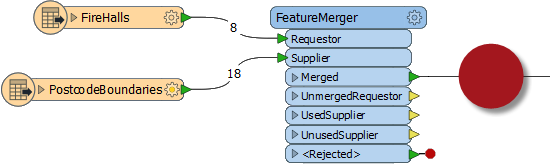

# Q + A答案

 问题

以下是本章问题的答案。

 Vector小姐说......

以下哪一项不属于转换器？ &lt;/font&gt;&lt;/font&gt;  
  
1.属性&lt;/font&gt;  
2.计算&lt;/font&gt;  
3.数据质量&lt;/font&gt;  
4.工作流程

&lt;/font&gt;&lt;/font&gt;&lt;/td&gt; &lt;/tr&gt; &lt;/tbody&gt;&lt;/table&gt;

 Vector小姐说......

这里有四个转换器和四个类别。&lt;/font&gt;将转换器与正确的类别匹配。

&lt;/font&gt;&lt;/font&gt;&lt;/td&gt; &lt;/tr&gt;

| 场景 |
| :--- |

| 工具 |
| :--- |

| Chopper |
| :--- |

| 几何对象 |
| :--- |

| Terminator |
| :--- |

| 工作流程 |
| :--- |

| Matcher |
| :--- |

| 数据质量 |
| :--- |

| DateTimeConverter |
| :--- |

| 字符串 |
| :--- |

您是否通过转换器库查找这些？&lt;/font&gt;更快捷的方法是查看转换器的帮助页面。在我们讨论这个话题的时候，转换器可以属于不止一个类别。DateTimeConverter（例如）属于字符串和计算值。

&lt;/font&gt;&lt;/font&gt;&lt;/td&gt; &lt;/tr&gt; &lt;/tbody&gt;&lt;/table&gt;

 Vector小姐说......

查看编辑对话框的屏幕截图，告诉我返回属性的值是： &lt;/font&gt;1. 2 + 22. 43. 4.04.错误！关键是要注意这个对话框的标题是“字符串编辑器\(String Editor\)”。因此，返回此属性的值将是文字字符串“2 + 2”。如果用户希望添加2 + 2来获得4，他们应该使用算术编辑器！

&lt;/font&gt;&lt;/font&gt;  
  
   
  
  
  
  
  
  
&lt;/td&gt; &lt;/tr&gt; &lt;/tbody&gt;&lt;/table&gt;

 Vector小姐说......

过滤和连接类别中有多少转换器出现在前30个最有价值转换器列表中？ &lt;/font&gt;&lt;/font&gt;  
  
1. 1&lt;/font&gt;  
2. 4&lt;/font&gt;  
3. 7&lt;/font&gt;  
4. 10&lt;/font&gt;  
  
截至2018年1月（FME 2018.0）有十个。它们是Tester（第1个），FeatureMerger（第4个），TestFilter（第8个），Aggregator（第12个），AttributeFilter（第13个），FeatureReader（第14个），SpatialFilter（第21个），GeometryFilter（第22个），DuplicateFilter（第27个）和Sampler （第28个）。因此，三分之一的顶级转换器来自过滤和连接类别！

&lt;/font&gt;&lt;/font&gt;&lt;/td&gt; &lt;/tr&gt; &lt;/tbody&gt;&lt;/table&gt;

 Vector小姐说......

所以...为什么是Tester呢？&lt;/font&gt;为什么不使用AttributeFilter？&lt;/font&gt;  
  
因为我们只需要以简单的Yes / No格式测试一个值。AttributeFilter更适合测试多个值。此外，AttributeFilter不允许我们进行"以...开始（Begins With）"测试。

&lt;/font&gt;&lt;/font&gt;&lt;/td&gt; &lt;/tr&gt; &lt;/tbody&gt;&lt;/table&gt;

 Vector小姐说......

 看看下面的屏幕截图，然后回答输出连接中会出现多少要素......  
  
  
  
 1. 8  
2. 18  
3. 26  
4. 说不清楚  
  
从截图中看出是不可能的，因为你不知道有多少属性值是匹配的。因为有八个消防站，它将从0到8，但这就是我们能了解的全部。事实上，如果它是一个FeatureJoiner转换器，那么如果每个消防站都与每个邮政编码边界相匹配，那么可能会有多达144个匹配！

 Vector小姐说......

为什么我们在道路数据上使用StringCaseChanger（将其更改为大写）而不是在犯罪数据上使用（将其更改为首字母大写）？ &lt;/font&gt;&lt;/font&gt;  
  
因为大写更容易匹配，并且没有坏数据的风险。如果在原始数据中错误地将块标记为W Georgia ST，则首字母大小写匹配将失败。不会发生大写转换。&lt;/font&gt;  
  
另外，请确保不要将StringCaseChanger（更改属性值）与BulkAttributeRenamer（更改属性名称）混淆！

&lt;/font&gt;&lt;/font&gt;&lt;/td&gt; &lt;/tr&gt; &lt;/tbody&gt;&lt;/table&gt;

 &lt;/article&gt;

## &lt;/div&gt;

