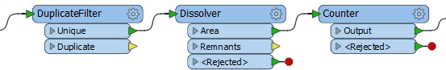
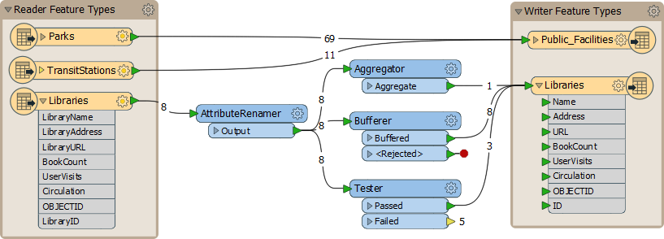
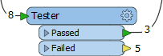

# 工作流

# 串联转换器

与电路中的一组元件非常相似，可以连接一系列Workbench转换器，以对一组要素产生累加效应。

即使FME中有大量转换器，用户也经常需要组合-或转换器链-而不是单个转换器。

一系列以图形方式表示整体工作流的转换器是FME的一个重要概念：

在此示例中，DuplicateFilter转换器删除重复的多边形要素。Dissolver转换器将每个剩余（唯一）多边形与其邻域合并，其中存在公共边界。最后，每个合并区域从Counter转换器获得一个ID号。

# 并联转换器

***流***是由工作空间中的连接表示的数据流。FME中的一个关键概念是能够在工作空间内拥有多个并行流。

## 多个流

当用户需要以多种不同方式处理相同数据时，多个流非常有用。工作空间作者可以根据需要将一个流转换为多个，或将多个数据流合并为一个：

在这里，作者正在创建三个数据流，每个数据流分别处理，然后组合回一个流。

## 创建多个流

可以通过多种方式创建多个数据流。有时，具有多个输出端口的转换器（Tester转换器就是一个很好的例证）将使用几种可能的输出流来划分（或过滤）数据：

这里的数据分为两个流，其中一个流与任何东西都没有连接。

此外，只需从单个输出端口进行多个连接即可复制完整的数据流。此方法为每个连接创建一组数据：

这里FME读取八个要素，但由于存在多个连接，因此会创建多个数据副本。

## 将多个流组合在一起

当多个流连接到同一输入端口时，要素会聚合。此操作通常称为*union（并集）*。

这里，三个数据流汇聚成一个写模块要素类型：

在输出数据集中，数据聚合为12个不同的要素。

如果您想以某种方式组合或合并这些要素，则需要执行*join*，也称为*intersection（交集）*。这要求该要素共享一个公共属性或密钥，以此为基础进行连接。例如，如果您有一个包含街区人口统计数据和图书馆地点（包括他们所在街区的属性）的表格，您可以根据他们的共享街区名称属性将人口统计数据表加入图书馆。然后在您的图书馆地点将附近的人口统计数据作为属性。

要执行此数据连接，需要使用特定的转换器，例如[FeatureMerger](http://docs.safe.com/fme/html/FME_Desktop_Documentation/FME_Transformers/Transformers/featuremerger.htm)或[FeatureJoiner]（http：//docs.safe.com/fme/html/FME_Desktop_Documentation/FME_Transformers/Transformers/featurejoiner.htm）。

