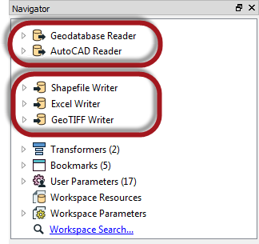
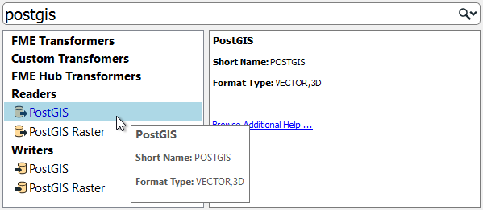
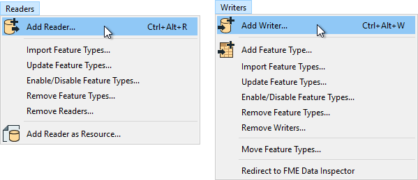
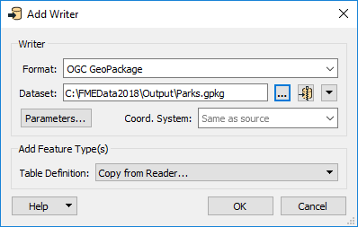
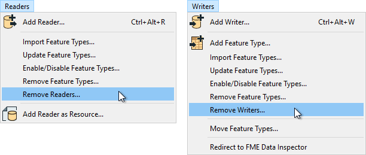
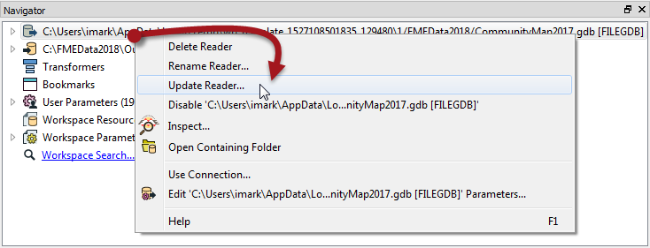
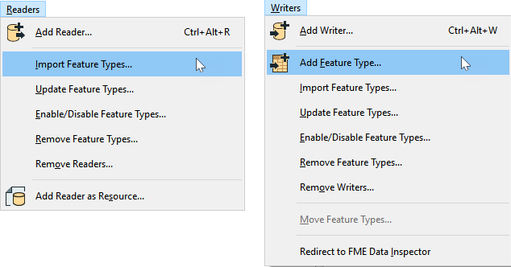

# 多个读模块和写模块

FME工作空间不限于任何特定数量的读模块或写模块；它可以有任意数量的读模块和写模块，使用任意数量的格式，并且不需要包含相同数量的读模块和写模块。

例如，导航窗口显示此工作空间包含两个读模块和三个不同数据类型和格式的写模块！

需要注意的是，读模块和写模块不会以对象的形式出现在工作台画布上。它们的要素类型可以，但是读模块和写模块不能。

相反，它们由“导航”窗口中的条目表示，如上面的屏幕截图所示。

## 添加读模块和写模块

使用“快速添加”菜单将其他读模块或写模块添加到转换中：

...或者从菜单栏中选择Readers>Add Reader（Writers>Add Writer）：

此操作将打开一个对话框，类似于“生成工作空间”对话框，您可以在其中定义新读模块或写模块的参数：

您可以通过这种方式添加任意数量的读模块和写模块。

还可以通过从文件系统资源管理器拖动数据集并将其放到Workbench画布上来添加读模块。

## 删除写模块或读模块

如果不再需要读模块或写模块，则可以使用菜单栏上的选项将其删除：

或者，可以在“导航”窗口中右键单击读模块/写模块，然后选择“删除”选项。

---

## 更新读模块或写模块

可以更新读模块和写模块，以便旧版工作空间具有较新版本的FME中可用的速度和要素。您可以通过在“导航”窗口中右键单击读模块器/写模块并选择“更新”选项来更新转换器：

对于读模块，此工具提供更新读模块或更新读模块要素类型列表的选项。这样，如果源数据发生更改，则可以更新工作空间。更新要素类型的另一种方法是菜单栏上的“读模块”>“更新要素类型”。

# 多种要素类型

添加新的读模块和写模块可以读取或写入新文件。但是，有时您希望将数据读取或写入现有数据集中的其他图层或表。您可以通过添加要素类型来实现此目的。请记住，要素类型属于读模块或写模块。

您可以通过选择“读模块”>“导入要素类型”或“写模块”>“添加要素类型”，将要素类型添加到现有读模块或写模块：

添加读模块要素类型可让您从现有读模块的数据集中读取新图层或表；添加写模块要素类型允许您在现有写模块的数据集中写入新图层或表。

