城市规划者正在进行战略规划，并想知道哪些当地规划区域需要额外的资源。他们要求报告当地规划区域组织的3-1-1请求，并附有表格和图表。

您已决定使用表格和图表创建HTML报告以和他们共享。此任务需要向工作空间添加其他写模块。在本练习中，我们将添加HTML写模块要素类型和转换器以生成HTML报告。

# 1）启动Workbench

启动Workbench（如有必要）并从练习3.3中打开工作空间。或者，您可以打开C：\\FMEData2019\\Workspaces\\IntroToDesktop\\Ex4.1-Begin.fmw。

# 2）添加Excel 写模块  

因为您的经理希望原始数据都包含新模式_和_摘要表，所以我们需要一个新的要素类型来处理StatisticsCalculator的结果。我们把它写回Excel；许多FME工作流都回写为他们读取的相同格式！

单击写模块>添加写模块：

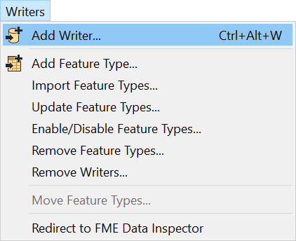

然后填写Add 写模块对话框：

<table style=“border：0px”>

<TR>
<td style=“font-weight：bold”>格式</td>
<td style=“”>Microsoft Excel</td>
</TR>

<TR>
<td style=“font-weight：bold”>数据集</td>
<td style=“”>C：\FMEData2019\Output\Training\311-requests-summary.xlsx</td>
</TR>

<TR>
<td style=“font-weight：bold”>工作表定义</td>
<td style=“”>自动</td>
</TR>

</TABLE>

您的对话框应如下所示：

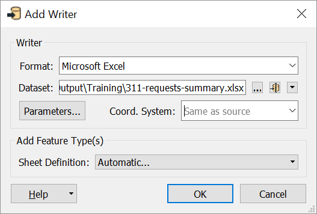

因为我们希望我们的要素类型复制来自StatisticsCalculator Summary端口的属性，所以我们将工作表定义方法从Manual更改为Automatic。使用此模式的要素类型将自动调整其模式以匹配连接的要素。

单击确定。将打开“要素类型”对话框，系统将提示您输入要素类型名称。键入311-requests-summary，然后单击“确定”。

将此新要素类型移动到原始要素类型上方，并将其连接到StatisticsCalculator的Summary输出端口：

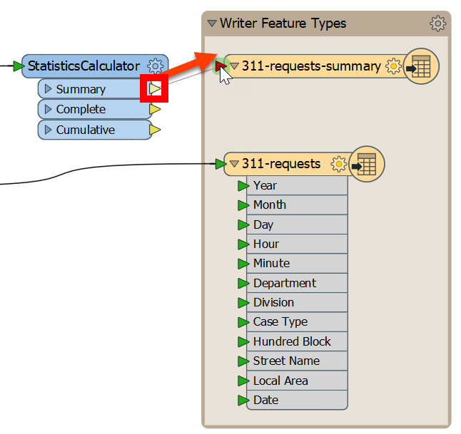

现在我们有一个新的Excel写模块要素类型，它将写出StatisticsCalculator的结果。我们将在下一个练习中使用它。

# 3）添加HTML 写模块

这是添加读模块或写模块的另一种方法：单击画布上的空白区域并键入HTML。您可以使用鼠标或<kbd>↑</kbd>和<kbd>↓</kbd>来浏览“快速添加”菜单。您应该在写模块下看到HTML作为选项列出：

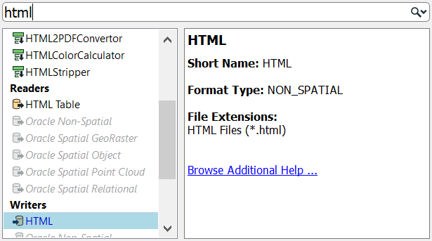

双击它或按<kbd>Enter</kbd>添加HTML写模块。使用以下参数：

<table style=“border：0px”>

<TR>
<td style=“font-weight：bold”>写模块格式</td>
<td style=“”>HTML</td>
</TR>

<TR>
<td style=“font-weight：bold”>写模块 Dataset</td>
<td style=“”>C：\FMEData2019\Output\Training\report.html</td>
</TR>

</TABLE>

您的对话框应如下所示：

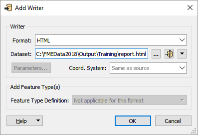

单击“确定”将写模块要素类型添加到画布。单击并拖动以将其移动到311-requests-summary 写模块要素类型上方：

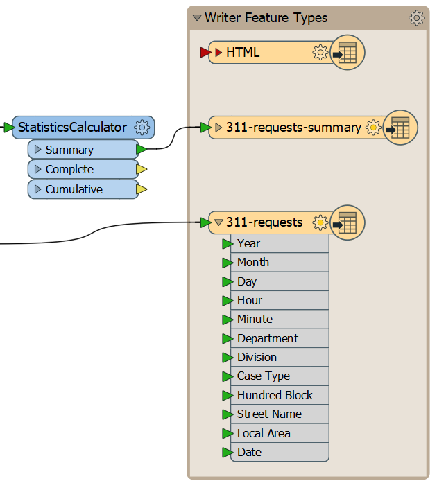

# 4）添加HTMLReportGenerator

要创建HTML报告，我们将使用HTMLReportGenerator。我们想在StatisticsCalculator之后添加它，因此它使用我们的汇总数据，但我们不想写出Excel。所以，我们将分支我们的数据流。添加HTMLReportGenerator并将其连接到StatisticsCalculator的Summary端口。然后，将HTMLReportGenerator的输出端口连接到HTML写模块要素类型：

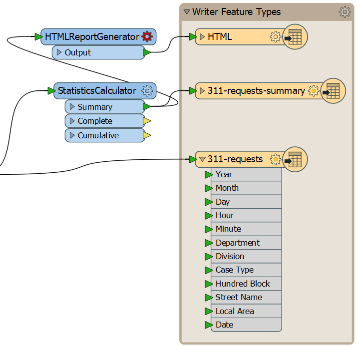

双击HTMLReportGenerator以打开其参数。首先，将分组依据设置为`Local Area`。这样做会告诉转换器分别为每个局部区域创建一个报告。

接下来，单击“页面内容”下的“图表（条形）”。此表用于向报表添加元素。从下拉列表中选择标题：

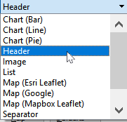

单击“内容设置”下的某个位置以更新“标题”块的参数。对于文本，选择`Local Area`属性。对于Header Level，选择H1。这些设置为我们提供了报告的每个部分中带有本地区域名称的标题。您的对话框应如下所示：

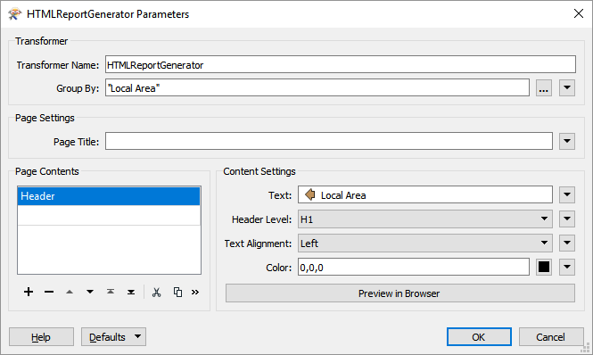

单击“页面内容中的页眉”下的单元格，然后从下拉列表中选择“表格”：

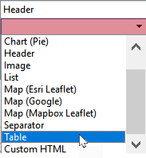

单击“内容设置”下的某个位置以更新表块的参数。在列设置下，我们将创建两个列，一个用于Department，另一个用于Cases。请注意，如果在“列名”中键入“Department”或“Cases”，FME将自动选择属性值而不是常量。要解决此问题，请右键单击该单元格，然后选择“打开文本编辑器”，然后键入该列的名称。此方法将存储常量值，而不是提供属性。您的对话框应如下所示：

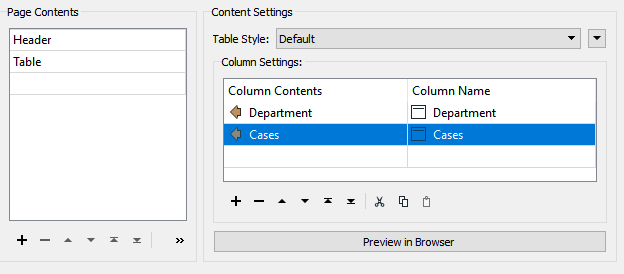

这些设置将生成一个HTML表，按部门列出案例数。

最后，让我们在页面内容中添加一个图表（条形图）。填写如下参数：

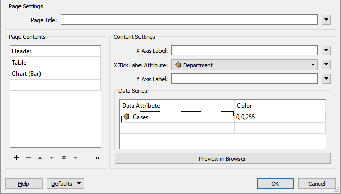

单击确定。您可以在HTMLReportGenerator上运行到此并检查缓存，但您将能够看到的只是Data Inspector中的原始HTML。我们需要将这些数据写入HTML文件，以便在浏览器中查看。

# 5）保存你的工作空间

不要忘记定期保存工作空间。

# 6）查看您的HTML报告

单击HTML要素类型，然后选择“运行至此”。运行后，单击“打开包含文件夹”按钮以打开C：\FMEData2019\Output\Training\。你应该看到`reports.html`。使用首选的Web浏览器打开它以检查标题，表格和图表：

<UL>
<li>与多个写模块一起工作</li>
<li>使用HTMLReportGenerator生成报告</li>
</UL>

