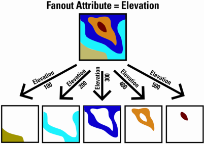
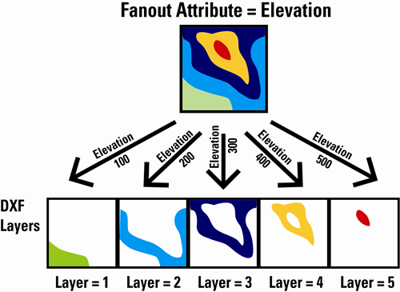
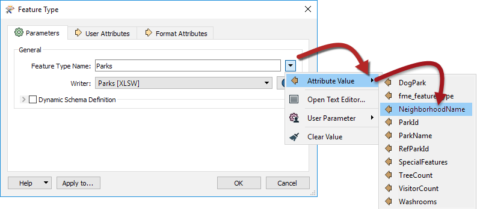
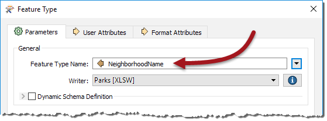
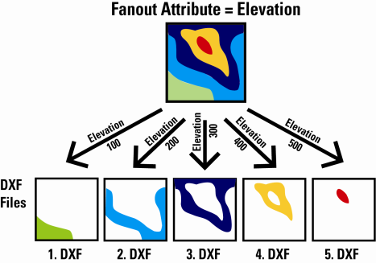
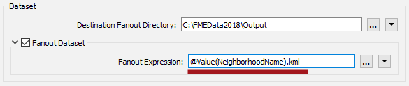

# 扇出

扇出是FME中最强大的功能之一，能够以最小的努力产生令人印象深刻的结果。

## 什么是扇出？

**扇出**是应用于FME中的写模块的工具。它们是工作空间作者写入数据的一种方式，这些数据被划分为输出数据集中的要素组。

这些组由单个属性的值或由属性和固定字符串的组合构成的字符串定义。

例如，这里作者根据一个要素的高程属性将一组数据“扇出”到多个输出中:：

由于在写入数据时会发生扇出，因此在工作空间内不需要多个数据流。因此，这种技术可以轻松创建对工作空间画布影响最小的组。

有两种类型的扇出：**要素类型扇出**和**数据集扇出**。

## 要素类型扇出

要素类型扇出将数据传递到单个数据集中的多个要素类型（图层/表）。以高程示例为例，此处输出是每个高程值的不同要素类型：

此扇出的结果是包含多个数据层的DXF CAD数据集。

### 设置要素类型扇出

通过选择要素类型名称的属性，在要素类型参数中定义要素类型扇出，如下所示：

然后更改要素类型名称以匹配所选内容：

在这种情况下，具有不同街区的每个公园记录将被写入输出Excel工作簿的不同工作表中。

## 数据集扇出

数据集扇出将数据传递到相同的要素类型，但在多个数据集中。再次使用高程示例，此处输出是每个高程值的不同数据集：

此扇出的结果是多个DXF CAD数据集，每个数据集都包含一个高程类的数据。

### 设置数据集扇出

数据集扇出是在 Workbench导航窗口中定义，略低于写模块的数据集参数：

双击“扇出数据集”参数将打开一个对话框，在该对话框中定义要写入的文件夹以及要使用的扇出表达式。它默认为原始文件名：

要实现扇出，请编辑扇出表达式以包含属性名称，例如：

在这种情况下，每个不同的街区生成一个单独的公园要素文件。

有关详细信息，请参阅[有关扇出的FME帮助](http://docs.safe.com/fme/2019.0/html/FME_Desktop_Documentation/FME_Workbench/Workbench/fanout_about.htm)。

