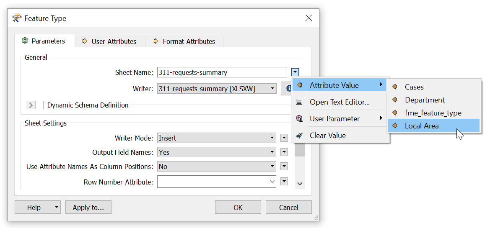

规划部门喜欢之前制作的HTML汇总报告。他们可以使用它来显示所有3-1-1呼叫的概要。但是，他们还希望将Excel电子表格分解为每个计划区域的单独工作表，以便发送给本地计划人员。我们将在本练习中为他们创建。

请记住，对于Excel，FME要素类型对应于Excel工作簿工作表（即表）。

# 1）在Excel写模块要素类型上进行扇出

我们可以手动添加23种不同的Excel要素类型，但效率非常低。相反，我们可以使用**要素类型扇出**。

双击311-requests-summary写模块要素类型以打开其参数。告诉FME写入单独的文件就像将属性设置为文件名一样简单。单击Sheet Name旁边的下拉箭头，然后选择Attribute Value>`Local Area`：

单击“确定”进行更改，然后选择“Excel写模块”要素类型，并使用“运行到此”写出单独的文件。

# 2）检查扇出结果

单击“打开包含文件夹”按钮。现在在C：\\FMEData2019\\Output\\Training\\311-requests-summary.xlsx中，您应该看到23个单独的工作表，每个工作表都有一个本地区域的名称：

现在我们可以将这些文件提供给需要它的本地规划人员。

<UL>
<li>进行要素类型扇出</li>
</UL>
