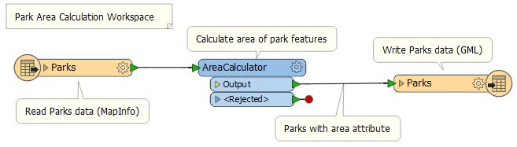
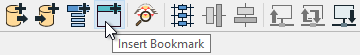
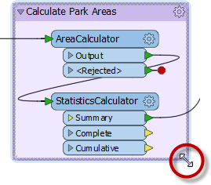
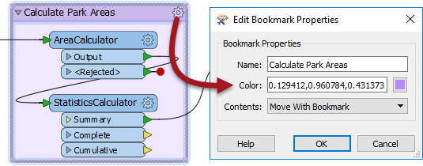

# 最佳实践

如果工作空间运行至完成并产生你想要的输出，这不会不好吧，会吗？ 嗯，会的，这可能会是。仅仅将一个有效的工作空间组合在一起是不够的；以高效和可扩展的方式使用FME也至关重要。

## 什么是最佳实践？

一般而言，最佳实践意味着最好的做事方式；换句话说，有效地执行任务。

尽管用“最好”这个词，但我们并不认为这里的想法会满足每一个需要和场合。我听过的这个概念的最佳描述-以及一个适合这里的概念-是：

>“根据过去的经验和分析，在这种情况下考虑的一个非常好的做法。”

在本节中，我们将讨论最佳实践的一个小方面-使用注释和书签使您的工作空间可以被其他人理解。这两种方法都允许您记录**如何**以及**为什么**您的工作空间这样工作。它们允许其他用户-或将来自己-了解每个部分的用途。

## 注释

注释是清晰易懂设计的关键方法。

注释有助于其他用户了解转换中应该发生的事情，并且在长时间间隔后返回工作空间时也支持创建者。

用户注释是用户创建的注释。它可以连接到工作空间对象（转换器或要素类型），可以连接到工作空间连接，也可以在工作空间内自由浮动。

### 添加注释

要创建用户注释，请右键单击画布并选择“插入注释”，或使用快捷键<kbd>Ctrl</kbd>+<kbd>K</kbd>。通过选择对象执行上述操作，可以将注释附加到画布对象（要素类型，转换器等）。

## 书签

书签，就像它的真实世界同名一样，是一种放下标记以便于访问的方法。

使用FME，书签覆盖工作空间的一个区域，该区域通常执行特定任务，因此用户可以从更广泛的转换器中选择它并相对容易地移动到它。

### 添加书签

要添加书签，请右键单击画布并选择“插入书签”，使用快捷键<kbd>Ctrl</kbd>+<kbd>B</kbd>，或单击工具栏上的“书签”图标：

传统书签只标记书中的单个页面，而FME书签可以覆盖画布的大部分区域。多个书签可以将单个工作空间划分为不同的部分。

如果在创建书签时选择了工作空间画布上的任何对象，则会自动扩展书签以包括这些项目。

### 调整书签大小

要将书签大小悬停在角落或边缘上，然后拖动光标以更改书签大小或形状。

单击书签齿轮以编辑其属性：

