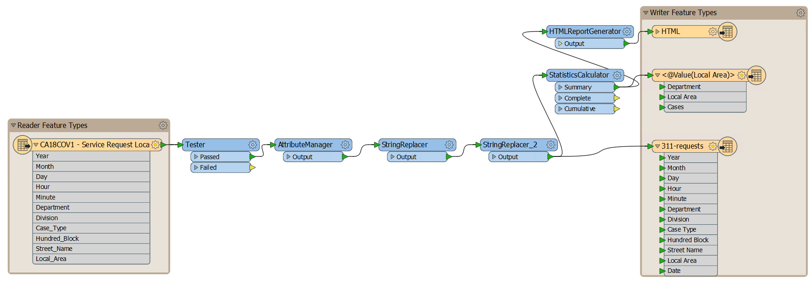

我们的最终工作空间有点复杂！我们有一个读模块要素类型，三个写模块要素类型和九个转换器。它应该看起来像这样（点击展开）：

如果你的一个同事要打开这个工作空间，那么他们需要一些时间来弄清楚它到底在做什么。让我们遵循最佳实践，使用书签和注释对工作区进行注释，让他们的工作更轻松。此步骤对您的未来也很友好：如果将来返回此工作空间，您将能够通过查看书签和注释来记住它的作用。

使用上一单元中介绍的技能为工作空间的相关部分和注释创建书签，以解释每个转换器正在执行的操作。确保添加以下内容：

- 如果您还没有[练习2.1](../2.translations/2.03.ex2.1.md)中的书签和编辑要素类型，请为其添加书签和注释
- 为转换步骤添加书签
- 添加注释来描述转换器正在做什么
- 随意移动所有画布对象，以确保您的工作空间布局合理

