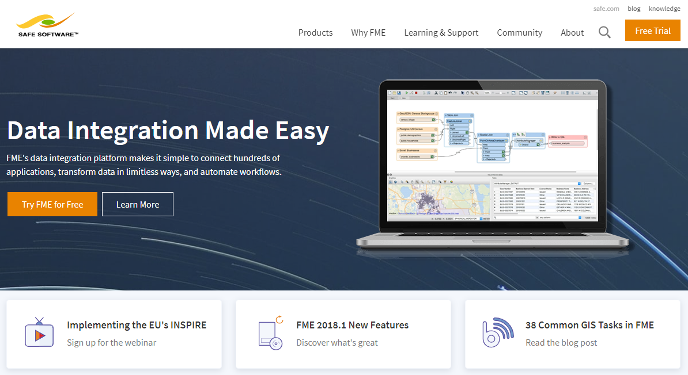
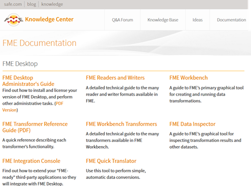
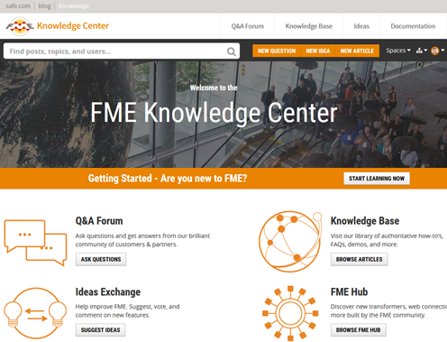
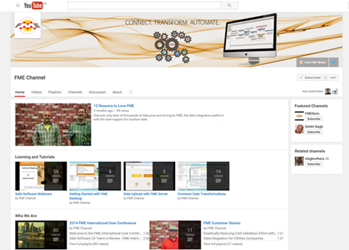

# 模块总结

恭喜您完成了FME Desktop模块入门。您现在准备继续您的FME之旅。

## 学习目标回顾

以下是您完成该模块后遇到的学习目标：

完成 [入门单元](../1.getting-started/1.01.getting-started.md)后，您可以：
- 描述FME及其功能。
- 区分FME Desktop, FME Server,和FME Cloud.。
- 打开工作空间。
- 运行工作空间。

完成 [FME转换器单元](../2.translations/2.01.fme-translations.md)后，您可以：
- 定义工作空间，并在FME Workbench中生成工作空间。
- 使用FME Data Inspector检查数据。
- 解释FME Workbench和FME Data Inspector之间的区别。
- 解释模式是什么，并在FME Workbench中对其进行编辑。
- 解释什么是模式映射，并使用转换器来完成。
- 打开和关闭要素缓存，并在构建工作空间时使用它。
- 使用带有要素缓存的部分运行。

完成 [FME变换单元](../3.transformations/3.01.fme-transformations.md)后，您可以：
- 解释转换器在FME中的作用。
- 讨论常见的转换器类别。
- 使用“快速添加”找到并放置转换器。
- 设置转换器参数。

完成 [FME工作流单元](../4.workflows/4.01.fme-workflows.md)后，您可以：
- 了解数据如何通过工作空间流动。
- 创建具有多种格式的工作空间。
- 创建具有多种要素类型的工作空间。
- 在构建工作空间时采用基本的最佳实践技巧(书签和注释)。

# 产品信息和资源 #

以下是了解有关FME的更多信息。

## 培训

我们提供[在线讲师指导的在线培训](https://www.safe.com/training/)，该培训以此介绍为基础。您还可以观看这些培训课程的[录音](https://www.safe.com/training/recorded/)。

## Safe Software网站 ##

**[Safe Software网站](https://www.safe.com/"Safe Software website")** 是所有FME的官方信息来源。它包括有关FME产品，安全软件服务，FME解决方案，FME支持和安全软件本身的信息。

## Safe支持团队 ##

FME背后是热情而有趣的专家， **[支持团队](https://support.safe.com/knowledgeSubmitCase"FME Support Team page")** 随时准备帮助您取得成功，以知识传递为原则的哲学。

您可以通过支持案例(网络/电子邮件)或使用在线聊天来请求产品支持。

## 您的本地合作伙伴 ##

Safe Software在全球范围内拥有合作伙伴和经销商，可为您所在地区和您的语言提供专业知识和服务。

您可以在 **[Safe Software合作伙伴页面](http://www.safe.com/partners/ "FME Partners Page")** 上找到官方合作伙伴列表。

## Safe Software博客 ##

**[Safe Software博客](http://blog.safe.com/"Safe Software Blog")** 提供有关FME，客户用例和数据互操作性的技术信息和一般想法。它包括文章，视频和播客。

## FME文档 ##

使用FME Workbench中的“帮助”功能可以访问FME Desktop的帮助和其他文档。或者，在线访问[文档](https://docs.safe.com)。

# 社区信息和资源 #

Safe Software积极推动FME用户成为FME社区的一员。

## FME知识中心 ##

**[FME知识中心](https://knowledge.safe.com/"FME Knowledge Center")** 是我们的社区网站- 所有社区资源的一站式商店，以及浏览文档和下载的工具。

### 知识库 ###
FME知识库包含大量信息;包括提示，技巧，示例和常见问题解答。FME Desktop和FME Server上都有一些部分，其中包含从安装和许可到最高级转换和变换任务等主题的文章。

### Q＆A论坛 ###

FME社区成员发布与FME相关的消息，提出问题并分享回答其他用户的问题。会员获得“声誉”和“徽章”，并且有顶级参与用户的排行榜。来看看他们如何帮助您的FME项目！

### 思想交流 ###

FME开发非常依赖于用户。Ideas Exchange让用户有机会发布他们对新FME功能的想法，或对现有功能的改进，并允许每个人对提议的想法进行投票。想法获得的投票越多，实施的可能性就越大！

## FME频道 ##

此 **[FME YouTube频道](https://www.youtube.com/user/FMEchannel"FME YouTube Channel")** 包含有关FME的截屏演示和其他视频内容。除此之外，还有许多解释性和有用的视频，包括大多数培训和教程的录音。

