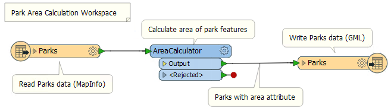

# 注释工作空间

注释是清晰易懂设计的关键方法。

注释可以帮助其他用户理解转换中应该发生的事情，并在长时间间隔后返回工作空间时帮助创建者（从我这里获取这一点尤为重要！）

可以将两种不同类型的注释应用于工作空间。

## 用户注释

用户注释是用户创建的注释。它可以连接到工作空间对象（转换器或要素类型），可以连接到工作空间连接，也可以在工作空间内自由浮动。

要创建附加的用户注释，请右键单击工作空间对象并选择“添加注释”，或在选择对象时使用快捷键Ctrl + K.

要创建浮动用户注释，请右键单击画布并选择“插入注释”，或在未选择任何内容时按Ctrl + K.

放置注释时，您可以更改字体样式，字体大小和背景颜色; 另外，您还可以添加超链接，项目符号和表格。

|  新知识 |
| :--- |
|  在FME2018中，用户注释现在可以直接附加到书签。 |

## 摘要注释

摘要注释是FME生成的注释，提供有关工作空间内任何对象的信息。此项可以是源或目标要素类型，也可以是转换器。

摘要注释始终显示为蓝色，以便将其与其他注释区分开来。它始终与其相关的项目相关联，并且无法分离。

摘要注释的优点在于它会自动更新以响应更改。这使得它很快就可以快速检查转换器参数（或读/写模块模式）。它在通过向导设置参数并且更难检查的情况下特别有用（例如，SchemaMapper或FMEServerJobSubmitter转换器）。

|  技巧 |
| :--- |
|  一个好主意是使用总结注释显示**哪些**行为正在发生; 但是使用用户注释来阐明**为什么**要执行某个操作。  您可以使用此上下文菜单选项将摘要注释转换为用户（附加）注释：    这允许您从摘要注释中提取信息，但可以像编辑用户注释一样对其进行编辑。请注意，转换后的摘要注释不再自动更新！ |

