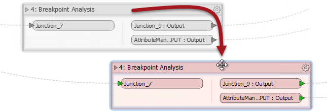

# 书签用来编辑

书签定义包含许多对象的工作空间的一部分。编辑没有书签的工作空间时，通过选择一个或多个对象并将它们拖动到新位置来完成移动对象。

但是，当工作空间被书签分割时，只需将书签拖动到新位置即可移动对象。当对象位于书签内部时，它会像书签一样移动。

使用此技术，可以在工作空间画布周围移动大量对象，以创建更清晰的布局。无论书签是折叠还是展开，对象都会在书签内移动。

|  Workbench医生说... |
| :--- |
|  请记住，其中一个书签属性标记为 **“内容”**， 其值为“使用书签移动”或“独立移动”。显然，前一个值会导致对象随转换器移动; 后一个值会导致对象在移动书签时保持在适当位置。 |

|  Vector小姐说... |
| :--- |
|  这是关于书签的问题。  以下哪项不是创建书签的方法？  [1.单击工具栏上的“插入书签”按钮](http://52.73.3.37/fmedatastreaming/Manual/QAResponse2017.fmw?chapter=3&question=1&answer=1&DestDataset_TEXTLINE=C%3A%5CFMEOutput%5CQAResponse.html) [2.选择一个转换器，右键单击，选择“创建书签”](http://52.73.3.37/fmedatastreaming/Manual/QAResponse2017.fmw?chapter=3&question=1&answer=2&DestDataset_TEXTLINE=C%3A%5CFMEOutput%5CQAResponse.html) [3.选择多个转换器，右键单击，选择“创建书签”](http://52.73.3.37/fmedatastreaming/Manual/QAResponse2017.fmw?chapter=3&question=1&answer=3&DestDataset_TEXTLINE=C%3A%5CFMEOutput%5CQAResponse.html) [4.使用Ctrl + B快捷键](http://52.73.3.37/fmedatastreaming/Manual/QAResponse2017.fmw?chapter=3&question=1&answer=4&DestDataset_TEXTLINE=C%3A%5CFMEOutput%5CQAResponse.html) |

