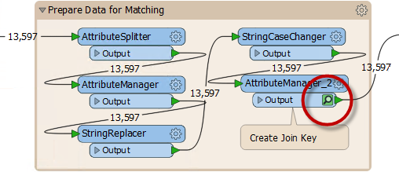

# 书签用于性能

在启用数据缓存的情况下运行工作空间时，会在每个转换器上缓存要素。可以想象，在较大的工作空间中，这会导致大量数据被缓存，有时不必要：

请注意，在上面的屏幕截图中，正在缓存“准备匹配数据”书签中的每个转换器。

但是，当折叠书签时，缓存仅发生在书签输出对象上：

此特性意味着仅为书签中的最终转换器缓存数据，从而节省大量时间和资源：

|  Workbench医生说... |
| :--- |
|  显然，无论您的书签是否已折叠，您都不希望在启用缓存时将工作空间投入生产。仅建议将此技术用于工作空间创建的设计，创作和测试阶段。 |

