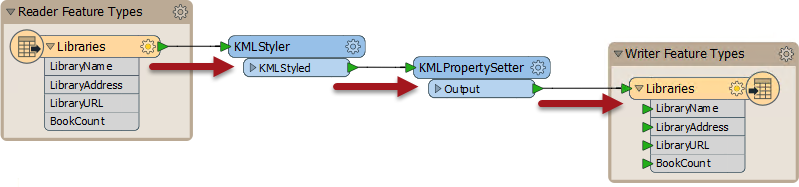
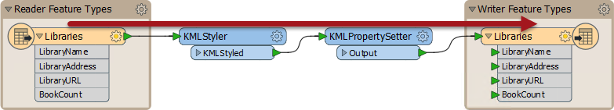
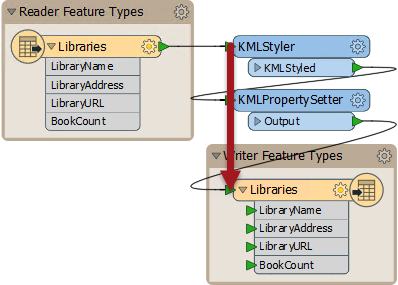
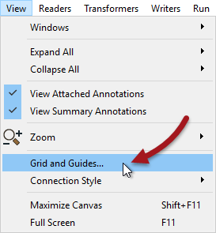
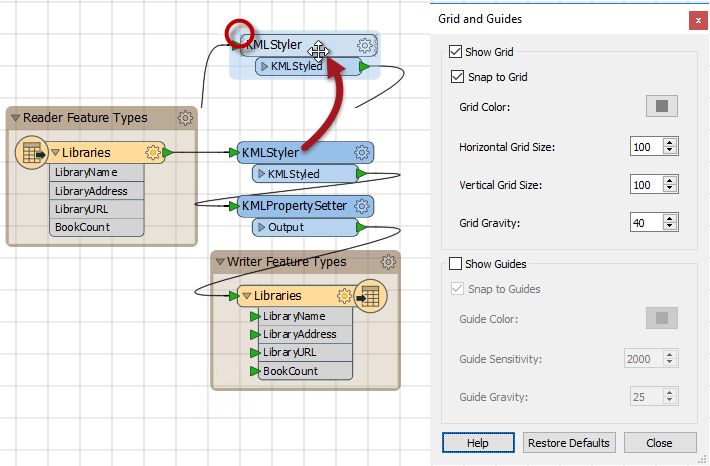
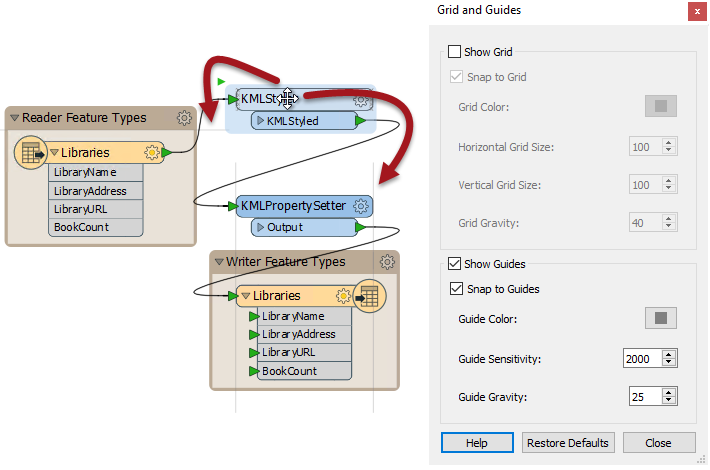
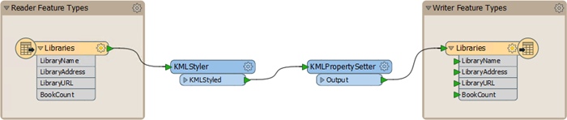

# 对象布局

工作空间对象的定位以及连接它们时的注意力可以使设计不良的工作空间与视觉上有吸引力且高效的工作空间之间产生差异。

## 对象布局

布局方法因用户而异。有些用户喜欢排列对象，以便所有_连接_都是水平的：

其他人更喜欢水平对齐的_物体_顶部，有角度的连接：

有些人喜欢垂直对齐对象边缘：

使用的样式更多的是个人偏好而不是明确的规则，但重要的是一致性。没有明显布局样式或不一致的工作空间不会激发对作者能力的信心！

## 格网和指南

格网和指南是一种帮助整齐和整齐地对齐工作空间对象的工具。可以通过Workbench菜单栏上的View&gt; Grid和Guides访问此功能。

**显示格网**会导致在Workbench画布上显示线条格网。“对齐格网”会导致所有对象（例如突出显示的摘要注释）在移动时捕捉到格网线的交叉点。通过这种方式，物体可以更容易排列。

**“显示参考”**会导致在移动对象时在Workbench画布上**显示参考线**，并将其大致排列到另一个画布对象。“捕捉到参考”允许将对象捕捉到突出显示的参考线上。

这两个工具使得工作空间对象以令人愉悦的方式对齐变得非常简单。

## 自动布局

自动布局工具显示在FME Workbench的工具栏上：

单击工具栏按钮将布局所有工作空间或仅显示当前选定的对象：

如您所见，自动布局倾向于使用水平图案，对象的顶部对齐。因此，在使用此工具时，最好一次选择转换器组，而不是尝试在单个操作中布置整个工作空间。

|  Workbench医生说...... |
| :--- |
|  通常，自动布局算法是正常的...但它仍然无法与花费时间和精力来手动组织对象布局进行比较。 |

