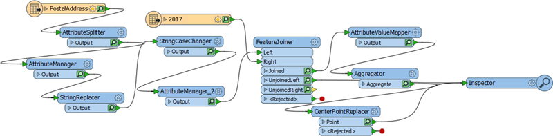
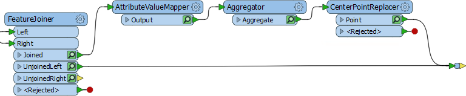
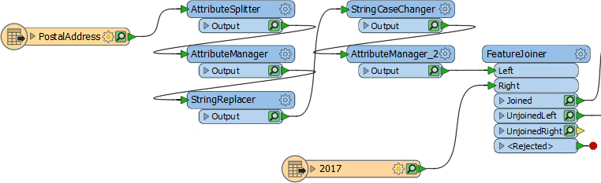
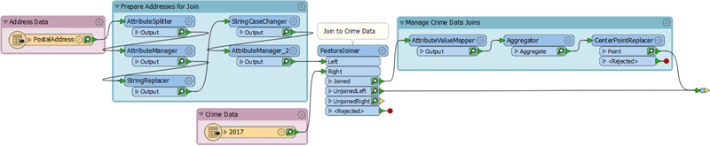
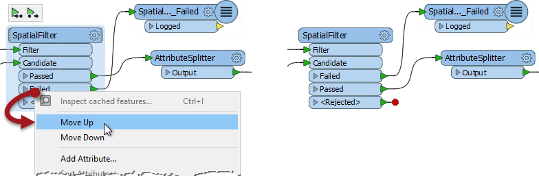
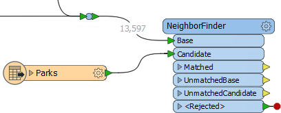
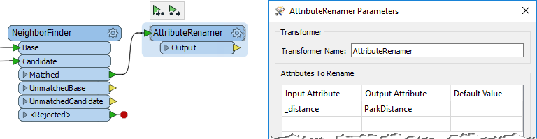
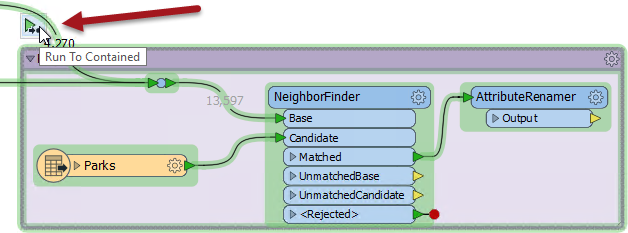
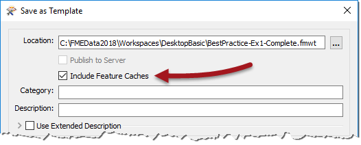

# 练习：FME风格指南

|  练习1 |  应用样式指南 |
| :--- | :--- |
| 数据 | 地址（Esri地理数据库） 犯罪数据（CSV - 逗号分隔值） 公园（MapInfo TAB） |
| 总体目标 | 参与温哥华可行走性项目 |
| 演示 | 样式最佳实践 |
| 启动工作空间 | C:\FMEData2018\Workspaces\DesktopBasic\BestPractice-Ex1-Begin.fmwt |
| 结束工作空间 | C:\FMEData2018\Workspaces\DesktopBasic\BestPractice-Ex1-Complete.fmwt |

您刚被分配到一个项目来计算温哥华市每个地址的“步行性”。步行性衡量步行访问当地设施的难易程度。它将包括到最近公园的距离，一个区域内的犯罪数量以及其他类似指标的度量。

该项目的工作空间已经启动，犯罪信息已连接到每个地址，但作者不知道FME样式指南，因此，为了继续项目，必须在现有内容中添加一定量的样式。

  
**1）启动Workbench**  
启动FME Workbench。

请注意，工作空间文件是一个模板（文件扩展名为.fmwt）。这很好，因为这意味着项目可能存在现有的缓存。确保已启用“使用要素缓存运行”并从C：\ FMEData2018 \ Workspaces \ DesktopBasic \ BestPractice-Ex1-Begin.fmwt打开工作空间模板。

此工作空间需要以书签和注释的形式应用某种样式。

  
**2）重新排列转换器**  
首先不需要Inspector转换器 - 我们可以更轻松地检查缓存 - 并且可以删除。但是，因为它有两个连接，我们想要跟踪它们是什么，一旦删除，用一个Junction转换器替换它。

然后清理它周围的转换器，以便没有重叠的连接：

现在重新排列工作空间的第一部分，避免重叠连接，并查找可能逻辑上分组在书签中的转换器：

  
**3）添加样式**  
重新排列转换器后，现在在适当的位置添加书签和注释。此步骤需要对转换器进行一些检查，以了解每个转换器的作用。但是你应该能够看到至少两组可以放入书签的转换器：

不要忘记使用注释和书签标题，以便工作空间的未来用户能够一目了然地了解工作空间应该做什么。

|  技巧 |
| :--- |
|  通过重新排列转换器输出端口的顺序，也可以清除重叠连接：   |

  
**4）运行工作空间**  
如果需要，可以在新放置的Junction转换器上使用Run to This运行工作空间。然后，您应该能够单击Junction并按Ctrl + I来检查转换阶段的数据。

需要注意的一点是，CSV（犯罪）读模块直接从温哥华市网站上的Excel电子表格中读取数据。因此，保留缓存数据并且不必再次读取它是很重要的。

  
**5）添加公园数据**  
现在让我们通过处理一些公园数据来继续项目。添加具有以下参数的读模块：

| 读模块格式 | MapInfo TAB（MITAB） |
| :--- | :--- |
| 读模块数据集 | C：\ FMEData2018 \ DATA \Parks\ Parks.tab |

  
**6）添加NeighborFinder**  
添加一个NeighborFinder转换器，我们可以用它来确定每个地址最近的停放地点，以及距离它有多远。

将Junction转换器连接到NeighborFinder:Base输入端口和Parks要素类型到NeighborFinder:Candidate输入端口：

检查参数。我们只想找到一个邻居，没有最大距离。

  
**7）添加AttributeRenamer**  
添加AttributeRenamer转换器以将属性_\_distance_重命名为_ParkDistance_：

在处理公园的工作空间部分周围添加书签。通过选择书签并选择Run to Contained来运行工作空间的该部分：

检查输出以确保输出正确。

  
**8）另存为模板**  
由于此项目可能会在以后继续，因此请保存工作空间，但使用“文件”&gt;“另存为模板”。出现提示时，请确保选中“包括要素高速缓存”选项：

现在，如果我们稍后再回到这个项目，我们可以重新打开模板并准备好所有缓存数据。

<table>
  <thead>
    <tr>
      <th style="text-align:left">恭喜</th>
    </tr>
  </thead>
  <tbody>
    <tr>
      <td style="text-align:left">
        
通过完成本练习，您已学会如何：
           
        

        <ul>
          <li>将转换器重新排列为逻辑布局，将执行单个任务的那些组合在一起</li>
          <li>使用注释来阐明工作空间中发生的过程</li>
          <li>使用书签将单个工作空间转换为已定义的部分</li>
          <li>避免糟糕的设计选择，如重叠连接</li>
          <li>在工作空间中只运行一个书签</li>
          <li>将工作空间另存为模板，包括缓存</li>
        </ul>
      </td>
    </tr>
  </tbody>
</table>