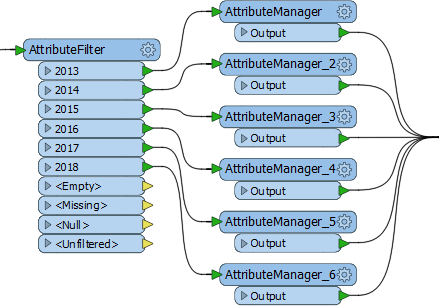
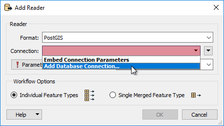
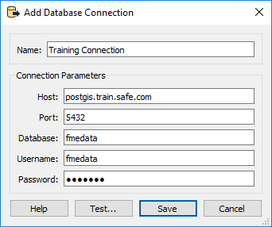
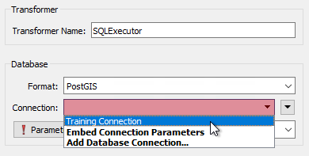

# 维护方法

当工作空间的设计不允许轻松更新或扩展时，维护方法很薄弱。一些关键指标表明了设计薄弱。

## 重复的转换器

一次又一次地复制相同的转换器 - 可能创建多个流来执行此操作 - 表示设计较弱。

例如，这里的多个AttributeManager转换器将导致维护问题：

第一个问题是每增加一年需要一台新转换器来处理它。第二个问题是AttributeManager中的一个小变化需要单独编辑每个转换器。

我们还可以说这种布局导致的样式不像应该的那样紧凑。

这里的解决方案是使用单个AttributeValueMapper转换器（或可能是SchemaMapper）替换所有上述内容，以允许使用最少的编辑次数进行扩展。

一般的解决方案是观察多个转换器的实例，并尝试评估是否有更好的设计。

## 复杂性

当工作空间设计比必要时更复杂时，工作空间设计很薄弱。复杂性意味着解决方案变得难以维护并且难以扩展，尤其是在由原作者以外的人执行时。

需要注意各种类型的复杂性：

* **Excri Scripting**：当等效转换器已存在时使用Python脚本
* \*\*低级复杂性\*\*：当已存在等效转换器时使用FME功能和工厂
* **多个工作空间**：当多个工作空间以不必要的方式链接时
* **工作空间样式**：当工作空间样式如此复杂时，很难理解

在将项目投入生产之前，值得请一位同事评估它是否清晰。他们无法轻易理解的工作空间部分是未来作者也难以维护的要点。

|  技巧 |
| :--- |
|  对于具有强大脚本技能的新FME用户，Python转换器提供了特别诱人的快捷方式。但是，其他工作空间作者可能不熟悉Python，并且发现没有完整的Python开发环境就很难调试。 |

## 数据库连接

数据库格式需要连接参数。有时这些参数需要在同一工作空间中多次应用，有时在切换平台时需要更改参数（例如从测试到实时环境）。

可以在工作空间中嵌入数据库连接值，并将该信息添加到需要的任何位置。但是，更好的解决方案涉及FME中称为数据库连接的工具。

数据库连接是一组预定义的连接和身份验证参数，存储在单个名称下。创建后，将使用连接名称而不是实际参数。

### 创建数据库连接

使用数据库格式并提示输入连接时，请选择添加连接的选项：

通过选择数据库类型，输入连接参数以及为连接指定名称来定义新连接：

现在，每当需要数据库连接时（此处在SQLExecutor转换器中），都会选择预定义的连接：

现在，重复使用数据库不需要重复输入相同的证书，如果证书更改，则只需要编辑一个连接。这两个功能都有利于工作空间的维护和扩展。

另一个好处是安全性。嵌入式连接信息存储在工作空间文件中，存在潜在的安全风险。数据库连接安全地存储在工作空间之外，并且其他人无法轻松访问。如果工作空间传递给另一个用户，则必须使用自己的参数设置连接。

|  消防队员Mapp说...... |
| :--- |
|  安全比抱歉更好。你可不想被糟糕的设计弄得焦头烂额。如果您对工作空间不确定，请咨询[其他FME用户](https://knowledge.safe.com/questions/index.html)，或联系 [Safe Software支持团队](http://www.safe.com/support)获取建议。  另外，请务必查看有关[FME和代码味道](https://blog.safe.com/2015/06/fmeevangelist136/)的博客文章[。](https://blog.safe.com/2015/06/fmeevangelist136/) |

