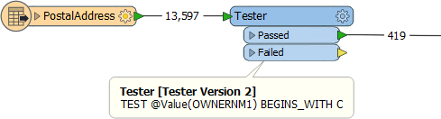
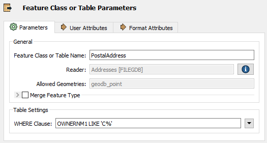
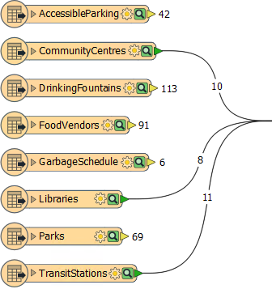
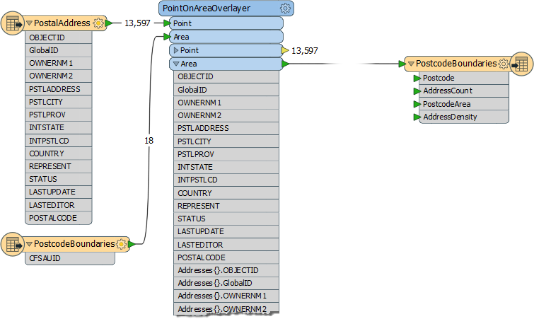
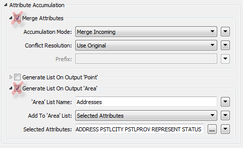
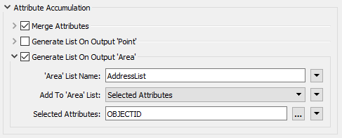
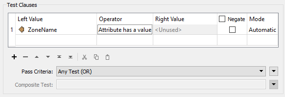

# 性能方法

当工作空间的设计导致工作空间使用比必要更多的系统资源（CPU和内存）时，性能方法很弱。与维护方法一样，一些关键指标表明设计缺陷。

性能方法意味着设置工作空间以便熟练地运行。

## 过滤输入

FME中的常见方案是将数据读入工作空间，然后过滤掉不需要的要素（记录）：

但是，当读取数据并立即丢弃时，用于读取该数据的资源会直接损失性能。

如果数据在读取时被过滤 - 而不是之后 - 性能要好得多，并且许多格式都有参数可以做到：

这里的'WHERE子句'参数将所需的过滤器直接应用于地理数据库读模块。仅读取与where子句匹配的数据并进入工作空间。

## 多余的要素类型

源数据集的模式在FME画布上由要素类型对象表示：

不将要素类型连接到工作空间中的其他对象等同于读取和丢弃数据，同样对性能有害。

添加读模块时，FME会提示用户选择要添加到转换的要素类型。您应该避免添加不需要的要素类型，并删除已添加但未连接的要素类型。

|  Workbenchy医生说... |
| :--- |
|  多余的要素类型不仅会减慢您的工作速度，还会使画布变得杂乱，并且难以保持干净整洁的样式。 |

## 多余的属性和列表

将数据读入工作空间后，仍可缩小其大小以协助性能。例如，输出模式中未定义的属性对于工作空间不是必需的，可以删除：

这里工作空间作者正在计算城市的每个邮政编码（CFSAUID）中的地址数量。输出模式中不需要地址属性，但会将其复制到邮政编码要素，以及地址列表以及工作空间末尾的所有内容。

在这种情况下，作者应避免使用PointOnAreaOverlayer选项来复制属性和创建列表：

此步骤将减少运行转换所需的内存量，而不会影响其输出。

|  Workbench医生说... |
| :--- |
|  列表是要保留的最糟糕的属性类型，没有任何理由，因为它们可以为每个记录设置多个值。许多连接转换器中的参数允许作者仅生成所需的列表属性：   |

## 错误陷阱

有时扩展/性能意味着使用更多不同类型和质量的数据集。如果不考虑数据质量，可能会影响未来的性能。

设计未来功能的一种方法是使用错误捕获。

错误捕获是一种设计工作空间的方法，使得意外数据不会导致工作空间失败。作者试图预见可能出现的数据问题并构建处理它们的方法。

错误捕获可以像添加测试或过滤器转换器一样简单，以清除不良要素，也可以更复杂，并包括根据具体情况以不同方式处理数据的方法。

|  技巧 |
| :--- |
|  Tester转换器有一个运算符，用于测试属性是否具有值：    这对于错误捕获非常有用，在尝试将其用作参数源之前测试属性是否具有值。 |

