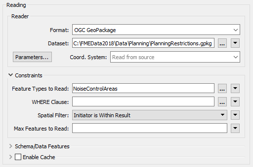
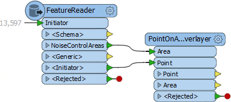
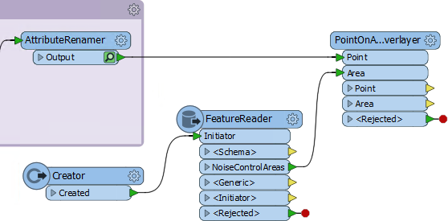
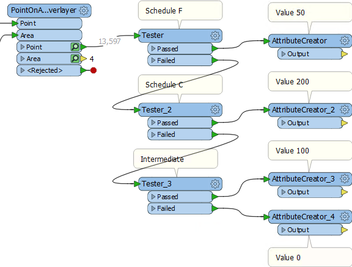
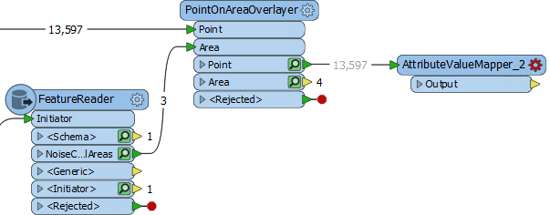
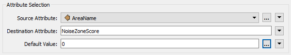
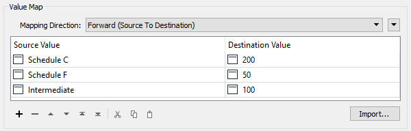
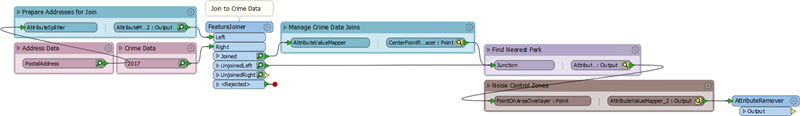
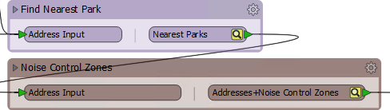

# 练习：设计模式

|  练习2 |  方法 |
| :--- | :--- |
| 数据 | 地址（Esri地理数据库） 犯罪数据（CSV - 逗号分隔值） 公园（MapInfo TAB） |
| 总体的目标 | 参与温哥华可行走性项目 |
| 演示 | 方法最佳实践 |
| 启动工作空间 | C:\FMEData2018\Workspaces\DesktopBasic\BestPractice-Ex2-Begin.fmwt |
| 结束工作空间 | C:\FMEData2018\Workspaces\DesktopBasic\BestPractice-Ex2-Begin.fmwt |

继续上一个练习，您已被分配到一个项目，以计算温哥华市每个地址的“步行性”。步行性衡量步行访问当地设施的难易程度。初始工作空间分析了该地区的犯罪行为，并添加了一个部分来计算到最近的公园的距离。

现在我们可以扩展项目，看看每个地址是否属于噪声控制区域。

  
**1）添加读模块**  
我们的第一个任务是读取噪声控制区域数据。这可以在以下数据集中找到：

| 读者格式 | OGC GeoPackage |
| :--- | :--- |
| 读模块数据集 | C:\FMEData2018\Data\Planning\PlanningRestrictions.gpkg |

我们将尝试使用FeatureReader转换器来读取此数据，使用地址作为触发器来提高性能; 所以放置一个FeatureReader转换器并将其连接到AttributeRenamer。

检查转换器的参数。如上所述设置读模块参数。只读取NoiseControlArea要素类型并将Spatial Filter参数设置为Initiator is Result：

以这种方式读取数据可能有益于性能，因为我们只读取了我们知道地址落入其中的噪声控制区域。我们拭目以待...

  
**2）覆盖地址和噪声控制区域**  
要进行覆盖，请添加PointOnAreaOverlayer转换器。将FeatureReader：&lt;Initiator&gt;连接到Point输入端口，将FeatureReader：NoiseControlArea连接到Area输入端口：

检查参数并启用“合并属性”选项。使用Run to This运行工作空间; 遗憾的是，工作空间需要很长时间才能运行，因此请按“停止”按钮取消转换。

  
**3）添加Creator**  
很明显，当前设置不是最佳解决方案。FeatureReader为每个重叠的地址输出一个面要素，导致PointOnAreaOverlayer减速。我们的赌博失败了。

因此，添加一个Creator转换器来触发FeatureReader，并将其与AttributeRenamer断开连接，保持其他连接不变：

检查FeatureReader参数并将Spatial Filter参数重置为&lt;无空间过滤No Spatial Filter&gt;。

现在重新运行工作空间的这一部分并检查输出以确保某些地址要素正在接收AreaID，AreaName和AreaDescription属性。

  
**4）设置数值**  
为了帮助评估步行性，我们将为每个不同的区域提供一个数值，相对于在城市中行走的居民所能获得的福利，：

| 计划F. | 50 |
| :--- | :--- |
| 计划C | 200 |
| 中间 | 100 |

一种技术是使用Tester和AttributeCreator转换器，如下所示：

然而，这显然是一种重复。这种方法很难维护; 如果添加了额外的计划表，则需要为每个表添加一个额外的Tester / AttributeCreator组合。

因此，替代为放置一个AttributeValueMapper转换器连接到PointOnAreaOverlayer:Point输出端口：

检查AttributeValueMapper的参数。将其设置为从AreaName映射到NoiseZoneScore，默认值为零（0）：

现在使用上面表格中的值设置映射：

您可以手动设置（通过键入值）或自动设置（通过使用“导入”按钮）。

在工作空间的此部分周围放置一个书签并运行它。检查缓存的结果以证明地址被赋予正确的值。

  
**5）清理输出**  
因为有太多多余的属性使显示混乱，检查输出变得困难。这些属性很难帮助工作空间的性能 - 即使在开发过程中使用缓存可以减轻这种影响。

检查模板文件BestPractice-Ex2-Begin.fmwt的大小。你会发现它的大小接近46mb，这对于模板来说相当大。立即保存工作空间，文件可能会更大。拥有一个大型模板文件并不是一个问题，但它确实表明正在缓存大量数据，这可能会影响工作空间的性能。

数据的一个方面是属性和列表的数量。要删除一些这些多余的信息，请将AttributeRemover转换器放在工作空间的末尾。

检查其参数并将其设置为删除您怀疑输出中不需要的任何属性和列表。

一个有意思的项目是一个名为CrimeList{}的列表属性，，对于此转换的任何部分而言似乎都不需要它。按Ctrl + F并搜索该短语来追踪其来源。您会发现它是由Aggregator转换器创建的。

检查Aggregator转换器的参数并关闭Generate List参数，以防止创建列表。此步骤将导致许多缓存变得陈旧，但我们将很快重新运行工作空间以解决此问题。

  
**5）折叠书签**  
过度缓存的另一个来源是转换器产生我们不需要检查的输出。可以通过在折叠的书签中隐藏这些转换器来防止这些。

因此，通过工作空间折叠书签，我们知道其中的转换器正在产生正确的输出：

您可能希望重命名书签上的某些端口以阐明它们的作用：

  
**6）重新运行工作空间**  
现在通过单击AttributeRemover并选择_Run to This_重新运行工作空间。

工作空间将运行，数据将被缓存，但仅限于书签的输出点。此外，还将删除输出不必要的属性。

将工作空间另存为新模板，并选中包含缓存的选项。这样，工作空间就可以在以后继续使用了。

检查新模板的文件大小。它应该相当小（大约14mb）。

<table>
  <thead>
    <tr>
      <th style="text-align:left">恭喜</th>
    </tr>
  </thead>
  <tbody>
    <tr>
      <td style="text-align:left">
        
通过完成本练习，您已学会如何：
           
        

        <ul>
          <li>评估读模块的表现以及什么时候FeatureReader不是一个好的选择</li>
          <li>避免重复转换器以提高维护和可扩展性</li>
          <li>删除不必要的属性以提高性能</li>
          <li>跟踪不必要的列表并将其删除</li>
          <li>通过折叠书签来提高性能，以防止过多的缓存</li>
        </ul>
      </td>
    </tr>
  </tbody>
</table>