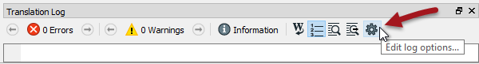
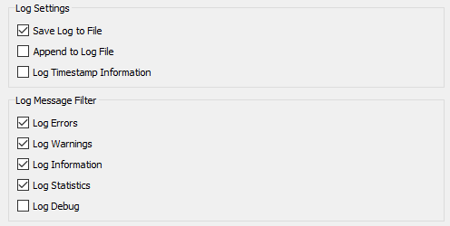
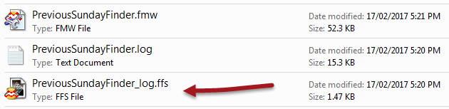
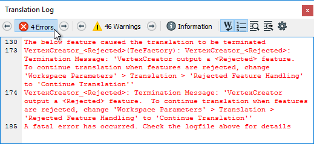

# 记录

FME日志包含转换中所有阶段和过程的记录。因此，内容对于调试目的至关重要。

## 记录消息类型

日志窗口中显示了不同的消息类型，包括：

**错误**：一个错误，在日志中用红色文本和术语**ERROR**表示, 代表有问题导致FME终止处理。例如，由于用户权限不正确，FME无法写入输出数据集。

**警告**：一个警告，由蓝色文本和术语**WARN**表示，意为处理问题。这个问题小到足以让FME完成转换，但输出可能会受到不利影响，应该检查。例如，FME无法写入要素，因为它们的几何对象与写模块格式不兼容。要素将从转换中删除，并在日志中发出警告。

**信息**：信息消息，由术语**INFORM**表示代表可以帮助用户确定他们的转换是否已被正确处理的一条信息。例如，FME有时会记录特定数据集参数的确认，例如坐标系。

**统计**：统计信息，由术语**STATS**表示，提供与转换有关的各种数字的信息; 例如，从源数据集读取的要素数量，以及执行此操作所需的时间。

## 日志文件选项

日志文件选项对于设置（在运行工作空间_之前_）非常重要，这样我们就可以在我们需要的结构中接收信息。可以通过日志窗口上的齿轮图标访问这些选项：

日志选项允许我们控制数据的呈现方式和格式：

在调试工作空间的性能时，“日志时间戳信息”选项至关重要，因为它会添加有关每个步骤所用时间长度的信息。它还会导致显示消息类型（ERROR，WARN等）。

过滤消息的能力并不是特别重要，因为可以在日志窗口中直接过滤消息类型。

Log Debug选项使FME在FME引擎中显示更深层次的消息。这个选项**不**应开启用作一般用途，但只有当工作空间已经显示为失败时，并且需要额外的信息。否则，可能会被正常过程中的异常消息混淆。

|  Intuitive修女说...... |
| :--- |
|  在跟踪与HTTP相关的问题时，Log Debug特别有用。 |

## 空间日志文件

除了将日志写入文本文件（&lt;工作空间名称&gt; .log）之外，FME还会写入空间日志：

空间日志是日志中提到的要素（以FME要素存储格式）的数据集 - 由于来自FME的警告或使用Logger转换器。

可以在FME Data Inspector中打开数据集，以检查要素并识别导致它们被拒绝的任何问题。

## 解析日志窗口

日志窗口应该是检查转换完成时的**第一个**位置。它会告诉用户是否有任何相关的错误或警告。

### 错误

如果发生ERROR，则可能会暂停转换。会有很多红色文本和一些终止语句，例如：

> 程序终止
>
> 转换失败。

可能有几个ERROR消息，因此向上滚动日志窗口以尝试识别其中的第一个，这可能是问题的原因。例如这条消息：

> ERROR \|连接到PostgreSQL数据库时出错（host ='postgis.train.safe.com'，port ='5432'，dbname ='fmedata'，user ='fmedata'，password ='\*\*\*'）：'致命：用户“fmedata”的密码验证失败致命：用户“fmedata”的密码验证失败

...验证数据库连接是一个明显的问题。

### 警告

即使转换成功，检查日志以获取以下注释也很重要：

> 转换成功与X警告（s）

如果有任何警告（即，如果X&gt; 0），则使用搜索选项查找单词WARN。任何警告消息都可能对输出数据的质量产生重要影响。

|  新知识 |
| :--- |
|  FME2018引入了在日志窗口中以交互方式按类型过滤消息的要素。在这里，用户单击了一个按钮，仅查看工作空间内的ERROR消息： 这对于调试非常有用，特别是对于色觉缺陷的用户而言，他们无法轻易区分红色错误和蓝色警告。     |

