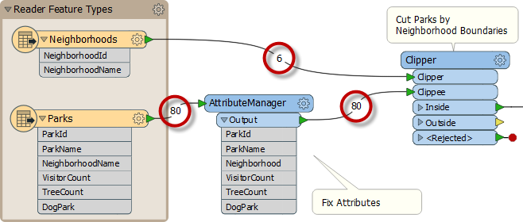
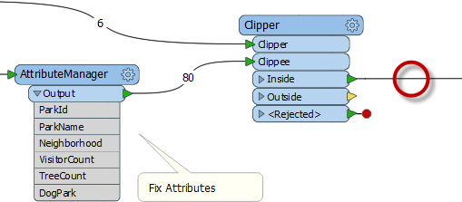
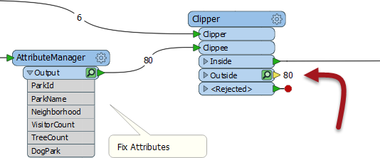
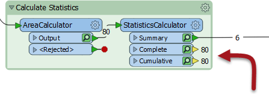
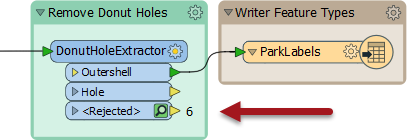
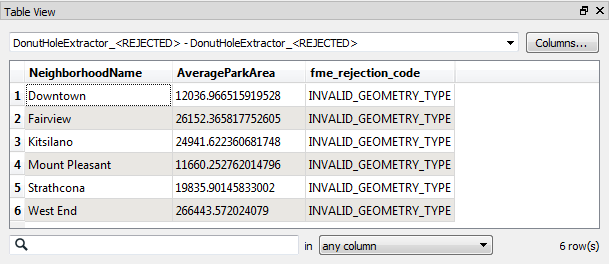

# 要素计数

工作空间**要素计数**是指转换完成后每个连接上显示的数字：

一旦错误或问题被确定为存在，要素计数帮助我们找出_哪里_这个问题的发生。

在上面的屏幕截图中，如果Clipper输出不正确，那么您将检查先前的要素计数以查看是否有任何计数看起来错误（可能您知道有七个街区，但要素计数仅显示六个）。

## 输出不正确

当输出要素的数量不正确时，有几件事要检查。

如果输出为零，并且要素计数显示所有要素都已进入转换器，但没有出现，那么您可以相信转换器是导致问题的原因：

例如，在这里，80个要素进入Clipper转换器（将被剪切为单个边界）但没有出现。Clipper转换器几乎可以肯定是输出错误的原因。

数据不会被视为无效; 它只是没有通过预期的测试。Clipper和Clippees可能不占用相同的坐标系; 因此，一个没有落在另一个里面。

启用要素缓存有助于确认是这种情况：

或者 - 这是缺少要素的常见原因 - 作者连接了错误的输出端口！例如，此用户已连接StatisticsCalculator Summary输出端口，其实他们真正想要连接是Complete端口时，：

要素缓存再次为我们提供了我们应该连接的端口的线索。

## 被拒绝的要素

有时当要素丢失时，它们会被转换器拒绝。许多转换器包含一个&lt;Rejected&gt;端口来输出这些无效要素：

请记住，即使关闭了要素缓存，要素也会自动计数并存储在&lt;Rejected&gt;端口上。

作为额外的好处，被拒绝的要素通常包括拒绝代码属性：

