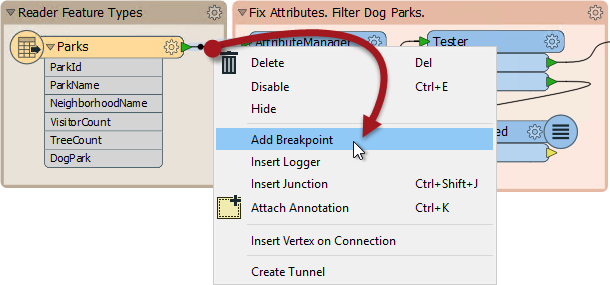
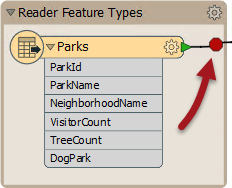
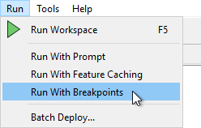
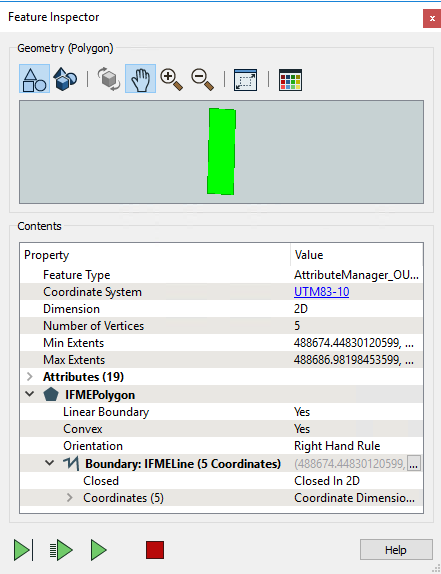

# 要素调试

要素调试是一种允许在翻译期间检查各个要素的工具。它不同于检查特定位置的数据，因为它一次检查一个要素，并允许作者通过工作空间跟踪该要素的进度。

当一个问题被确定为在转换期间，但是失败点未知时，这是最有用的。

要素调试由“断点”触发; 工作空间连接，由用户标记为应检查要素的位置：

连接以深黑色突出显示，带有红色“停止”符号，表示其新状态：

现在，工作空间运行时打开了“Run with Breakpoints”选项：

当第一个要素到达断点时，临时暂停转换，并在“要素检查器”窗口中显示有关该要素的信息。

窗口的上半部分显示了该要素的图形表示; 下半部分列出了要素类型和坐标系等属性; 加上属性和几何对象信息。

Feature Inspector窗口底部有四个按钮：

| 按键 | 操作 | 描述 |
| :--- | :--- | :--- |
|  | 进入到下一个连接 | 此工具一次一个转换器，一步步通过工作空间，显示处理时的要素状态。 |
|  | 进入到下一个断点 | 此工具重新启动转换，在下次要素到达检查点时停止。 |
|  | 继续转换 | 此工具重新启动转换，忽略所有其他断点。 |
|  | 停止转换 | 此工具会停止转换。 |

当前活动的连接以红色突出显示，表示它是当前暂停转换的位置。

