# 练习：调试工作空间

|  练习3 |  调试工作空间 |
| :--- | :--- |
| 数据 | 地址（Esri地理数据库） 犯罪数据（CSV - 逗号分隔值） 公园（MapInfo TAB） 游泳池（OSM - OpenStreetMap） |
| 总体目标 | 参与温哥华可行走性项目 |
| 演示 | 调试最佳实践 |
| 启动工作空间 | C:\FMEData2018\Workspaces\DesktopBasic\BestPractice-Ex3-Begin.fmwt |
| 结束工作空间 | C:\FMEData2018\Workspaces\DesktopBasic\BestPractice-Ex3-Complete.fmwt |

继续上一个练习，您已被分配到一个项目，以计算温哥华市每个地址的“步行性”。步行性衡量步行访问当地设施的难易程度。该工作空间目前正在评估犯罪，公园和噪音控制区域，但并未对步行性进行全面衡量。

所以，让我们这样做，然后看看是否还有其他方面可以包括。

  
**1）添加ExpressionEvaluator**  
我们可以创建一个walkability度量，它使用ExpressionEvaluator转换器组合所有当前值。

因此，将ExpressionEvaluator转换器添加到工作空间的末尾。

检查其参数。将其设置为创建一个名为Walkability的新属性，该属性为：

```text
ParkDistance + CrimeValue  -  NoiseZoneScore
```

[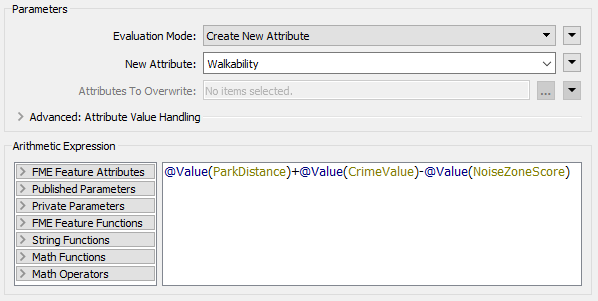](https://github.com/safesoftware/FMETraining/blob/Desktop-Basic-2018/DesktopBasic5BestPractice/Images/Img5.218.Ex3.ExpressionEvaluatorDialog.png)

使用此表达式，结果越小越好。在ExpressionEvaluator上使用Run from This运行工作空间。

  
**2）评估结果**  
让我们评估转换结果是否正确。

首先检查日志窗口是否有错误和警告。没有错误，但有超过13,000个警告，这不是一个好兆头：

[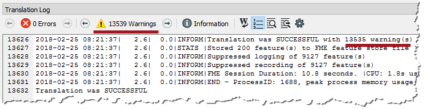](https://github.com/safesoftware/FMETraining/blob/Desktop-Basic-2018/DesktopBasic5BestPractice/Images/Img5.219.Ex3.LogWarningCount.png)

警告说：

```text
ExpressionEvaluator：无法计算表达式'@ real64（560.3272250455418+ <null> -0）'。
结果设置为空
```

检查输出缓存，某些地址确实具有&lt;null&gt;的Walkability值。

所以我们知道存在问题，让我们试着弄清楚问题出在哪里以及问题发生的原因。

  
**3）定位问题**  
我们可以告诉ExpressionEvaluator发出警告，但这并不一定意味着问题所在。计算失败，因为中间值为&lt;null&gt;。如果表达式是：

```text
ParkDistance + CrimeValue  -  NoiseZoneScore
```

然后我们知道必须是CrimeValue才是问题。展开执行犯罪计算的书签。然后在FeatureJoiner转换器上执行Run From This，以便我们在书签中为转换器提供缓存，并为所有连接提供要素计数：

[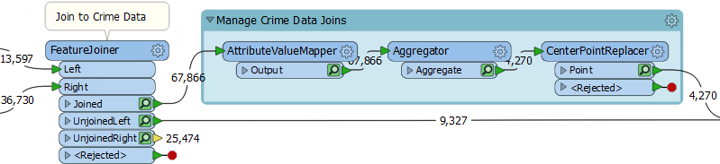](https://github.com/safesoftware/FMETraining/blob/Desktop-Basic-2018/DesktopBasic5BestPractice/Images/Img5.220.Ex3.CrimeBookmarkExpanded.png)

我们知道这里的一些要素正在获得&lt;null&gt;结果。首先检查AttributeValueMapper的缓存。这就是设置值的地方，所以也许那里出现了空值？

|  技巧 |
| :--- |
|  一个有用的测试是右键单击表视图窗口中的CrimeValue，然后按升序排序。这将把任何空值放在表的顶部。 |

检查时，我发现其中没有CrimeValue属性的&lt;空&gt;值。Aggregator和CenterPointReplacer缓存都没有空值。

因此，请检查每个连接的要素计数。有4,270个要素标记有犯罪，9,327个要素没有。这总共给出了13,597，这是正确的。

哦。你看到了吗？没有标记犯罪的9,327个要素：他们获得了什么CrimeValue？检查FeatureJoiner的UnjoinedLeft输出，您将看到它们没有值。这就是ExpressionEvaluator说存在空值的原因。

|  技巧 |
| :--- |
|  为了确认这一点，我将日志复制到文本编辑器中并搜索短语“ExpressionEvaluator：无法评估表达式”。 它出现了9,327次，与退出UnjoinedLeft端口的要素数量相同。巧合？ |

  
**4）修复问题**  
如果这些要素没有CrimeValue属性，那么我们应该给它们一个。为此，请将AttributeCreator转换器添加到工作空间，并展开“管理犯罪数据连接”书签以将其括起来：

[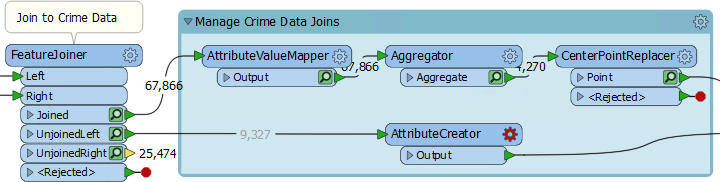](https://github.com/safesoftware/FMETraining/blob/Desktop-Basic-2018/DesktopBasic5BestPractice/Images/Img5.221.Ex3.AttributeCreatorOnCanvas.png)

打开其参数并创建一个名为CrimeValue的属性，其值为零（0）。

[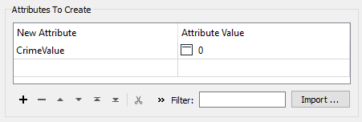](https://github.com/safesoftware/FMETraining/blob/Desktop-Basic-2018/DesktopBasic5BestPractice/Images/Img5.222.Ex3.AttributeCreatorParams.png)

折叠书签并重新运行工作空间（使用ExpressionEvaluator上的“运行到此Run to This”）。您现在应该发现警告更少，输出中不包含&lt;null空&gt;值。

  
**5）四舍五入属性**  
数据中的一个问题是结果被测量到多个小数位。此步骤不是必需的。快速浏览一下数据就会发现，ParkDistance结果才是罪魁祸首。

因此，找到ParkDistance值的创建位置，并添加一个AttributeRounder转换器，将其四舍五入到零位：

[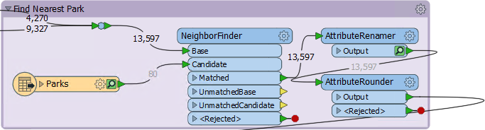](https://github.com/safesoftware/FMETraining/blob/Desktop-Basic-2018/DesktopBasic5BestPractice/Images/Img5.222a.Ex3.AttributeRounder.png)

  
**6）添加游泳池**  
由于我们现在能够计算步行性值，因此请将游泳池纳入计算中。为此，请添加以下内容：

| 读模块格式 | OpenStreetMap（OSM）XML |
| :--- | :--- |
| 读模块数据集 | C:\FMEData2018\Data\OpenStreetMap\leisure.osm |

出现提示时，仅选择leisure要素类型：

[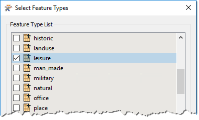](https://github.com/safesoftware/FMETraining/blob/Desktop-Basic-2018/DesktopBasic5BestPractice/Images/Img5.223.Ex3.LeisureFeatureType.png)

  
**7）过滤休闲（Leisure）数据**  
如果您检查休闲数据，您会注意到有各种类型的休闲设施，其类型记录在_休闲leisure_属性中。

因此，设置一个Tester转换器来测试leisure = swimming\_pool

[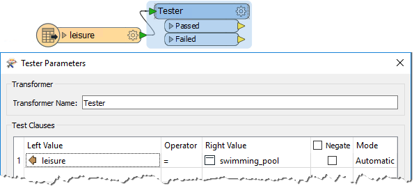](https://github.com/safesoftware/FMETraining/blob/Desktop-Basic-2018/DesktopBasic5BestPractice/Images/Img5.224.Ex3.SwimmingPoolTester.png)

  
**8）找到最近的游泳池**  
找到最近的游泳池的技术与找到最近公园的技术相同。因此，展开最近的公园书签，并从里面复制/粘贴转换器。

在它周围放一个书签，并以与park部分相同的方式连接它：

[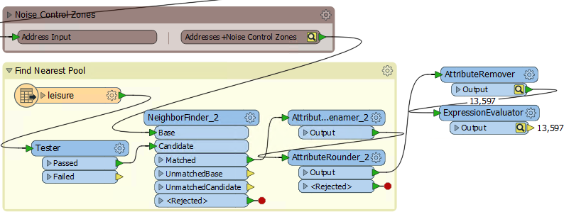](https://github.com/safesoftware/FMETraining/blob/Desktop-Basic-2018/DesktopBasic5BestPractice/Images/Img5.225.Ex3.NearestSwimmingPoolSection.png)

检查新粘贴的转换器的参数。NeighborFinder转换器没有任何需要设置，但AttributeRenamer和AttributeRounder需要使用PoolDistance而不是ParkDistance。

  
**9）更新ExpressionEvaluator**  
现在只需更新ExpressionEvaluator以考虑新的PoolDistance属性：

[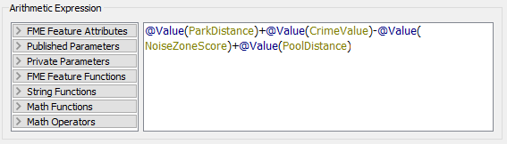](https://github.com/safesoftware/FMETraining/blob/Desktop-Basic-2018/DesktopBasic5BestPractice/Images/Img5.226.Ex3.UpdatedExpressionEvaluator.png)

重新运行工作空间。检查日志中是否有警告和错误，然后检查ExpressionEvaluator缓存。

请注意，由于PoolDistance，可步行性得分突然非常大。出了点问题，但是什么？

  
**10）找到问题**  
 PoolDistance是**问题**的根源。没有相关的日志消息提供线索，并且要素计数数字看起来正确。

因此，右键单击“查找最近的泳池”书签，然后选择“选择书签中的所有对象”。现在按Ctrl + I检查所选对象的缓存。

Data Inspector中的显示窗口显示两个数据小斑点，相距很远。该结果是坐标系不匹配的典型结果。

查询一些要素，您将看到主数据的坐标系为UTM83-10，而OSM的休闲数据的坐标系为LL84。

这种差异是为什么每个地址的“最近”泳池是如此高的距离。

  
**11）修复坐标系问题**  
显而易见的解决方案是将池重新投影到正确的坐标系。因此，添加一个Reprojector转换器，以便在它到达NeighborFinder之前重新显示休闲数据：

[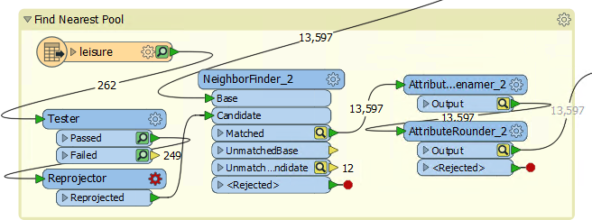](https://github.com/safesoftware/FMETraining/blob/Desktop-Basic-2018/DesktopBasic5BestPractice/Images/Img5.227.Ex3.ReprojectorOnCanvas.png)

检查其参数并将其设置为从LL84重新投影到UTM83-10

折叠所有书签并重新运行工作空间的相应部分。检查日志窗口并检查ExpressionEvaluator缓存。

现在每个地址都有一个步行分数，数字越低越好，数字越高越差。

<table>
  <thead>
    <tr>
      <th style="text-align:left">恭喜</th>
    </tr>
  </thead>
  <tbody>
    <tr>
      <td style="text-align:left">
        <p>通过完成本练习，您已学会如何：
          <br />
        </p>
        <ul>
          <li>使用ExpressionEvaluator转换器</li>
          <li>检查日志窗口是否有错误和警告</li>
          <li>通过使用要素计数和数据检查来查找问题</li>
          <li>识别并修复工作空间中的问题</li>
        </ul>
      </td>
    </tr>
  </tbody>
</table>