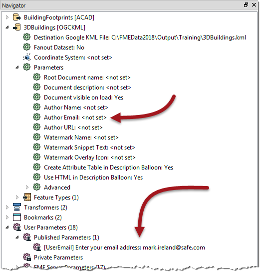
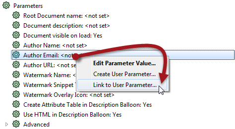
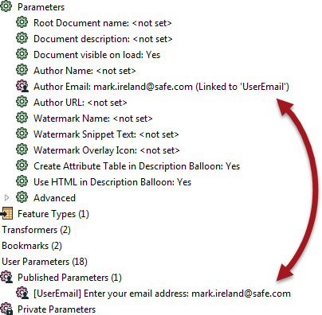
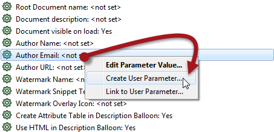
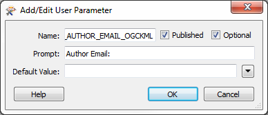

  

    <article class="markdown-body entry-content" itemprop="text"><h2>链接参数</h2>

众所周知，有直接控制FME的<strong>FME参数</strong>和允许用户输入的<strong>用户参数</strong>。

有时工作空间作者需要用户的输入直接应用于FME参数，这通过将用户参数链接到FME参数来完成。

例如，某个FME作者有一个写入KML数据集的工作空间。有一个名为“作者电子邮件”的参数，用于将用户的电子邮件添加为元数据。

工作空间作者希望最终用户输入他们自己的电子邮件地址，但不希望他们必须搜索该参数。

因此，除了FME参数，它们还会创建一个用户参数：

他们的用户参数允许用户输入值，但是工作空间不会对该值执行任何操作。为此，必须将用户参数链接到FME参数。

作者通过右键单击FME参数并选择“链接到用户参数”来完成此操作：

然后他们选择要链接的用户参数。

<table>
<tbody><tr>
<td>
<i></i>
分析师女士说......
</td>
</tr>
<tr>
<td>

或者，他们可以反过来; 右键单击User参数，然后选择Apply To [FME Parameter]。但通常有比用户参数更多的FME参数，因此'链接'方法通常更容易，更快捷。

</td>
</tr>
</tbody></table>

由于FME参数现在链接到用户参数，因此用户为该用户参数设置的任何值都将直接应用于FME参数（作者电子邮件）：

<table>
<tbody><tr>
<td>
<i></i>
分析师女士说......
</td>
</tr>
<tr>
<td>

如果作者改变主意，总会有一个选项来取消链接用户参数并将FME参数返回给作者直接控制。

</td>
</tr>
</tbody></table>

<h3>创建直接链接</h3>

在前面的示例中，单独创建了一个用户参数，然后将其链接到FME参数。但是，有一个快捷方式，可以同时创建和链接参数。

在“导航”窗口中，只需右键单击现有FME参数，然后选择“创建用户参数”选项：

这将像以前一样打开“添加用户参数”对话框，但这次创建参数的定义会自动填充：

单击“确定”，将创建用户参数并自动链接到FME参数。

<table>
<tbody><tr>
<td>
<i></i>
分析师女士说......
</td>
</tr>
<tr>
<td>

您也可以在转换器对话框中执行相同的一步操作，如下所示：
 此处工作空间作者正在创建链接到3DForcer转换器中的Elevation FME参数的用户参数。 

  
  </td>
</tr>
</tbody></table>

<h3>直接链接的优势和劣势</h3>

您可能想知道为什么要单独链接用户参数，或者为什么我们首先显示该进程。这是因为这两种方法都有优势和劣势。

<h4>直接链接优势</h4>

直接创建链接的FME参数具有明显的优势，即它是一个单步过程。用户参数的创建和链接在单个动作中完成。

此外，从FME参数创建的用户参数会自动获得正确的数据类型。

例如，在3DForcer中，高程需要浮点数; 从此FME参数创建的任何用户参数将自动为float类型，无需更改它。

<h4>直接链接劣势</h4>

但是，无法设置数据类型可能是一种限制。

比如说，作者想要提供3DForcer允许的高程列表; 0.0,10.0,50.0等。直接创建用户参数无法实现这一点，因为当Choice是必需选项时，它会创建一个Float参数。

因此作者应单独创建一个选择用户参数，然后将其链接到FME参数：

当然，作者需要注意用户参数提供的值是与FME参数所期望的类型匹配的类型。FME无法解析用户参数（尤其是Choice参数）的所有输入，以确保它与链接到的FME参数匹配。

另一个缺点是用户参数的持续性之一。

它是这样的：如果用户参数是直接从转换器上的FME参数创建的，那么它永远与该转换器相关联。如果删除转换器，则也将删除FME参数。

但是，如果单独创建用户参数，并手动链接到转换器的FME参数，则即使删除了转换器，它也将保留在工作空间中。

这可能被视为优势或劣势，取决于您是否愿意这种行为！

最后，直接创建的用户参数无法控制所谓的属性分配（本章稍后将详细介绍）。

</article>
  

</body></html>
