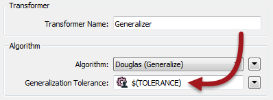
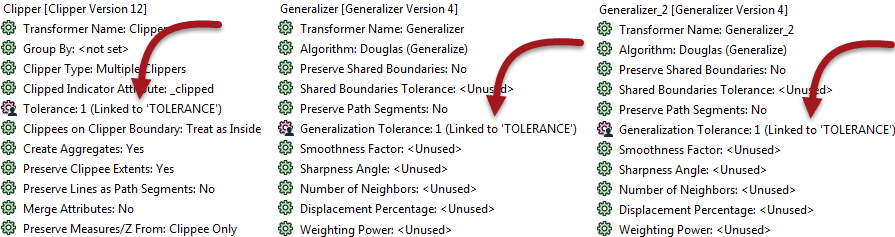

  

    <article class="markdown-body entry-content" itemprop="text"><h2>共享，嵌入和脚本参数</h2>

共享和嵌入参数不是特定类型的参数; 相反，它们指的是可以使用参数的两种不同方式。

脚本参数是一种以定义参数的方式包含Python或Tcl代码的方法。

<h3>共享参数</h3>

用户参数可以使用或链接到FME参数的次数没有限制。从用户参数获得的值可以根据需要多次使用。

当参数在两个或多个地方使用时，可以将其描述为<em>共享参数</em>。

例如，工作空间有一个名为TOLERANCE的用户参数（此处在Generalizer中使用）：

 但是，工作空间作者决定在三个地方共同应用相同的参数; 两个Generalizers和一个Clipper：

优点是可以使用相同的值而无需用户多次输入。

<h3>嵌入式参数</h3>

有时在FME中，参数值需要由多个组件构成。当构造一个参数以便在其中包含另一个参数的值时，这称为<em>嵌入参数</em>。

例如，这里的文件名由两个用户参数构成：一个是固定输出路径，另一个是用户名：

该技术称为嵌入，因为用户参数（UserName和OutputFolder）嵌入在FME参数（目标文件名）中。

<h3>脚本参数</h3>

脚本参数比嵌入参数更进一步。脚本参数不是简单连接，而是允许使用完整的Python或Tcl脚本来构造值。

例如，此Tcl脚本从固定路径和嵌入式用户参数创建文件名。但是，在这种情况下，脚本用于测试工作空间是否在Windows或Linux系统上运行，以便它可以相应地设置输出路径：

<pre>设置真实姓名''

if {[string match'C：*'$ FME_MacroValues（FME_HOME）]} {
	设置realname'C：\ Output \'+ $ FME_MacroValues（UserFileName）
} else {
	set realname'/ Output /'++ $ FME_MacroValues（UserFileName）
}

返回真实姓名
</pre>

请注意，脚本必须包含return语句，以便将值返回给参数。脚本参数纯粹供作者使用。系统不会提示用户输入值，因为在工作空间运行时期望他们输入Python代码是荒谬的！

<table>
<tbody><tr>
<td>
<i></i>
分析师女士说......
</td>
</tr>
<tr>
<td>

使用'print'命令（在Python中）或'puts'命令（在TCL中）从脚本写入FME日志文件。

</td>
</tr>
</tbody></table>
</article>
  

</body></html>
