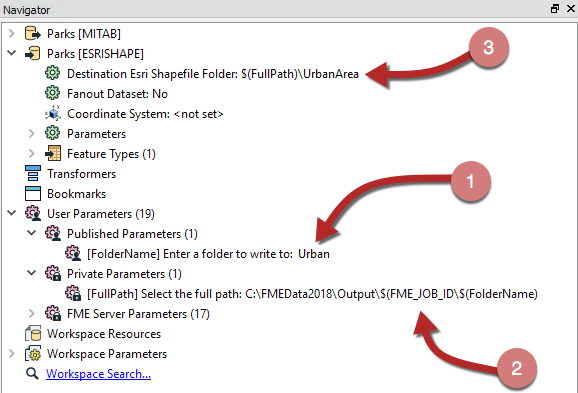

  

    <article class="markdown-body entry-content" itemprop="text"><h2>参数设置</h2>

创建用户参数时，存在两个复选框选项; 一个标记为已发布，另一个标记为可选。

<h3>发布的参数</h3>

此选项的目的是向最终用户公开或隐藏参数。如果选中“已发布”框，则最终用户可以输入值。如果未选中该框，则不会提示他们输入值，并且该参数将被视为“私有”。

<strong>私有参数</strong>有两种用途。

首先，私有参数是工作空间作者创建共享参数而不将其暴露给用户的一种方式。

例如，如果他们想为几个Snapper转换器提供相同的容差值 - 但是作者而不是用户设置了该值 - 则使用私有参数。

私有参数的第二个用途是将用户的部分输入嵌入到更大的参数中。

例如，这里工作空间作者提示用户输入要写入文件的文件夹（1）。然后，作者将完整文件夹路径定义为私有参数（2），作为固定路径和作业ID的混合：

最后（3）私有参数嵌入在目标Shapefile数据集的FME参数内。

<table>
<tbody><tr>
<td>
<i></i>
分析师女士说......
</td>
</tr>
<tr>
<td>

您可能已经注意到，有许多FME服务器参数可用于打算在企业规模上部署其创建的工作空间作者。
  实际上，如果您查看上面的屏幕截图，您可能会注意到Server参数（FME_JOB_ID）已嵌入到FullPath私有参数中！

</td>
</tr>
</tbody></table>

<h3>可选参数</h3>

Optional选项卡告诉FME用户参数是强制的还是可选的。

例如，在这里，DateTimeCalculator用于计算公园关闭的时间，给定其开放时间和用户输入打开的小时数和分钟数：

MINUTES用户参数在Optional设置中有一个复选标记，表示它不是强制性的。例如，用户可以输入公园打开八（8）小时并忽略MINUTES参数。

或者，用户参数可以为Generalizer转换器提供容差值。在这种情况下，作者将要关闭此复选框并使参数成为必需。没有给出容差值的Generalizer通常会失败，制造公差强制是阻止这一切发生的一种方法。。

<table>
<tbody><tr>
<td>
<i></i>
Vector小姐说......
</td>
</tr>
<tr>
<td>

告诉我，是否有可能有一个强制的私有参数？（即两个设置框都未选中）
   <a href="http://52.73.3.37/fmedatastreaming/Manual/QAResponse2017.fmw?chapter=11&amp;question=5&amp;answer=1&amp;DestDataset_TEXTLINE=C%3A%5CFMEOutput%5CQAResponse.html" rel="nofollow">1.是</a>
 <a href="http://52.73.3.37/fmedatastreaming/Manual/QAResponse2017.fmw?chapter=11&amp;question=5&amp;answer=2&amp;DestDataset_TEXTLINE=C%3A%5CFMEOutput%5CQAResponse.html" rel="nofollow">2.否</a>
 <a href="http://52.73.3.37/fmedatastreaming/Manual/QAResponse2017.fmw?chapter=11&amp;question=5&amp;answer=3&amp;DestDataset_TEXTLINE=C%3A%5CFMEOutput%5CQAResponse.html" rel="nofollow">3.是，但您需要立即设置值</a>
 <a href="http://52.73.3.37/fmedatastreaming/Manual/QAResponse2017.fmw?chapter=11&amp;question=5&amp;answer=4&amp;DestDataset_TEXTLINE=C%3A%5CFMEOutput%5CQAResponse.html" rel="nofollow">4.是，但仅适用于文本或数字参数</a>

</td>
</tr>
</tbody></table>
</article>
  

</body></html>
