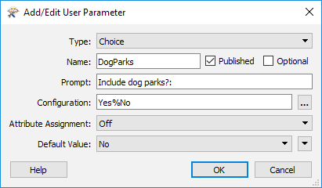

  

    <article class="markdown-body entry-content" itemprop="text">
<table>
<tbody><tr>
<td>
<i></i>
练习3
</td>
<td>
地面维护项目
</td>
</tr>
<tr>
<td>数据</td>
<td>公园（MapInfo TAB）</td>
</tr>
<tr>
<td>总体的目标</td>
<td>参数化并完成转换日志</td>
</tr>
<tr>
<td>演示</td>
<td>创建和使用复杂的用户参数</td>
</tr>
<tr>
<td>启动工作空间</td>
<td>C:\FMEData2018\Workspaces\DesktopAdvanced\Parameters-Ex3-Begin.fmw</td>
</tr>
<tr>
<td>结束工作空间</td>
<td>C:\FMEData2018\Workspaces\DesktopAdvanced\Parameters-Ex3-Complete.fmw  C：\ FMEData2018 \ Workspaces \ DesktopAdvanced \ Parameters-Ex3-Complete-Advanced.fmw</td>
</tr>
</tbody></table>

在之前的项目中（在FME Basic Desktop培训中），您创建了一个项目，通过计算每个公园的大小和平均大小来转换公园数据。

现在正在使用它的团队希望在FME Server上实现它。同时，他们希望改进一些功能并实现自定义转换日志。

在创建原始工作空间时，您被分配执行以前的工作升级。

<ul>
<li>将输出设置为写入该用户的文件夹</li>
<li>询问是否过滤遛狗公园</li>
<li>询问用于创建标签的属性</li>
<li>以CSV格式创建转换日志</li>
</ul>

 <strong>1）启动Workbench</strong>
  启动Workbench并打开工作空间C：\ FMEData2018 \ Workspaces \ DesktopAdvanced \ Parameters-Ex3-Begin.fmw

您可以看到工作空间读取一些MapInfo公园数据，过滤掉遛狗公园，计算公园区域和平均区域，创建标签，并将数据写回MapInfo。

 
<table>
<tbody><tr>
<td>
<i></i>
.1更新
</td>
</tr>
<tr>
<td>

FME2018.1具有新版本的AttributeManager转换器，具有更高的性能。如果需要，右键单击AttributeManager并选择Upgrade Transformer以升级此工作空间中的转换器。

</td>
</tr>
</tbody></table>

现有两个已发布的参数 - 一个用于源数据集，另一个用于目标：

源数据集永远不会更改，我们将为目标创建一个新参数，因此请删除这两个参数。

 <strong>2）添加用户参数</strong>
 如果我们要将输出写入特定于当前用户的文件夹，我们需要知道该用户是谁。

因此，接下来创建一个文本格式的用户参数来询问用户的名字：

确保未选中可选复选框; 我们希望用户必须在此处输入值。此外，请确保属性分配为关闭，因为我们不希望它们能够选择属性。

 <strong>3）添加用户参数</strong>
 我们可以通过多种方式实现这些要求; 我们将执行涉及共享用户参数的版本。

因此，创建一个类型为Folder（Output）的新用户参数。取消选中<strong>both</strong>的发布时间和可选字段; 即它将是我们使用的私有参数（不是最终用户），它将是必需的。

将Name字段设置为类似OutputFolder的值，并将Value浏览设置为C：\ FMEData2018 \ Output \ Training

将属性分配设置为关闭，虽然它并不重要，因为无论如何这将是一个私有参数。

<table>
<tbody><tr>
<td>
<i></i>
Workbench博士说......
</td>
</tr>
<tr>
<td>

从技术上讲，我们可以使用文本类型参数。文件夹参数的唯一好处是它可以让我们浏览到该位置。但由于它是用户永远不会看到的私有参数，因此并不重要。无论如何，这两种方法都符合我们的要求。

</td>
</tr>
</tbody></table>

 <strong>4）设置输出位置</strong>
 现在让我们使用我们创建的两个参数。

<em><strong>注意：</strong></em> <em>首先确保在步骤1中删除了两个现有的源/目标用户参数，否则此步骤将不起作用！</em>

在“导航”窗口中找到“目标MapInfo文件夹”的FME参数，然后双击它以打开编辑对话框。

在该对话框中手动输入：

<pre>$（OutputFolder）\ $（用户名）
</pre>

或者，使用文本编辑器，您可以通过双击添加它们，以减少出错的可能性。

您基本上将两个用户参数连接/嵌入到FME参数中。

当您运行工作空间时，系统将提示您输入您的名称，然后输出数据现在将写入C：\ FMEData2018 \ Output \ Training＆lt; Username&gt;

<table>
<tbody><tr>
<td>
<i></i>
Workbench博士说......
</td>
</tr>
<tr>
<td>

我们<strong>可以</strong>通过各种方式完成此任务。我们可以将OutputFolder参数设置为C：\ FMEData2018 \ Output \ Training \ $(Username)，然后将其链接到FME Destination MapInfo参数。你会马上看到我们为什么不那样做！

</td>
</tr>
</tbody></table>

 <strong>5）添加用户参数</strong>
 下一个任务是检查输出中是否需要遛狗公园。工作空间中的Tester转换器显示属性（DogParks）具有值Y或N以表示其状态。我们需要询问用户并将他们的决定添加到测试人员。

现在创建一个新的用户参数。它将是Choice类型参数，它<strong>不是</strong>可选的：

将其设置为一个简单的是/否问题是否在输出中包含溜狗公园。关闭属性分配，因为 - 再次 - 我们不希望用户能够选择属性。

 <strong>6）更新测试程序</strong>
 要使用DogParks参数，请打开Tester参数对话框。添加第二个测试条款：

<pre>$（DogParks）=是的
</pre>

现在，当工作空间运行时，如果您选择不保溜狗公园，它们将从工作空间中过滤掉。这个概念 - 根据用户参数的值引导功能 - 是一个非常有用的注意事项。

 <strong>7）添加用户参数</strong>
 确定。下一个任务是允许用户选择要用于标签的属性。

如上一节训练中所述，如果我们只是在LabelPointReplacer中发布label参数，则用户将能够输入文本以及选择属性。我们希望他们必须选择一个属性而不能输入文本。

因此，请创建属性名称类型的新用户参数。这个可以是可选的，因为用户未能选择属性相当于说“不需要标签”：

<table>
<tbody><tr>
<td>
<i></i>
Workbench博士说......
</td>
</tr>
<tr>
<td>

单击运行按钮，查看提示列表中显示的内容; 您应该看到选择标签属性的参数。但看！参数显示“No Attributes Available”。为什么是这样？
  这是因为可用属性列表取决于参数的使用位置。由于我们尚未使用该参数，因此没有可用的属性！
  类似地，如果我们在具有属性A和B的位置使用参数，并且在具有属性B和C的不同位置使用参数，则参数可用的唯一属性是B.这是因为此类型的参数仅显示存在于其使用的<strong>所有位置的</strong>属性。

</td>
</tr>
</tbody></table>

 <strong>8）更新LabelPointReplacer</strong>
 要使用LabelAttribute参数，请检查LabelPointReplacer参数。

请记住（再次来自上一节）我们不能将此用户参数应用于Label FME参数。那只会返回属性的名称; 我们想要属性值。

所以在Label参数中手动输入（或打开文本编辑器并输入）：

<pre>@Value（$（LabelAttribute））
</pre>

现在，当工作空间运行时，系统还会提示您选择用于标记公园的属性。如果您选择无属性，则不会创建任何标签（只是点要素）。

 <strong>9）添加日志写模块</strong>
 最后一项任务是创建CSV格式转换日志。这不是太难做到。

使用Writer&gt; Add Writer添加新的CSV格式写模块，并进行以下设置：

<table>
<tbody><tr>
<td>写模块格式</td>
<td>CSV（逗号分隔值）</td>
</tr>
<tr>
<td>写模块数据集</td>
<td>C:\FMEData2018\Output\Training</td>
</tr>
<tr>
<td>写模块参数</td>
<td>覆盖现有文件：没有 写字段名称行：如果写第一行</td>
</tr>
<tr>
<td>添加要素类型</td>
<td>CSV文件定义：手动...</td>
</tr>
</tbody></table>

单击“确定”后，将打开对话框以定义表模式。

在常规选项卡上，将CSV文件名设置为<em>TranslationLog</em>：

在“用户属性”选项卡中，定义“用户”和“日期”属性：

单击“确定”关闭对话框。

 <strong>10）连接要素类型</strong>
 我们需要一条记录才能触发此要素类型; 但只有一个功能，否则我们将获得多个记录。

放下Creator转换器并将其连接到TranslationLog功能类型：

 <strong>11）设置输出文件夹</strong>
 我们应该将日志的输出位置设置为相对于用户文件的写入位置。

因此，找到CSV写模块的目标数据集参数，右键单击它并选择“链接到用户参数”：

出现提示时，选择我们之前创建的OutputFolder（私有）参数。

<table>
<tbody><tr>
<td>
<i></i>
Workbench博士说......
</td>
</tr>
<tr>
<td>

您可能想知道最后一部分的重点是什么。当两者都指向同一个文件夹时，为什么我们链接参数？
  关键是现在MapInfo和CSV写模块共享一个定义其输出文件夹的参数。如果我们希望改变它们被写入的位置（比如当路径从FMEData2018变为FMEData2019时），我们只需编辑私有参数来修复两个写模块。这就是为什么我们做了我们在第4步中所做的事情。
  如果你不相信我，试一试，亲自体验！

</td>
</tr>
</tbody></table>

 <strong>12）设置用户属性</strong>
 这里的最后一步是为转换日志（CSV写模块）的用户和日期字段提供值。

在要素类型上右键单击名为User的属性，然后选择Edit Value选项：

在弹出的对话框中输入值的$（用户名）（一旦开始输入，系统会提示您选择它）：

这是共享用户参数的另一个示例。此参数现在在此处和MapInfo写模块名称中使用。

 <strong>13）</strong>
 立即<strong>设置日期属性</strong> - 为<strong>Date属性</strong>提供值 - 对Date字段重复上述步骤，但这次输入DateTimeNow（）函数而不是user参数：

我们完成了！保存工作空间然后运行它！

您应该找到您选择的数据（带或不带标签）写入您名下的文件夹，以及添加到父文件夹中CSV文件的转换记录。

<table>
<tbody><tr>
<td>
<i></i>
高级练习
</td>
</tr>
<tr>
<td>

如果你有时间再做一个任务，为什么不添加一个转换器来舍入ParkArea和AverageParkArea属性并创建一个用户参数来控制舍入的发生方式？您可以选择任何类型的参数，您认为最适合允许用户选择要舍入的小数位数。它可以是Choice参数，Choice with Alias参数，Number参数或其他内容。
  您还可以扩展写入CSV日志文件的信息; 例如，添加转换中使用的FME的版本号，它可用作名为$（FME_BUILD_NUM）的参数。

</td>
</tr>
</tbody></table>

<table>
<tbody><tr>
<td>
<i></i>
恭喜
</td>
</tr>
<tr>
<td>

通过完成本练习，您已学会如何：
<ul><li>创建非可选的用户参数</li>
<li>创建私有用户参数</li>
<li>创建文件夹类型用户参数</li>
<li>用户参数的控制属性分配</li>
<li>在FME参数中嵌入/连接用户参数</li>
<li>创建选择类型用户参数</li>
<li>在Tester转换器中使用用户参数来重定向要素</li>
<li>创建并使用“属性名称”用户参数</li>
<li>通过在多个位置使用它来共享用户参数</li></ul>

</td>
</tr>
</tbody></table>
</article>
  

