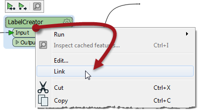

## 切换自定义转换器类型 #

当自定义转换器设计为允许类型切换时，将自定义转换器实例从嵌入模式切换到链接模式非常简单。只需右键单击该实例，然后选择“链接”：

 

当然，切换类型要求已经导出自定义转换器。如果没有，则没有选项来链接转换器，因为没有要链接到的文件！

切换到链接模式时，将关闭自定义转换器定义选项卡，并将自定义转换器替换为仅引用外部fmx文件定义的转换器。

如果有多个自定义转换器实例，系统会询问您是否要切换所有实例：

---

通常的答案是肯定的，因为相同的转换器既嵌入又链接可能会令人困惑！如果您回答“否”，请注意您单击的转换器将被链接（但其他实例都不会）。

以与上面类似的方式，从“链接”切换到“嵌入”右键单击并选择“嵌入”选项。

---

<table style="border-spacing: 0px">
<tr>
<td style="vertical-align:middle;background-color:darkorange;border: 2px solid darkorange">
<i class="fa fa-quote-left fa-lg fa-pull-left fa-fw" style="color:white;padding-right: 12px;vertical-align:text-top"></i>
大副Transformer说…
</td>
</tr>

<tr>
<td style="border: 1px solid darkorange">

只有两个版本相同，才能从嵌入式切换到链接式。
  换句话说，如果您嵌入一个链接式转换器然后更改嵌入式定义，您将无法恢复到链接式版本。

</td>
</tr>
</table>
