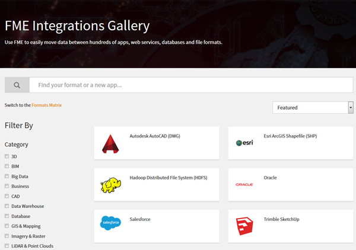

# 数据转换基础 #

从本质上讲，FME是一种数据转换工具，通常这是用户希望学习的第一个方面。

**数据转换** 是Safe Software使用的术语，指的是将数据从一种格式转换为另一种格式。您是否曾经遇到过在Go-to应用程序中以异常格式打开数据的麻烦？您是否曾经需要以系统的方式将电子表格数据加载到数据库中？您是否曾经想过以HTML，JSON和XML的格式提取和转换Web数据而无需编写代码？那么你来对地方了！FME使数据转换变得容易，使您可以在400多种不同格式之间进行转换。

英语原文用的是**translation** 而不是 **conversion** ，以强调无缝地让数据以另一种格式的语言讲话的目标。FME旨在使您不仅将数据从一种格式转换为另一种格式，而且还可以创建符合您确切规格的输出数据。

在本单元中，您将学习如何使用FME自己进行基本数据转换。
