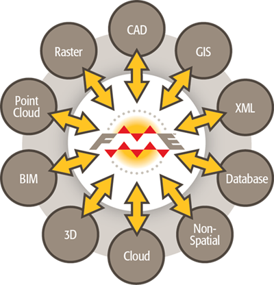
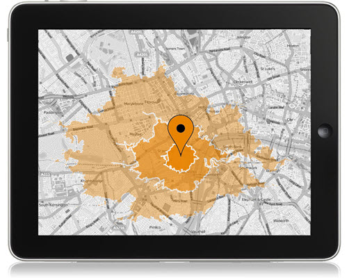
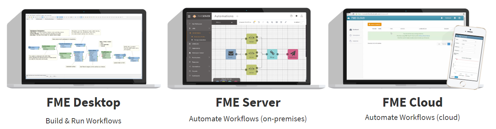

# 什么是FME? #

Safe Software提供 **FME (要素操作引擎)**, the data integration platform with the best support for spatial data worldwide. 

## 历史

Safe Software始于1993年，帮助林业公司与省政府交换地图。从技术上讲，那时可以共享地图，但是只能在数小时的手动工作之后才能共享。通常，在此过程中会丢失大量信息。

没有人会高兴。Safe Software创建了FME来解决此问题，并且从那时起一直在解决数据挑战。如今，FME已成为世界上拥有最佳空间支持的数据集成平台，并且通过在每个发行版本中增加对新数据格式和工作流的支持，它继续扩展了可能的范围。

## 数据集成

<tag></tag>
> "世界上最有价值的资源不再是石油，而是数据"

>-- [经济学家](https://www.economist.com/leaders/2017/05/06/the-worlds-most-valuable-resource-is-no-longer-oil-but-data), 2017

数据的创建，操作和分析对当代组织构成了重大挑战。从来没有像现在这样的机器可读数据存在，但是组织仍在努力寻找使用大量信息来辅助决策的方法。

### 什么是数据集成？

[我们将数据集成定义为](https://www.safe.com/what-is/data-integration/) “将来自不同来源的数据汇总到一个统一的视图中，以创建包含有价值和可用信息的数据集。”

数据集成使跨孤立的“数据孤岛”的数据组合和分析成为可能，这些孤岛通常很难进行协作。数据孤岛是指将数据存储在特定位置的异构数据源。由于遗留系统和部门的脱节，它们长期以来一直是一个问题。过去，部门只考虑他们的需求来选择用于数据存储的软件和方法是有意义的。现在，必须考虑跨功能。使用FME合并数据可以帮助将专有的、遗留的数据带入新的系统，这些系统很容易被任何团队成员访问。

### 使用FME进行数据集成

FME通过从多个来源读取数据（在下图中显示为来源A和B），使用转换工具来更改或重组数据以满足用户需求并将其写入输出位置来完成数据集成（ C）：

FME的数据集成功能可用于转换文件格式，转换数据或同时执行这两种操作。FME还可以集成复杂的**空间**数据，这是市场上大多数集成工具无法利用的数据类别。它使用图形界面，因此不需要编码。

## FME如何工作

FME的核心是一个支持一系列数据类型和格式的引擎：Excel，CSV，XML和数据库，以及各种类型的映射格式，包括GIS，CAD，BIM 等等。

通过处理所有可能的几何对象和属性类型的富数据模型，可以支持如此多的数据类型。

## 谁使用FME？

FME已帮助全球数以千计的客户利用他们的数据，因此可以准确地用于需要的地点，时间和方式。我们的许多客户都在以下行业：

- 建筑与工程
- 联邦政府
- 地方政府
- 石油和天然气
- 电信
- 公用事业

以下是人们如何使用FME的一些示例，以及指向更多详细信息的链接。

### 温哥华国际机场

温哥华国际机场（YVR）希望帮助乘客在机场内导航。他们选择在自己的移动应用程序中，在其网站上以及通过Apple Maps共享室内地图数据。他们的室内制图源数据存储为CAD图。YVR通过FME将其CAD图转换为[室内制图数据格式](https://www.safe.com/integrate/indoor-mapping-data-format-imdf/)，成为最早提供室内寻路的机场之一。

[Watch a video](https://www.youtube.com/watch?v=pHaLPP6Vj4c&feature=youtu.be) about this example.
[Watch a presentation](https://www.safe.com/presentation/indoor-mapping-trials-and-tribulations/?) about this example.

### 气象网络或Pelmorex Corp.

Weather Network或Pelmorex Corp.希望向政府机构，私人公司和公众提供实时和存档的雷击日期。他们使用FME转换了来自加拿大各地传感器的数据， 以创建[Pelmorex Lightning Detection Network (PLDN)](http://data.twncs.com/Solutions/Lightning/lightning.html), 该网络可提供地图，电子邮件警报和其他有价值的信息。

[阅读博客文章](https://blog.safe.com/2010/09/fme-server-and-the-weather-network/?) 有个此示例。

### Tetrad Sitewise

[Tetrad](http://www.tetrad.com/)的[Sitewise](http://www.tetrad.com/software/sitewisepro/) 供市场分析解决方案，以使用FME帮助客户选择新的商业地点软件。Sitewise可以分析竞争，停车，交通可达性，将多个数据集结合起来，使客户可以根据数据做出有关在哪里放置新设施的决策。

[观看在线讲座](https://www.safe.com/webinars/market-analysis/)有关此示例。

访问我们的网站了解更多[客户案例](https://www.safe.com/customers/).

## 数据集成平台

本模块介绍如何使用FME Desktop创建数据转换。FME Desktop是FME数据集成平台中的一个软件：

- [**FME Desktop**](https://www.safe.com/fme/fme-desktop/) 使您可以连接和转换数据。
  - 例如，获取一个包含业务信息和地址的Excel电子表格，并将其添加到MySQL数据库，该数据库是公民数据访问门户的后端，该门户允许搜索营业执照信息。
- [**FME Server**](https://www.safe.com/fme/fme-server/) 使您可以自动化本地工作流。
-例如，自动从地理信息系统层检索数据，以匹配输入的市政营业执照申请，以及发送电子邮件提醒相关利益相关者。
- [**FME Cloud**](https://www.safe.com/fme/fme-cloud/) 使您可以自动化云中的工作流程。
  - 例如，上面的市政府可以在完全托管的AWS云环境中访问FME Server技术。

