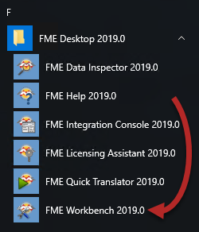
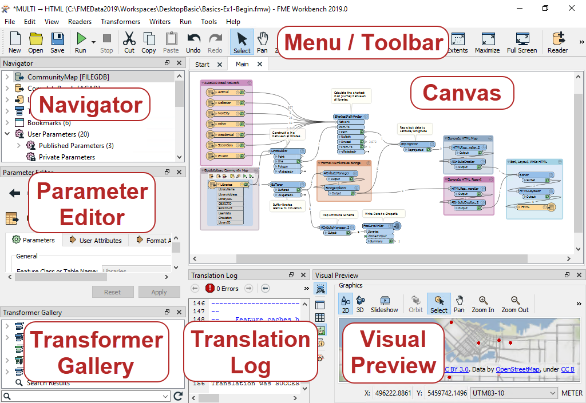
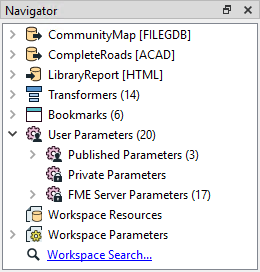
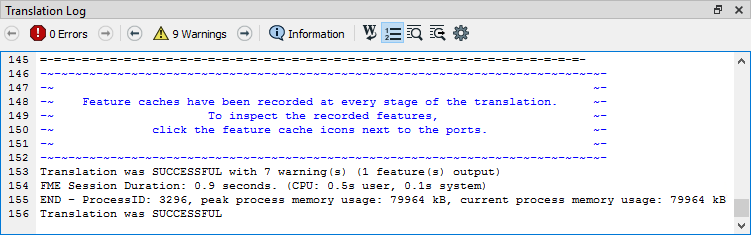
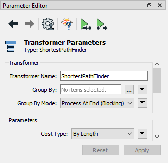
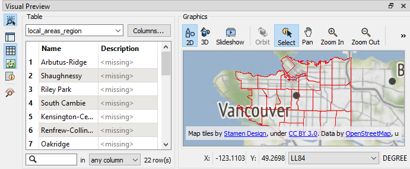

# FME Workbench简介 #

让我们仔细看看FME Workbench。如果直接打开工作区，您可以通过Windows“开始”菜单启动Workbench：

<table style="border-spacing: 0px">
  <tr>
    <td colspan="100%" style="vertical-align:middle;background-color:darkorange;border: 2px solid darkorange">
      <i class="fa fa-info-circle fa-lg fa-pull-left fa-fw" style="color:white;padding-right: 12px;vertical-align:text-top"></i>
      FME蜥蜴说...
    </td>
  </tr>

  <tr>
    <td style="border-left: 1px solid darkorange; border-bottom: 1px solid darkorange">
      
          
您好，我是<a href="https://twitter.com/fmelizard?lang=en">FME蜥蜴</a>! 我是FME专家，偶尔会出现以提供一些使用FME的有用提示。这是我的第一个！

          
Feel free to follow along in Workbench during these informational sections if you wish. Alternatively, you can just complete the hands-on exercises in each unit, which will illustrate the concepts shown between exercises.

      
    </td>
    <td style="border-bottom: 1px solid darkorange; border-right: 1px solid darkorange">
      
    </td>
  </tr>
  </table>

## FME Workbench的主要组件

FME Workbench用户界面有许多主要组件：

### 画布

正如我们所见，FME Workbench画布是定义转换的地方。它是Workbench中的主要窗口：

默认情况下，工作空间从左到右读取; 左侧的数据源，中间的转换工具和右侧的数据目标。每个项目之间的连接表示数据流，可以分支在不同的方向，合并在一起，或两者兼而有之。

### 菜单/工具栏

菜单栏和工具栏包含许多工具：例如，用于在Workbench画布周围导航，控制管理任务以及添加或删除读模块/写模块的工具：

### 导航器

“导航”窗口是一个结构化的参数列表，用于表示和控制转换的所有组件：

### 转换器库

转换器库是用于定位和选择FME转换工具的工具。转换器的数量根据FME的版本和安装的任何可选的定制转换器而有所不同：

### 转换日志

转换日志报告转换和其他操作。信息包括任何警告或错误消息，转换状态，转换长度以及处理的要素数量：

### 参数编辑器窗口

参数编辑器窗口用于编辑画布窗口上对象的参数：

...尽管每个画布对象也都有其自己的参数窗口。

### 可视化预览

可视化预览Visual Preview是FME Data Inspector的嵌入式版本，可在表格或地图上显示要素。通过此窗口，您可以跟踪构建转换时数据的变化情况。独立数据检查器应用程序中的许多可用功能在Visual Preview中可用。我们将在后面的部分中对其进行更多讨论。

