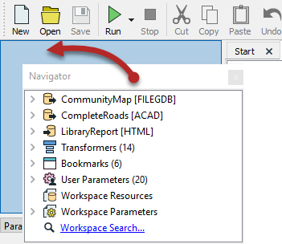

# 窗口控制 #

可以将Workbench中的所有窗口从其默认位置分离，并放置在自定义位置。为此，只需单击窗口框架并将其拖动到新位置即可。

如果窗口放在现有窗口的顶部，那么这两个窗口将成为**选项卡式的**。

如果窗口放在现有窗口旁边（或两个现有窗口之间），则它们将**堆叠在一起**。

在上面的屏幕截图中，用户将导航器放在Workbench左侧的位置，堆叠在参数编辑器的顶部。

---

<!--Tip Section-->

<table style="border-spacing: 0px">
  <tr>
    <td style="vertical-align:middle;background-color:darkorange;border: 2px solid darkorange">
      <i class="fa fa-info-circle fa-lg fa-pull-left fa-fw" style="color:white;padding-right: 12px;vertical-align:text-top"></i>
      FME蜥蜴说...
    </td>
  </tr>

  <tr>
    <td style="border: 1px solid darkorange">
      
        无需缩小画布空间。按下<kbd>F11</kbd> 可将较少使用的窗口移到一侧，然后将画布窗口扩展到全尺寸！窗口也可以移开并移至另一台显示器以获取更多空间！
      
    </td>
  </tr>
</table>
