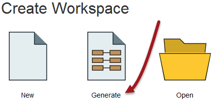
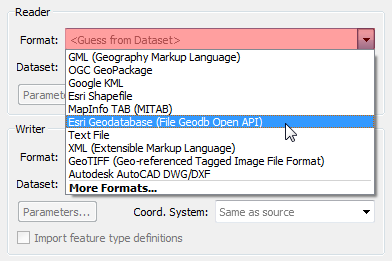
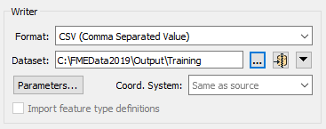
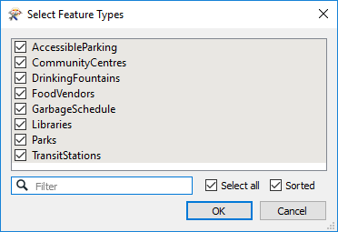

# 创建转换

Workbench的直观界面使您可以轻松设置和运行简单的格式到格式（“快速”）转换。

## “开始”选项卡

FME Workbench中的“开始”选项卡包含创建或打开工作空间的不同方法。最简单的方法是Generate Workspace：

## 生成工作空间对话框

“生成工作空间”对话框将所有选项压缩为单个对话框。它具有用于定义要读取的数据和要写入的数据的格式和位置的字段。

FME对话框中的红色着色表示必填字段。用户必须在这些字段中输入数据才能继续。在大多数对话框中，“确定”按钮将被取消激活，直到必填字段完成。

### 格式和数据集选择

关键要求是源数据的格式。FME中的所有格式选择字段都是下拉菜单和文本输入字段。

文本输入字段允许您直接键入格式名称。它具有“智能完成”功能，可在您键入时选择紧密匹配。

下拉列表显示了一些最常用的格式，因此可以立即获得许多喜爱的格式：

单击“更多格式”，将打开一个表格，其中显示了**读模块和写模块库**中FME支持的所有格式。

源数据集是另一个关键要求。数据集选择字段是文本输入字段，但具有浏览按钮以打开类似于资源管理器的文件选择对话框。

同样，写模块格式和数据集在此对话框中定义：

单击“生成工作空间”对话框上的“确定”会导致FME生成已定义的工作空间。但是，只要源数据集包含多个**要素类型**，就会首先提示用户选择要转换的要素类型。

这可以通过“选择要素类型”对话框来实现。功能类型是FME术语，用于描述记录的子集。该术语的常见替代方法是 _图层，表格，图纸，要素类和对象类。_ 例如，Excel工作簿中的每张工作表，数据库中的表或空间数据文件中的图层都是由FME中的要素类型定义的。仅在“选择要素类型”对话框中选择的要素类型将被添加到工作空间：

例如，这是一个“选择要素类型”对话框，其中用户已选择在工作空间中包含所有可用图层。
