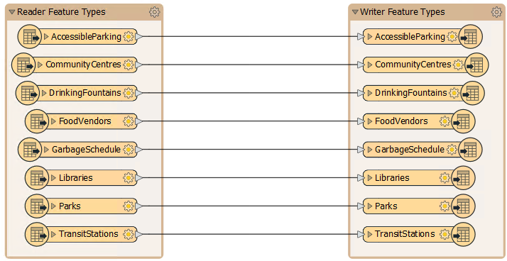

## 新工作空间

新工作空间从左到右，从源（读模块）图层到目标（写模块）图层进行读取。箭头表示数据流的方向：

在上面的屏幕截图中，从一种格式读取八个要素类型并将其写入另一个格式。

|  FME蜥蜴说... |
| :--- |
|  在大多数情况下，FME使用术语“读模块”和“写模块”而不是“源”和“目标”。因此，读模块读取数据集，写模块写入数据集，类似于源/目标和输入/输出。 |

## 保存工作空间

工作空间可以保存到文件中，以便以后可以重复使用。工具栏上的保存按钮是执行此操作的一种方法：

还有一些菜单选项可以执行相同的操作，在本例中，文件 &gt; 保存 (快捷键= <kbd>Ctrl</kbd>+<kbd>S</kbd>) 或文件&gt;另存为。默认文件扩展名为.fmw。

|  FME蜥蜴说... |
| :--- |
|  FME Workbench界面的一些直观但不太明显的功能。  
   例如，在菜单栏上选择“文件”&gt;“打开最近”以显示以前使用的工作空间列表。此列表最多可显示15个条目。 |
