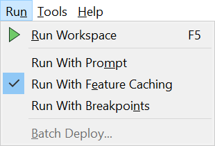

  

    <article class="markdown-body entry-content" itemprop="text"><h2>运行工作空间</h2>

Workbench工具栏上的绿色箭头（或“播放”按钮）启动转换：

或者，在菜单栏上的运行下查看：

菜单栏和工具栏上都会显示相同的工具栏选项。请注意，可以使用快捷方式选项F5：

<table>
<tbody><tr>
<td>
<i></i>
技巧
</td>
</tr>
<tr>
<td>

“运行”按钮的操作可以通过一系列选项进行修改，包括提示用户输入的功能（使用提示符运行），缓存中间数据的功能（使用完全检查运行）以及在调试模式下运行的功能（断点运行）。这些是可以随意打开和关闭的切换选项。

</td>
</tr>
</tbody></table>

<h2>工作空间结果</h2>

运行工作空间后，可在转换日志中找到相关信息和统计信息，该日志显示在Workbench日志窗口中。

转换日志显示转换是成功还是失败，从源读取多少要素并写入目标，以及执行转换所需的时间。

在此示例中，日志文件显示已读取350个要素（来自Esri地理数据库）并已写出（到GML数据集）。

整个过程取得了成功，没有任何警告。转换的经过时间是2.1秒。

<table>
<tbody><tr>
<td>
<i></i>
Vector小姐说......
</td>
</tr>
<tr>
<td>

我打赌你到目前为止所有的问题都是正确的！做得好。现在看看你是否可以得到这些：
   其中哪一个不是设置转换格式的方法？
  <a href="http://52.73.3.37/fmedatastreaming/Manual/QAResponse2017.fmw?chapter=1&amp;question=8&amp;answer=1&amp;DestDataset_TEXTLINE=C%3A%5CFMEOutput%5CQAResponse.html" rel="nofollow">1.键入格式名称</a>
 <a href="http://52.73.3.37/fmedatastreaming/Manual/QAResponse2017.fmw?chapter=1&amp;question=8&amp;answer=2&amp;DestDataset_TEXTLINE=C%3A%5CFMEOutput%5CQAResponse.html" rel="nofollow">2.从下拉列表中选择格式</a>
 <a href="http://52.73.3.37/fmedatastreaming/Manual/QAResponse2017.fmw?chapter=1&amp;question=8&amp;answer=3&amp;DestDataset_TEXTLINE=C%3A%5CFMEOutput%5CQAResponse.html" rel="nofollow">3.浏览格式库中的格式</a>
 <a href="http://52.73.3.37/fmedatastreaming/Manual/QAResponse2017.fmw?chapter=1&amp;question=8&amp;answer=4&amp;DestDataset_TEXTLINE=C%3A%5CFMEOutput%5CQAResponse.html" rel="nofollow">4.选择具有已知文件扩展名的数据集</a>
 <a href="http://52.73.3.37/fmedatastreaming/Manual/QAResponse2017.fmw?chapter=1&amp;question=8&amp;answer=5&amp;DestDataset_TEXTLINE=C%3A%5CFMEOutput%5CQAResponse.html" rel="nofollow">5.以上都不是（它们都是设置格式的有效方式）</a>
  哪个键是运行工作空间的快捷方式？
  <a href="http://52.73.3.37/fmedatastreaming/Manual/QAResponse2017.fmw?chapter=1&amp;question=9&amp;answer=1&amp;DestDataset_TEXTLINE=C%3A%5CFMEOutput%5CQAResponse.html" rel="nofollow">1. F4 </a>
 <a href="http://52.73.3.37/fmedatastreaming/Manual/QAResponse2017.fmw?chapter=1&amp;question=9&amp;answer=2&amp;DestDataset_TEXTLINE=C%3A%5CFMEOutput%5CQAResponse.html" rel="nofollow">2. F5 </a>
 <a href="http://52.73.3.37/fmedatastreaming/Manual/QAResponse2017.fmw?chapter=1&amp;question=9&amp;answer=3&amp;DestDataset_TEXTLINE=C%3A%5CFMEOutput%5CQAResponse.html" rel="nofollow">3. F5.6 </a>
 <a href="http://52.73.3.37/fmedatastreaming/Manual/QAResponse2017.fmw?chapter=1&amp;question=9&amp;answer=4&amp;DestDataset_TEXTLINE=C%3A%5CFMEOutput%5CQAResponse.html" rel="nofollow">4. F＃</a>

</td>
</tr>
</tbody></table>
</article>
  

