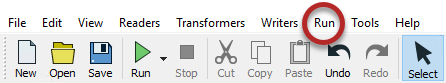
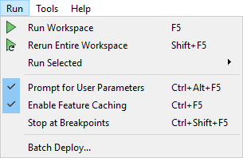

## 运行工作空间

Workbench工具栏上的绿色箭头（或“播放”按钮）启动转换：

或者，在菜单栏上的运行下查看：

菜单栏和工具栏上都会显示相同的工具栏选项。请注意，可以使用快捷方式选项<kbd>F5</kbd>代替:

|  FME蜥蜴说... |
| :--- |
|  可以通过按钮上的下拉菜单来修改“运行”按钮的操作，包括仅运行工作空间的某些部分的功能（“运行选定内容”），提示用户进行输入（提示用户参数），缓存中间数据的功能（启用要素缓存），并可以使用断点运行以进行调试（在断点处停止）。我们将在稍后的培训中介绍其中的一些内容。 |

## 工作空间结果

运行工作空间后，可在转换日志中找到相关信息和统计信息，该日志显示在Workbench日志窗口中。

转换日志显示转换是成功还是失败，从源读取多少要素并写入目标，以及执行转换所需的时间。

在此示例中，日志文件显示已读取350个要素（来自Esri地理数据库）并已写出（到GML数据集）。

整个过程取得了成功，没有任何警告。转换的经过时间是2.1秒。

|  FME蜥蜴说... |
| :--- |
| 在FME中，“要素”是一个单独的数据块，类似于数据库中的一条记录或电子表格中的一行。|
