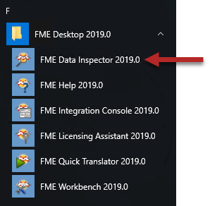
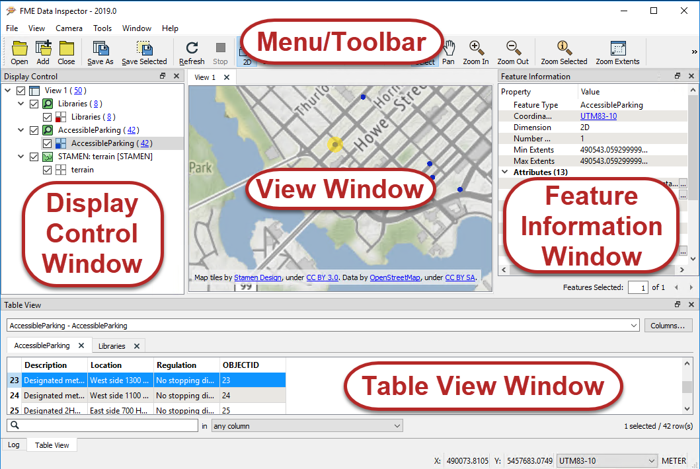
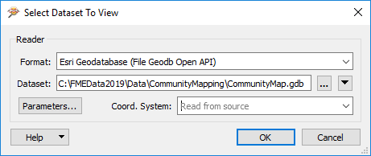

## FME Data Inspector ##

FME Data Inspector是用于检查数据的独立应用程序。

### 启动FME Data Inspector ###

要启动Data Inspector, l请在Windows开始菜单中找到它：

### ME Data Inspector的主要组件 ###

当FME Data Inspector打开数据集时，它看起来像这样：

这些组件的功能与Visual Preview相同，但有以下区别：

- 有一个菜单栏。
- “图形”窗口称为“视图”窗口，可以有多个称为“视图”的选项卡，每个选项卡显示不同的数据集。
- 您可以打开数据（“文件”>“打开数据集”），以在新的视图中打开它，也可以添加数据（“文件”>“添加数据集”），以将数据添加到打开的视图中。
- 提供了一些其他工具，包括 [标记位置](http://docs.safe.com/fme/2019.0/html/FME_Desktop_Documentation/FME_DataInspector/DataInspector/Marking-Locations.htm) 以及 [测量距离](http://docs.safe.com/fme/2019.0/html/FME_Desktop_Documentation/FME_DataInspector/DataInspector/Using_the_Measuring_Tool.htm).

---

<!--New Section-->

<table style="border-spacing: 0px">
<tr>
<td style="vertical-align:middle;background-color:darkorange;border: 2px solid darkorange">
<i class="fa fa-bolt fa-lg fa-pull-left fa-fw" style="color:white;padding-right: 12px;vertical-align:text-top"></i>
新内容
</td>
</tr>

<tr>
<td style="border: 1px solid darkorange">

视图窗口能够以表格格式显示空间数据（2D或3D）或属性信息。使用工具栏按钮可以在这些视图之间切换。对于FME 2019.0及更高版本，FME现在可以直接在视图窗口而不是表视图窗口中自动打开非空间数据。

</td>
</tr>
</table>

---

## 查看数据 ##
The FME Data Inspector提供了两种查看数据的方法：打开或添加。

***打开*** 数据集将打开一个新的视图窗口，以便显示数据集。 ***添加*** 数据集显示在现有的视图窗口中的数据; 这样，可以同时查看多个数据集。

### 打开数据集 ###
可以通过几种方式在FME Data Inspecto中打开数据集。

- 从菜单栏中选择“文件”>“打开数据集”
- 选择工具栏按钮“打开数据集”。
- 将文件拖放到任何窗口（视图窗口除外）
- 在Workbench中打开

所有这些方法都会导致在FME Data Inspector中打开一个对话框，用于定义要查看的数据集。

### 添加数据集 ###
打开数据集将创建一个新的“视图”选项卡并显示数据。要在现有视图选项卡中打开数据集，需要使用工具来添加数据集。

- 从菜单栏中选择文件>添加数据集
- 选择工具栏按钮添加数据集
- 将文件拖放到视图窗口中

### 窗口工具 ###
一旦数据在FME Data Inspector中打开，就有许多工具可用来更改视图。

- 平移
- 放大
- 缩小
- 缩放至所选要素
- 放大到整个数据范围

---

<!--Tip Section-->

<table style="border-spacing: 0px">
<tr>
<td style="vertical-align:middle;background-color:darkorange;border: 2px solid darkorange">
<i class="fa fa-info-circle fa-lg fa-pull-left fa-fw" style="color:white;padding-right: 12px;vertical-align:text-top"></i>
小技巧
</td>
</tr>

<tr>
<td style="border: 1px solid darkorange">

按下键盘上的<kbd>Shift</kbd>键 ，它将激活Inspector中的放大工具。
按下<kbd>Ctrl</kbd>键, ，这将激活缩小工具。释放键以恢复到先前的工具。 
  
此功能使用户只需按一下键即可在选择模式和导航模式之间快速切换，因此无需在菜单栏或工具栏上的选择和导航工具之间单击。

</td>
</tr>
</table>
