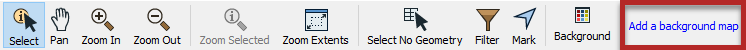
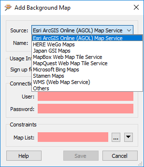
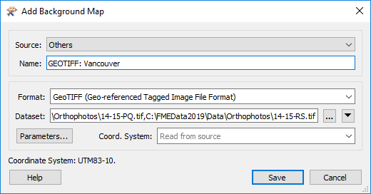
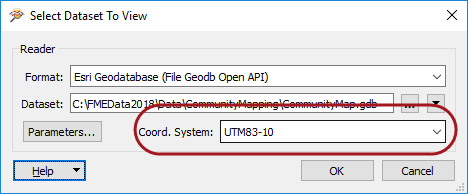

## 背景图 ##

通过单击“Data Inspector”工具栏上的“添加背景图”，可以激活将地图（或其他图像）作为背景作为空间数据的功能： 

背景图对话框使用户可以从Web服务添加背景图。其中一些（例如ArcGIS Online）需要现有帐户：

您还可以通过选择其他并填写格式和数据集，将现有数据集（任何FME支持的格式）用作背景。

---

<!--Tip Section-->

<table style="border-spacing: 0px">
<tr>
<td style="vertical-align:middle;background-color:darkorange;border: 2px solid darkorange">
<i class="fa fa-info-circle fa-lg fa-pull-left fa-fw" style="color:white;padding-right: 12px;vertical-align:text-top"></i>
技巧
</td>
</tr>

<tr>
<td style="border: 1px solid darkorange">

请记住，添加背景图（或任何读模块）时，可以选择相同格式的多个数据集。在上面的图像中，用户正在添加许多正射栅格图像。

</td>
</tr>
</table>

---

### 坐标系 ###

必须使用有效坐标系引用源数据才能使用背景地图查看它。如果坐标系未记录在数据集本身中，则可以在打开数据集时将其输入到字段中：

即使存在多个不同坐标系的源数据集，FME也可以根据背景地图显示源数据。FME通过将数据重新投影到背景地图使用的坐标系来完成此操作。因此，建议您在想要检查原始形式的数据时关闭背景地图。

---

<!--Person X Says Section-->

<table style="border-spacing: 0px">
<tr>
<td style="vertical-align:middle;background-color:darkorange;border: 2px solid darkorange">
<i class="fa fa-quote-left fa-lg fa-pull-left fa-fw" style="color:white;padding-right: 12px;vertical-align:text-top"></i>
FME蜥蜴说...
</td>
</tr>

<tr>
<td style="border: 1px solid darkorange">

您可以在“显示控制”窗口中调整背景图的符号系统和显示顺序，就像对任何普通数据集一样。

</td>
</tr>
</table>
