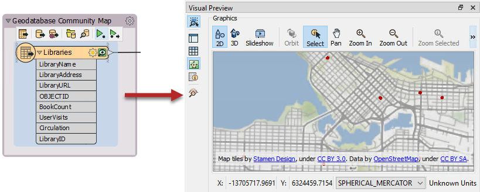

## 要素缓存 ##

有时，在翻译的任何步骤都能够检查数据很重要。使用菜单栏上的 Run &gt; Run with Feature Caching 可以激活此行为：:

启用此选项后，运行工作空间时，FME会在转换的每个步骤中生成缓存：

缓存由每个对象上的小图标指示。在上面的屏幕截图中，缓存为绿色，但是如果任何可能影响缓存中数据的参数更改，它们将变为黄色。黄色缓存被视为无效；您仍然可以查看它们，但它们的数据可能不再准确代表转换的结果。

---

### 检查缓存的数据 ###

启用“选择时自动切换检查”后，如果单击具有缓存的要素类型或转换器，它将自动显示在可视化预览(Visual Preview)中（在下一节中介绍）：

通过单击要素缓存图标，可以检查特定的数据缓存（例如，转换器上的单个输出端口）：

通过这种方式检查数据可以使您快速调试和开发工作空间，但是请记住，如果您要检查大量要素或具有复杂几何对象的要素，则自动检查所需的缓存可能会带来性能挑战。

---

<!--Tip Section-->

<table style="border-spacing: 0px">
<tr>
<td style="vertical-align:middle;background-color:darkorange;border: 2px solid darkorange">
<i class="fa fa-info-circle fa-lg fa-pull-left fa-fw" style="color:white;padding-right: 12px;vertical-align:text-top"></i>
技巧
</td>
</tr>

<tr>
<td style="border: 1px solid darkorange">

请注意，缓存数据会导致转换速度变慢，并会占用磁盘空间等系统资源。
  数据缓存在开发工作空间时非常有用，但是在将工作空间投入生产之前应将其关闭。

</td>
</tr>
</table>

---

### 部分运行 ###

When cachin启用缓存后，运行转换将导致数据缓存在工作空间的每个部分。在随后的运行中，可以使用这些缓存，而不必重新运行工作空间的整个部分。

例如，在这里，在打开缓存的情况下运行了工作空间：

现在，作者对AreaCalculator参数进行了更改：

请注意，缓存在AreaCalculator和后续的转换器上更改颜色（变为黄色）。此颜色表示缓存已过时；它们的数据内容不再与工作空间产生的数据匹配。

要获得新结果，作者必须重新运行工作空间。但是，他们不必重新运行整个工作空间;他们可以在变化点-AreaCalculator启动工作空间：

---

<!--New Section-->

<table style="border-spacing: 0px">
<tr>
<td style="vertical-align:middle;background-color:darkorange;border: 2px solid darkorange">
<i class="fa fa-bolt fa-lg fa-pull-left fa-fw" style="color:white;padding-right: 12px;vertical-align:text-top"></i>
新内容
</td>
</tr>

<tr>
<td style="border: 1px solid darkorange">

FME 2019.0中的新增功能：键盘快捷键<kbd>F5</kbd>现在可以从任何现有缓存中运行工作空间，而不是运行整个工作空间，而您可以使用<kbd>Shift</kbd> + <kbd>F5</kbd>进行操作。

</td>
</tr>
</table>

---

*Run From This(从此运行)* 将导致工作空间仅从该点开始运行，并使用直到该点为止一直缓存的数据。请注意，将鼠标悬停在该选项上会如何突出显示所有“下游”转换器。仅有它们会运行。这使转换更快。

另一个选项是 *Run To This(运行至此)*. 作者可以在写模块要素类型上使用该选项，并获得大致相同的效果：

...但是请注意，StatisticsCalculator的第二个分支是如何不突出显示的。它不会运行。这显示了如何避免运行工作空间的特定部分，就像禁用该连接一样。

---

<!--Tip Section-->

<table style="border-spacing: 0px">
<tr>
<td style="vertical-align:middle;background-color:darkorange;border: 2px solid darkorange">
<i class="fa fa-info-circle fa-lg fa-pull-left fa-fw" style="color:white;padding-right: 12px;vertical-align:text-top"></i>
技巧
</td>
</tr>

<tr>
<td style="border: 1px solid darkorange">

部分运行对于避免从源头重新读取数据特别有用。尤其是当数据来自缓慢的远程位置（例如Web服务）时。
  另外，将缓存另存为模板时，可以将其与工作空间一起保存。这意味着可以使用上一个会话甚至其他作者的缓存重新运行工作空间！
</td>
</tr>
</table>
