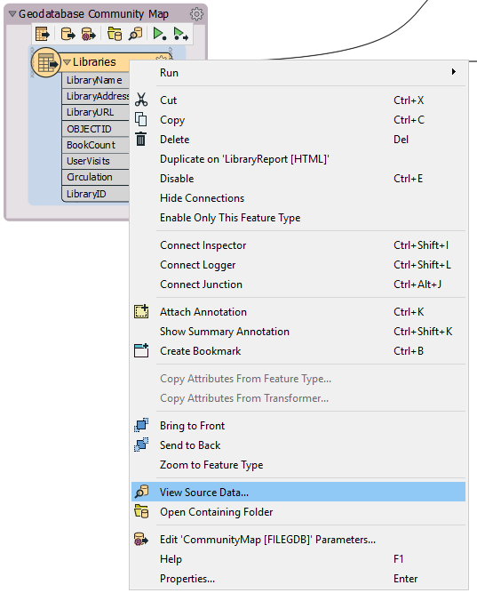
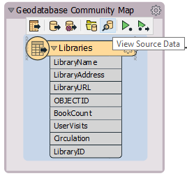
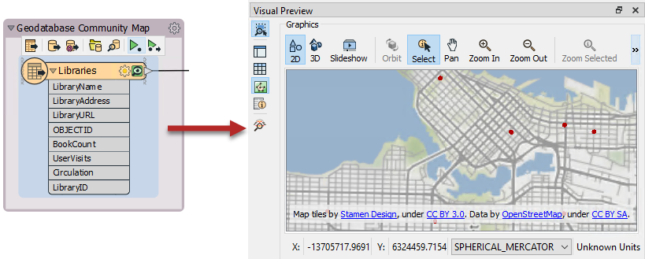
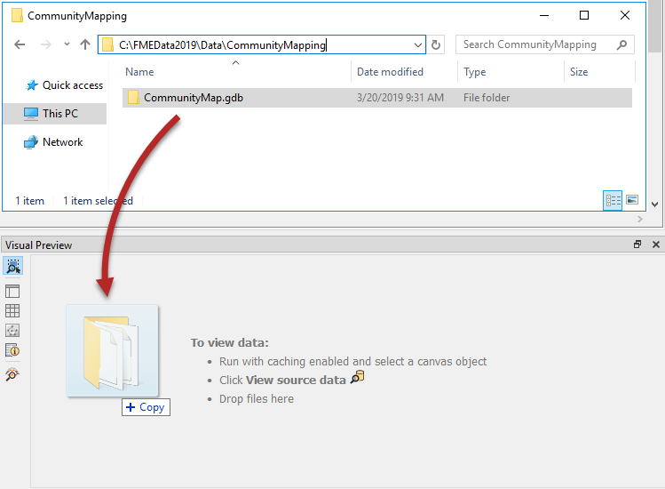
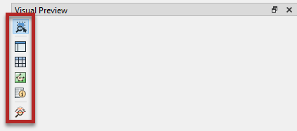

## 可视化预览（Visual Preview）

Visual Preview是FME Data Inspector的嵌入式版本，可在Workbench窗口中显示要素。独立ata Inspecto应用程序中的许多（但不是全部）功能在Visual Preview中可用。在本课程中，我们将主要使用Visual Preview和要素缓存检查数据。

使用Visual Preview，可以在构建工作空间时直接在Workbench中检查数据：

 地图瓦片提供由 <a href="https://stamen.com">Stamen Design</a>, 许可由 <a href="https://creativecommons.org/licenses/by/3.0">CC-BY-3.0</a>. 数据提供由<a href="http://openstreetmap.org">OpenStreetMap</a>, 许可由 <a href="http://creativecommons.org/licenses/by-sa/3.0">CC-BY-SA</a>.

---

<!--New Section-->

<table style="border-spacing: 0px">
<tr>
<td style="vertical-align:middle;background-color:darkorange;border: 2px solid darkorange">
<i class="fa fa-bolt fa-lg fa-pull-left fa-fw" style="color:white;padding-right: 12px;vertical-align:text-top"></i>
新内容
</td>
</tr>

<tr>
<td style="border: 1px solid darkorange">

Visual Preview是FME 2019.0的一项新功能。 
如果您不想使用它，可以在“ Visual Preview”窗口关闭时，在“ FME选项”>“工作台”>“数据检查”>“使用数据检查器检查”下禁用它。

</td>
</tr>
</table>

---

### 在Visual Preview中查看数据

您可以通过以下方式在Visual Preview中查看要素：

右键单击“导航器”或Workbench画布中的要素类型，然后选择 View Source Data:

在画布上，单击某个要素类型或某些转换器上的迷你工具栏上的“ View Source”图标：

运行启用了要素缓存的工作空间，然后选择缓存的对象：

将数据文件拖放到窗格上：

### Visual Preview的主要组成部分

Visual Preview窗格具有用于切换其他几个窗口的选项，以提供检查数据的不同方法。您可以使用“Visual Preview”窗格左侧的按钮来执行此操作：

#### 选项

**选择时自动切换检查** 按钮  使您可以决定在选择缓存的对象时是否应在Visual Preview中自动显示数据。默认情况下它是打开的。

**在Data Inspector中打开** 按钮  将打开Data Inspector所显示的数据。

#### 窗口

可视预览(Visual Preview)工具栏上的其余按钮都可以打开和关闭窗口。这些窗口复制其在Data Inspector中的功能。

**切换图形视图** 按钮  控制“图形”窗口，即显示空间数据的区域。

**切换显示控制** 按钮  控制显示控制窗口。

**切换表视图** 按钮  制表视图。

**切换要素信息窗口** 按钮  控制要素的信息窗口。就像在Data Inspector中一样，当您在“图形”或“表视图”窗口中选择要素时，“要素信息”窗口将显示有关该要素的信息。
