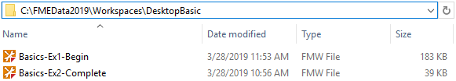
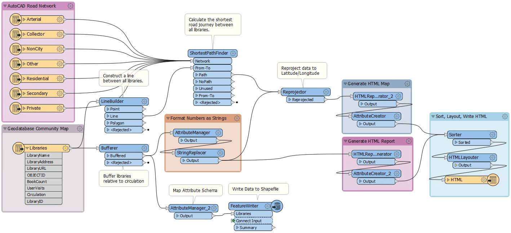
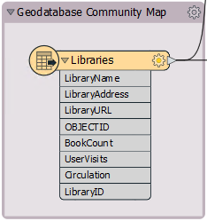
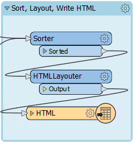
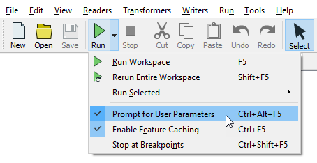
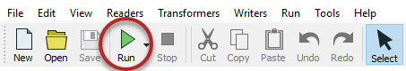
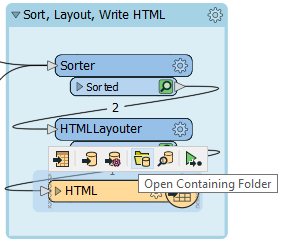
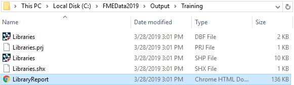
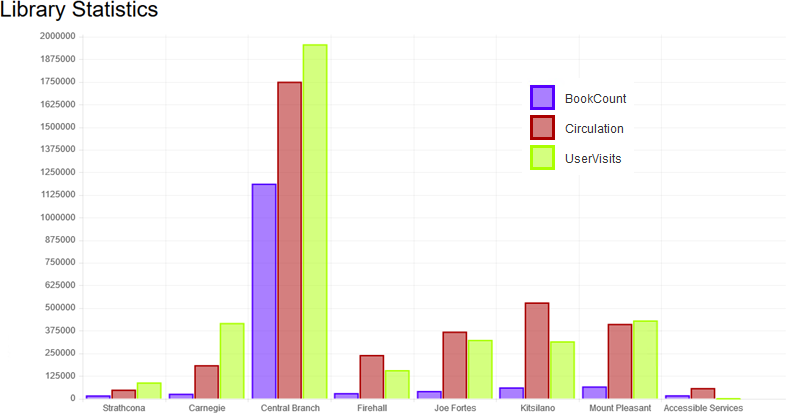

# 练习：探索FME

|  练习1 |  打开和运行工作空间 |
| :--- | :--- |
| 数据 | 图书馆（Esri Geodatabase） 道路（AutoCAD DWG） |
| 总体目标 | 打开并运行FME工作空间以探索它可以对数据执行的操作 |
| 演示 | 打开并运行工作空间 |
| 启动工作空间 | C:\FMEData2019\Workspaces\DesktopBasic\Basics-Ex1-Begin.fmw |
| 结束工作空间 | N / A |

与其尝试解释FME是什么和做什么，不如让我们自己尝试一下！在本练习中，您将探索一个工作流，以集成和转换数据以创建HTML报告，该报告汇总有关加拿大不列颠哥伦比亚省温哥华市图书馆的信息。此工作流程转换空间和属性数据。

**1）查找工作空间文件**  
在FME中定义转换和变换时，可以将它们保存在.fmw文件中。

使用文件资源管理器，浏览到上面列出的文件：

双击该文件。它将打开一个名为FME Workbench的应用程序。

**2）探索FME工作空间**  
当FME Workbench打开时，您将看到查看Workbench Essentials教程的选项。您可以根据需要立即完成此操作，或者稍后在“帮助”>“ Workbench Essentials”下进行查看。现在，单击X以关闭窗口。

该应用程序的主要部分将如下所示（单击以展开）：

这部分我们称之为画布。它是以图形方式定义数据的转换和变换的地方。虽然它可能看起来很复杂，但使用FME创建此类型的工作流程并不需要太多练习。

检查画布的左侧：

该区域是我们读取数据的地方，在这种情况下，是Esri地理数据库中的图书馆表。

现在看一下右侧：

这个区域是我们编写数据的地方，在本例中，是HTML格式的图书馆报告。

读模块和写模块之间是转换数据的对象。

标签和其他注释向我们展示了工作空间的功能。它：

* 读取道路（AutoCAD DWG）和图书馆（Esri Geodatabase）
* 计算所有图书馆的最短道路路线
* 创建直径相对于图书馆图书流通的圆圈
* 创建HTML报告和库的HTML映射
* 将数据写入HTML以及Esri Shapefile

|  FME蜥蜴说...... |
| :--- |
|  让我们确保我们对术语清楚。应用程序本身称为FME“Workbench”，但在画布窗口中定义的过程称为“工作空间”。这些术语很容易混淆。 |

  
**3）运行FME工作空间**  
让我们运行此工作空间。

在这样做之前，我们要控制 _如何_ 运行工作空间。 默认情况下，名为 **提示用户参数** 的功能处于打开状态。在本课程中，我们不需要启用此功能，因此，通过单击工具栏上的“运行”按钮旁边的下拉箭头，然后单击“提示输入用户参数”，可以将其关闭：

现在我们准备运行工作空间。单击Workbench工具栏上的绿色“运行”按钮：

现在，工作空间将运行。这样，您将在日志窗口中看到消息通过。您可能还会看到数字出现在画布连接上，并且每个对象上都有绿色带注释的图标。稍后我们将介绍这些内容！

**4）找到并检查输出**  
转换完成后，单击画布上的HTML写模块对象。 它位于工作区的右侧，并标记为“ HTML”。选择打开包含文件夹的选项：

在打开的“资源管理器”对话框中，您将找到HTML输出和Shapefile数据集：

使用Firefox或Chrome等网络浏览器打开FME创建的输出文件（双击该文件应在默认浏览器中将其打开）。您将看到一个图书馆表，一个图书馆统计图以及一个显示图书馆位置的交互式地图。这一切都是FME从传入的地理数据库点和属性生成的：

---

|  FME蜥蜴说... |
| :--- |
|  这个小例子展示了FME的强大功能。此工作空间从多个空间数据集中读取数据，并以空间和“表”格式将其写入数据集。在此之间进行了一系列转换和空间分析，对数据进行缓冲和重新投影，并创造了附加值和信息。 |

<table>
  <thead>
    <tr>
      <th style="text-align:left">恭喜</th>
    </tr>
  </thead>
  <tbody>
    <tr>
      <td style="text-align:left">
        
通过完成本练习，您已学会如何：
           
        

        <ul>
          <li>打开FME工作空间</li>
          <li>运行FME工作空间</li>
          <li>找到FME工作空间的输出</li>
        </ul>
      </td>
    </tr>
  </tbody>
</table>
